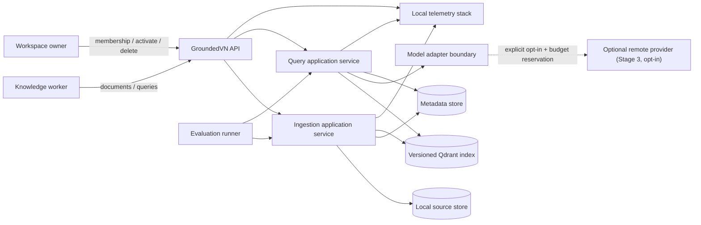
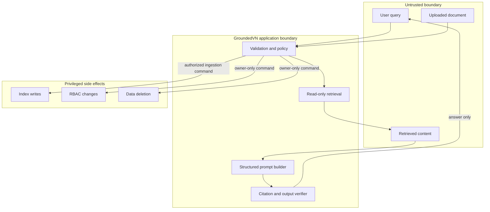
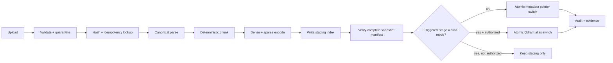
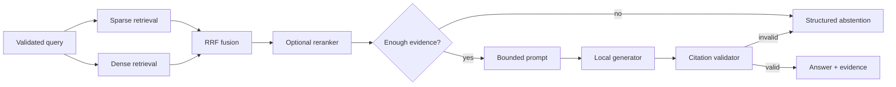

# GroundedVN — Cursor and Codex Implementation Blueprint

> **Status:** Active under career-system GOAL_DELIVERY mode
> **Audience:** Phạm Hoàng Hải (“Mighty Raccoon”), Cursor, Codex, reviewers, and future collaborators
> **Working language:** English for code, documentation, commits, issues, and evaluation artifacts
> **Normative terms:** **MUST**, **MUST NOT**, **SHOULD**, and **MAY** are requirements with their usual RFC-style meanings
> **Last reviewed:** 2026-08-09
> **Operating mode:** `GOAL_DELIVERY` — see career-system `shared/SELF_REVIEW_PROTOCOL.md`

## 1. How to use this blueprint

This is the single source of truth for building GroundedVN. It describes five
numbered stages, with Stage 2 split into development gate 2A and separately
authorized test gate 2B, from a small retrieval baseline to an optional
senior-level local reference system.

### Operating mode override (normative)

The career system default is **GOAL_DELIVERY**. The human states a goal and
checks the final result. Wherever this blueprint says to stop and wait for
human approval, or to ask before commit/push/deploy, the agent MUST instead
run the delivery loop in `shared/SELF_REVIEW_PROTOCOL.md` (or the vendored
copy under `docs/contracts/career-system/` after Stage 0 bootstrap): execute →
verify → audit → evidence → self-review → seal → ship. The agent MAY record
the exact approval phrase below with `approval.mode: agent-self-review`,
continue across stages when the goal requires it, and commit/push/deploy as
needed. Only catastrophic hard stops in that protocol require a goal that
names the dangerous action.

An agent receives a goal (often one stage; may be multi-stage end-to-end).
Before using a prompt, every `<REQUIRED_...>` placeholder MUST be filled (by
the human or by the agent from repository state when unambiguous). The agent MUST:

1. Read this entire file before editing code.
2. Compute this file's SHA-256 and compare it with
   `REQUIRED_BLUEPRINT_SHA256` from the prompt.
3. Read `PROJECT_STATE.md`, which follows
   `/Users/konalyn/Documents/dev/mighty-raccoon-career-system/shared/PROJECT_STATE_TEMPLATE.md`,
   and confirm the active milestone.
4. Inspect the repository and confirm the preceding signed gate receipt and
   clean evidence packet exist when a preceding stage is required.
5. Work only inside the current stage’s scope and allowed paths.
6. Run the required tests and evaluations.
7. Save raw results and machine-readable evidence.
8. Report observed results exactly; it MUST NOT invent, round up, or “estimate” metrics.
9. Seal the stage gate under GOAL_DELIVERY when the checklist passes; continue
   or ship as the goal requires. If the checklist fails after bounded repair,
   stop with a pending/rejected receipt — do not forge a pass.

An agent MUST NOT:

- silently change a fixed decision;
- add frameworks, services, model providers, file formats, or UI features outside the active stage;
- tune against the frozen test split;
- claim official MIRACL results from a sampled or candidate-pooled corpus;
- perform catastrophic hard-stop actions from `SELF_REVIEW_PROTOCOL.md` unless the goal names them; ordinary commit/push/deploy for a stated goal is allowed;
- expose private documents, prompts, secrets, raw user text, or personally identifiable information in logs or evaluation artifacts;
- progress to a later stage because it “looks straightforward,” or without a sealed gate receipt.

The bootstrap sources for the shared contracts are:

```text
/Users/konalyn/Documents/dev/mighty-raccoon-career-system/shared/PROJECT_STATE_TEMPLATE.md
/Users/konalyn/Documents/dev/mighty-raccoon-career-system/shared/EVIDENCE_PACKET_SPEC.md
/Users/konalyn/Documents/dev/mighty-raccoon-career-system/shared/DECISION_LOG_TEMPLATE.md
/Users/konalyn/Documents/dev/mighty-raccoon-career-system/shared/GATE_RECEIPT_TEMPLATE.yaml
/Users/konalyn/Documents/dev/mighty-raccoon-career-system/shared/GATE_RECEIPT_SCHEMA.json
/Users/konalyn/Documents/dev/mighty-raccoon-career-system/shared/SELF_REVIEW_PROTOCOL.md
```

Stage 0 MUST copy these files byte-for-byte into
`docs/contracts/career-system/`, write a `manifest.json` containing each
source path and SHA-256, and verify every copy. After bootstrap, the vendored
copies are the implementation repository's authoritative, portable gate
contracts. Later stages MUST read the vendored copies and MUST NOT depend on
the career-system repository still existing at an absolute local path.

The implementation repository MUST contain:

```text
PROJECT_STATE.md
docs/blueprints/groundedvn-blueprint.md
docs/contracts/career-system/EVIDENCE_PACKET_SPEC.md
docs/contracts/career-system/DECISION_LOG_TEMPLATE.md
docs/contracts/career-system/GATE_RECEIPT_TEMPLATE.yaml
docs/contracts/career-system/GATE_RECEIPT_SCHEMA.json
docs/contracts/career-system/SELF_REVIEW_PROTOCOL.md
docs/contracts/career-system/manifest.json
docs/gates/stage-<id>.yaml
evidence/groundedvn-stage-<id>/packet.yaml
evidence/groundedvn-stage-<id>/claims.yaml
```

`PROJECT_STATE.md` is the handoff and scope ledger. A gate receipt is valid only
when it identifies the blueprint hash, a clean source commit, the public
evidence-packet hash, the exact approval phrase, approver (human or
agent-self-review actor), and approval date.

The approval phrase for advancing (issued by human **or** agent under SELF_REVIEW) is:

```text
GROUNDEDVN STAGE <N> APPROVED. Proceed to Stage <N+1>.
```

Anything else is feedback, not authorization to advance.

Stage 2 has two approvals:

```text
GROUNDEDVN STAGE 2A APPROVED. Authorize the one-time Stage 2B test run.
GROUNDEDVN STAGE 2B APPROVED. Proceed to Stage 3.
```

---

## 2. Integrity correction: MIRACL is not a Vietnamese benchmark

The official MIRACL v1.0 corpus contains these language configurations:

```text
ar, bn, de, en, es, fa, fi, fr, hi, id, ja, ko, ru, sw, te, th, yo, zh
```

It does **not** contain Vietnamese (`vi`). The official corpus listing and repository are linked in [Primary sources](#23-primary-sources).

Therefore:

- **MIRACL-en** is the public, human-annotated retrieval benchmark in this project.
- **GroundedVN Bilingual Evaluation Pack v1** is the project-authored Vietnamese/English and cross-lingual suite.
- The repository MUST NOT use the name `MIRACL-vi`, imply that translations are official MIRACL data, or compare sampled results with the official MIRACL leaderboard.
- A future public Vietnamese benchmark MAY be added only after its provenance, task definition, license, corpus access, and official evaluation procedure are verified from primary sources. It becomes a separate versioned suite, not a retroactive change to MIRACL.

This correction is fixed and is not an implementation choice.

---

## 3. Product statement

### 3.1 One-sentence goal

Build a local-first, bilingual Vietnamese/English retrieval-augmented generation system that produces answers traceable to exact source passages and demonstrates measurable retrieval quality, safe failure behavior, reproducible evaluation, and production-minded operations.

### 3.2 Portfolio value

GroundedVN should prove that its author can:

- define and version data contracts;
- establish a lexical baseline before adding neural components;
- evaluate multilingual and cross-lingual retrieval;
- make evidence-based model and architecture choices;
- design citations and abstention as first-class behavior;
- handle document ingestion, retries, deletion, and index lifecycle safely;
- instrument latency, quality, cost, and failures;
- articulate threat boundaries, SLOs, rollback, and recovery;
- distinguish a local portfolio system from a production claim.

### 3.3 Users

The primary users are:

1. **Evaluator/recruiter:** runs the project locally and checks documented evidence.
2. **Knowledge worker:** uploads approved documents and asks Vietnamese or English questions.
3. **Local owner:** manages documents and synchronous retention/deletion from Stage 1.
4. **Workspace owner/operator:** manages triggered membership, alias activation,
   durable jobs, and recovery only for approved Stage 4 extensions.

### 3.4 Exact goals

GroundedVN MUST:

- accept UTF-8 Markdown and plain-text documents at Stage 0; PDF support enters only at Stage 3;
- preserve source, document, revision, and chunk identity through ingestion and retrieval;
- support Vietnamese and English queries against Vietnamese and English documents;
- return ranked evidence before it returns generated prose;
- attach each material answer claim to one or more verifiable citations;
- abstain when evidence is insufficient;
- provide a local-only path with no paid dependency;
- provide optional remote model adapters only behind explicit configuration and consent;
- benchmark lexical, dense, hybrid, and reranked retrieval separately;
- record model revisions, pipeline settings, corpus hashes, code revision, hardware profile, latency, and raw predictions for every evaluation run;
- provide deterministic data preparation and repeatable evaluation commands;
- keep test data and production/user data separate;
- publish only verified, complete active-revision snapshots in Stages 1–3;
- use an atomic metadata-pointer switch for the single-workspace local service;
- add Qdrant alias activation only when a measured Stage 4 trigger is accepted;
- provide tested local purge from Stage 0 and synchronous document deletion
  from Stage 1; add durable deletion or tenant isolation only when its Stage 4
  trigger is accepted.

### 3.5 Explicit non-goals

GroundedVN MUST NOT become:

- a general autonomous agent or tool-execution platform;
- an unrestricted web crawler or search engine;
- a social-media content generator or publisher;
- a fine-tuning project for a foundation model;
- a replacement for legal, medical, financial, or safety-critical professional advice;
- a polished multi-page consumer frontend;
- an enterprise SSO, billing, CRM, or analytics platform;
- a Kubernetes, microservice, service-mesh, or multi-region demonstration without measured need;
- a benchmark leaderboard project;
- a repository full of notebooks without a tested library and CLI;
- a system that calls a response “grounded” merely because a prompt asked the model to cite.

### 3.6 Definition of done

The project is complete only when:

- Stages 0, 1, 2A, 2B, and 3 pass their gates with clean-commit public evidence packets.
- Stage 4 is either not triggered and documented as such, or only the
  measured, approved extensions pass their individual gates.
- A clean clone can run the documented local happy path.
- CI runs deterministic unit, contract, integration, and bounded evaluation tests.
- The public README links to a versioned model card, data card, evaluation report, threat model, ADRs, and runbook.
- All published metrics can be regenerated from checked-in commands and immutable manifests.
- No claim uses private data, unverifiable numbers, or results from an unlabelled benchmark variant.

---

## 4. Decision register

### 4.1 Fixed decisions

Agents MUST implement these decisions unless the owner edits this blueprint.

| Area | Fixed decision | Reason |
|---|---|---|
| Delivery | Five numbered stages; Stage 2 has separate 2A dev and 2B test gates | Prevents test leakage and senior scope from swallowing the baseline |
| Runtime | Python 3.12 | Mature ecosystem and current typing/runtime support |
| Package workflow | `uv`, `pyproject.toml`, and a committed lock file | Reproducible, fast local setup |
| API | FastAPI + Pydantic v2 | Typed contracts and generated OpenAPI |
| Domain design | Plain Python domain/application core behind protocols | Keeps vendor libraries at adapters |
| Primary vector/search engine | Qdrant, locally through Docker Compose from Stage 1 | Dense+sparse search; aliases remain a triggered Stage 4 extension |
| Metadata | SQLite through Stage 2; PostgreSQL from Stage 3 | Small local baseline first, durable control plane later |
| Object storage | Repository fixtures and local filesystem through Stage 3 | No cloud dependency |
| Local generation | Ollama adapter | Free-first and private by default |
| Optional generation | OpenAI-compatible HTTP adapter, disabled by default | Controlled benchmark/demo fallback without coupling |
| Retrieval architecture | Lexical baseline → dense → reciprocal-rank hybrid → optional reranking | Every added component must prove value |
| Evaluation | GroundedVN Bilingual Pack v1 primary; optional MIRACL-en pooled-rerank diagnostic | Controlled vi/en gates plus clearly limited public diagnostic |
| API response | Evidence and stable citation identifiers are mandatory | Grounding must be inspectable |
| Safety | Retrieved text is untrusted data, never executable instruction | Reduces indirect prompt-injection impact |
| Tool use | Generation has no tools, shell, network, database write, or side-effect capability | Limits blast radius |
| Deployment | Local Compose is the only required deployment | No cloud bill or false production claim |
| License | Project code: Apache-2.0; wholly project-authored evaluation data: CC BY 4.0 | Clear reuse terms; third-party data retains original terms |
| Stage gate | A hash-bound receipt (agent-self-review or human) approves every stage; hard-stop external mutations still need an explicit human instruction | Prevents scope drift without mid-stage human waits |
| Evidence | Raw predictions + manifest + summary; no screenshot-only metrics | Auditable results |
| Logging | No raw document text or full query text by default | Privacy-preserving operations |
| Public evidence | Sanitized Evidence Packets follow the vendored `docs/contracts/career-system/EVIDENCE_PACKET_SPEC.md` | Recruiter-inspectable claims without publishing private data |
| Paid services | Local/free by default; hard total ceiling 300,000 VND/month | Matches the career-system budget, not a target to spend |

### 4.2 Benchmark-dependent choices

These choices MUST be resolved by experiments. The defaults are starting points, not promised winners.

| Choice | Initial candidates/default | Selection rule |
|---|---|---|
| Dense embedding | Small-model registry candidate first, then `intfloat/multilingual-e5-base` or `BAAI/bge-m3` only if approved | Pass the exact Stage 1 gate within download, memory, and latency budgets |
| Sparse method | Qdrant BM25 sparse vectors | Keep unless a tested alternative materially improves the primary metric |
| Fusion | Reciprocal Rank Fusion, `k=60`; retrieve 50 per channel, fuse to 30 | Tune on development split only; retain simpler default unless improvement is reliable |
| Reranker | Registry-approved multilingual candidate, initially top 20 | Keep only if it passes the exact Stage 2A retrieval gate |
| Chunk size | 500 Unicode words, 75-word overlap | Select from registered sweep; no test-set tuning |
| Generator | Start with a registry-approved 1.5B–4B model; 4B–8B requires preflight approval | Accept only if A1 passes the exact Stage 2A answer gate |
| Context count | Top 6 reranked chunks | Tune on development split; record truncation and token budget |
| Abstention threshold | Calibrated from development evidence scores | Maximize abstention F1 subject to citation-recall floor |
| Query normalization | Unicode NFC, whitespace normalization; no translation by default | Add translation only if measured cross-lingual gain justifies added risk and latency |
| Quantization | Smallest format that passes answer-quality gate | Record exact artifact digest and hardware |
| Concurrency | Start at 1 generation worker | Raise only after load tests show safe headroom |

For each selected choice, write an ADR containing:

- candidates and exact revisions;
- datasets and split used;
- primary and guardrail metrics;
- hardware and software environment;
- raw result artifact paths;
- why the selected option won;
- rollback option.

The default Stage 1 retrieval promotion rule is:

```text
primary = macro nDCG@10 over vi→vi, en→en, vi→en, en→vi approved dev cases
bootstrap = 10,000 paired, direction-stratified resamples
bootstrap seed = 20260728
minimum absolute delta versus incumbent = +0.020
95% CI lower bound for delta = > 0.000
maximum regression in any direction nDCG@10 = 0.030
maximum evidence-span Recall@10 regression = 0.020
candidate p95 retrieval latency = min(2.0 s, 1.5 × incumbent p95)
candidate total peak RSS = ≤ 8 GiB and incremental RSS = ≤ 2 GiB
```

If the declared reference machine cannot satisfy an absolute resource limit,
the experiment may register a lower limit before any candidate result is seen.
It may not relax a limit after seeing results. MIRACL pooled-rerank diagnostics
never promote or block the core retriever.

---

## 5. Architecture principles

1. **Evaluation before generation.** Retrieval must be useful before an LLM can hide its weaknesses.
2. **Evidence before prose.** The query service produces a versioned evidence set; generation consumes it.
3. **Data is not instruction.** User input and retrieved text are untrusted fields, not system directives.
4. **Ports before vendors.** Qdrant, Ollama, and PostgreSQL remain adapters to stable domain contracts.
5. **Immutable versions.** Source revisions, pipeline versions, index versions, model revisions, prompts, and evaluation datasets are immutable identifiers.
6. **Build then activate.** A new index is verified before one atomic alias switch exposes it.
7. **Safe retry.** Ingestion is idempotent; retry cannot create duplicate active chunks.
8. **Observable boundaries.** Parsing, chunking, embedding, retrieval, fusion, reranking, generation, and citation validation have separate spans and metrics.
9. **Local privacy by default.** Remote calls are opt-in and visibly recorded.
10. **Complexity earns its place.** A senior artifact explains why a component exists and how to remove it.

---

## 6. System context



### 6.1 Trust boundaries



The model output path has no edge to `IndexWrite`, `Membership`, `Delete`, the
shell, or arbitrary network access. Only the Stage 3 remote adapter has one
allowlisted provider edge under section 11.5; retrieved text and model output
cannot choose its URL or trigger a call without request-level opt-in.

---

## 7. Data flows

### 7.1 Ingestion flow

1. API authenticates the actor and authorizes `document:write` for a workspace.
2. Validate filename, media type, byte size, encoding, and declared parser.
3. Store the original bytes in a quarantined location; compute `content_sha256`.
4. Create the idempotency key from canonical JSON encoded as UTF-8:

   ```json
   {
     "domain": "groundedvn.ingestion.v1",
     "workspace_id": "wsp_...",
     "source_id": "opaque-source-id",
     "content_sha256": "lowercase-hex",
     "pipeline_version": "content-addressed-version"
   }
   ```

   Keys are serialized with sorted keys, no insignificant whitespace, and
   explicit UTF-8 bytes before SHA-256. Raw string concatenation is forbidden.
5. If a terminal local ingestion record or durable job with that key exists,
   return it without duplicating data.
6. Parse into canonical blocks with source offsets and parser warnings.
7. Normalize Unicode to NFC and normalize line endings; do not translate.
8. Chunk deterministically. Derive each `chunk_id` from document revision, chunker version, and ordinal.
9. Generate dense and sparse representations through pinned adapters.
10. Resolve the complete active revision set, apply exactly one mutation, and
    persist that intended set in a source manifest. A candidate snapshot is
    never a collection containing only the newly uploaded document.
11. Write every chunk in the intended revision set to a non-active physical
    collection named only with opaque identifiers:

    ```text
    gv_<workspace_ulid>_<pipeline_hash_prefix>_<build_ulid>
    ```

    User-controlled slugs, filenames, or paths MUST NOT appear in collection names.
12. Verify the exact source-manifest hash, document/chunk counts, revision set,
    vector dimensions, required payload indexes, sampled round trips, and
    workspace filters.
13. Persist an immutable `IndexManifest`.
14. Stages 1–3 synchronously switch the single-workspace
    `active_index_version` metadata pointer in one transaction only after
    verification. The API returns a terminal `LocalIngestionRecord` with `201`.
15. Mark the new revision active and the prior revision superseded in the same
    metadata transaction as the pointer switch.
16. Stage 4, only when its measured trigger is accepted, MAY enqueue a durable
    job, return `202`, and replace the metadata-pointer publication step with
    one atomic Qdrant alias update after the same checks and human authorization.
17. Emit audit and telemetry events containing identifiers and counts, never raw content.



### 7.2 Query flow

1. API authenticates the actor and authorizes `query:read`.
2. Validate length, encoding, requested language, filters, and request timeout.
3. Normalize Unicode; preserve the original query only in memory.
4. Retrieve lexical and dense candidates from the same active index version.
5. Enforce `workspace_id` filtering inside each search request, not after retrieval.
6. Fuse results with reciprocal rank fusion.
7. Rerank only the bounded fused candidate set when the selected configuration enables it.
8. Apply evidence thresholds, duplicate suppression, context diversity, and token budget.
9. If evidence is insufficient, return a structured abstention without calling the generator.
10. Build a structured prompt with separate system, user-query, and quoted-context fields.
11. Generate a bounded answer. The model has no tools or side effects. The
    default local adapter has no external access; the optional Stage 3 remote
    adapter may perform only the explicitly opted-in, budget-reserved provider
    request described in section 11.5.
12. Parse a structured `DraftAnswer` containing explicit claim-to-citation
    mappings. The server resolves each proposed source span into a server-built
    citation and validates IDs, index version, revision, canonical offsets, and
    exact quote membership.
13. Reject structurally invalid claims or convert the response to abstention.
    Runtime validation proves citation identity and traceability; it does not
    prove semantic entailment. Semantic claim support is measured offline by
    the approved evaluation protocol and must not be overstated.
14. Return answer, evidence, versions, timing, and a request ID.
15. Record redacted spans, metrics, and decision reasons.



### 7.3 Evaluation flow

0. Default to `dev`. If `split=test`, enforce the Stage 2B receipt, frozen-hash,
   clean-source, and consumption-ledger protocol before reading cases.
1. Resolve a frozen suite manifest by content hash.
2. Resolve a pipeline configuration and all model revisions.
3. Create a unique `evaluation_run_id`.
4. Execute queries with cache disabled unless the experiment explicitly measures cache behavior.
5. Write one immutable prediction row per case.
6. Calculate metrics from prediction rows, not from logs.
7. Bootstrap confidence intervals with a recorded seed.
8. Generate a summary that points to raw artifacts.
9. Compare against the registered baseline and guardrails.
10. A human accepts or rejects the candidate; the evaluator never activates it.

### 7.4 Deletion flow

1. An authorized local owner requests deletion for a workspace, document, or revision.
2. Step-up confirmation is required. Stages 0–3 provide a local purge CLI;
   Stages 1–3 also provide synchronous API deletion. Stage 4 MAY add a durable
   asynchronous deletion job after its trigger is accepted.
3. Write a tombstone before removing data so stale jobs, retries, imports, and
   restore procedures cannot reintroduce the deleted revision.
4. Inventory every source file, parsed block, active/staging/retired snapshot,
   vector, cache, private evaluation derivative, and backup in scope.
5. Build and verify a complete clean snapshot from the remaining active revisions.
6. Publish the clean snapshot using the stage-appropriate atomic pointer or alias operation.
7. Purge the deleted material from all inventoried stores. Revoke every rollback
   target or manifest that could expose it; a clean rollback target must be
   rebuilt before it becomes eligible.
8. Verify zero records/hits by document ID, revision ID, and source hash across
   every physical collection and cache. If a backup cannot yet be purged, the
   deletion remains `pending_backup_expiry`, and the UI/API MUST NOT claim completion.
9. Record redacted verification evidence. Audit records retain opaque IDs and
   action metadata, never deleted content.

Stages 1–3 serialize publish/delete for a workspace with one write lock. Deletion
writes the tombstone before the clean-snapshot build, prevents new queries from
acquiring the affected revision, drains or cancels in-flight queries at the
deletion barrier, then performs purge and verification. After a successful
deletion response, no query begun before or after the barrier may return the
deleted revision. Deterministic concurrent tests pause a query on both sides of
the barrier and prove this invariant.

A failed staging snapshot is never searchable or rollback-eligible. Stages 1–3
delete it immediately. If cleanup itself fails, record it as
`failed_quarantined`, deny every read/activation path, and retry bounded cleanup;
the local retention ceiling is 24 hours. Readiness becomes degraded while an
overdue failed snapshot exists. This retention window never relaxes a user
deletion: a staging snapshot containing a tombstoned revision must be purged
before deletion can report success.

Deleting metadata while leaving embeddings or source bytes behind is a failed deletion.
Restoring or aliasing a pre-deletion snapshot after deletion is also a failed deletion.

---

## 8. Repository structure

The GroundedVN implementation repository SHOULD use this structure. Stage tags indicate the earliest stage that creates a path.

```text
groundedvn/
├── README.md                                      # S0: verified setup and evidence links
├── PROJECT_STATE.md                               # S0: shared state/handoff contract
├── LICENSE                                        # S0: Apache-2.0 code license
├── CITATION.cff                                   # S3: project and MIRACL attribution
├── SECURITY.md                                    # S3: reporting and supported versions
├── CONTRIBUTING.md                                # S3: quality and data rules
├── pyproject.toml                                 # S0: dependencies and tool config
├── uv.lock                                        # S0: reproducible dependency lock
├── Makefile                                       # S0: stable developer/eval commands
├── .env.example                                   # S1: non-secret settings
├── .gitignore                                     # S0: data, models, secrets, artifacts
├── .pre-commit-config.yaml                        # S0: lint and secret checks
├── docker-compose.yml                             # S1: Qdrant; S3 adds Postgres/telemetry
├── configs/
│   ├── baseline.yaml                              # S0: lexical baseline
│   ├── hybrid.yaml                                # S1: chosen/candidate hybrid settings
│   ├── rag.yaml                                   # S2: generation and citation policy
│   ├── production-local.yaml                      # S3: local production-shaped profile
│   ├── model-registry.yaml                        # S1+: revisions, licenses, adapter formats
│   ├── pricing/                                   # S3: reviewed remote price snapshots
│   └── experiments/                               # S1+: immutable experiment configs
├── src/groundedvn/
│   ├── __init__.py
│   ├── settings.py                                # S0: typed environment/config loading
│   ├── domain/
│   │   ├── models.py                              # S0: domain records and identifiers
│   │   ├── errors.py                              # S0: stable error taxonomy
│   │   ├── policies.py                            # S2: evidence/citation policy
│   │   └── events.py                              # S3: audit and lifecycle events
│   ├── ports/
│   │   ├── retrieval.py                           # S0: retriever/reranker protocols
│   │   ├── generation.py                          # S2: generator protocol
│   │   ├── persistence.py                         # S0: source/metadata/index protocols
│   │   ├── telemetry.py                           # S3: tracing/metrics protocol
│   │   └── clock.py                               # S0: deterministic time boundary
│   ├── application/
│   │   ├── ingest.py                              # S0: orchestration, no vendor imports
│   │   ├── query.py                               # S0: retrieval; S2 generation
│   │   ├── activate_index.py                      # S4: verified alias activation
│   │   ├── delete_data.py                         # S0 CLI; S1 sync API; S4 durable mode
│   │   └── membership.py                          # S4: RBAC application service
│   ├── ingestion/
│   │   ├── normalize.py                           # S0: Unicode/content normalization
│   │   ├── chunk.py                               # S0: deterministic chunks
│   │   ├── parsers/
│   │   │   ├── text.py                            # S0
│   │   │   ├── markdown.py                        # S0
│   │   │   └── pdf.py                             # S3
│   │   └── validation.py                          # S0; S3 hardens file validation
│   ├── retrieval/
│   │   ├── lexical.py                             # S0
│   │   ├── dense.py                               # S1
│   │   ├── fusion.py                              # S1
│   │   ├── rerank.py                              # S2
│   │   └── context.py                             # S2
│   ├── generation/
│   │   ├── prompts.py                             # S2: structured, versioned prompts
│   │   ├── ollama.py                              # S2: local adapter
│   │   ├── openai_compatible.py                   # S3: opt-in adapter
│   │   ├── citations.py                           # S2: exact validation
│   │   └── abstention.py                          # S2: calibrated decision
│   ├── adapters/
│   │   ├── sqlite.py                              # S0–S2 metadata
│   │   ├── postgres.py                            # S3+
│   │   ├── qdrant.py                              # S1+
│   │   ├── local_files.py                         # S0+
│   │   └── auth.py                                # S3+
│   ├── jobs/
│   │   ├── models.py                              # S4: lease/retry state
│   │   ├── worker.py                              # S4: bounded worker
│   │   └── recovery.py                            # S4: stale lease and DLQ handling
│   ├── observability/
│   │   ├── logging.py                             # S3: redaction and correlation
│   │   ├── metrics.py                             # S3
│   │   └── tracing.py                             # S3
│   ├── api/
│   │   ├── app.py                                 # S1
│   │   ├── dependencies.py                        # S1; S3 auth dependencies
│   │   ├── errors.py                              # S1: error envelope mapping
│   │   └── routes/
│   │       ├── health.py                          # S1
│   │       ├── documents.py                       # S1
│   │       ├── search.py                          # S1: evidence-only retrieval
│   │       ├── queries.py                         # S2: grounded answer endpoint
│   │       ├── ingestions.py                      # S1 terminal records; S4 durable jobs
│   │       └── admin.py                           # S4
│   └── cli.py                                     # S0: ingest/query/evaluate/admin
├── evaluation/
│   ├── README.md                                  # S0: exact methodology and caveats
│   ├── schemas.py                                 # S0: suite/prediction/run contracts
│   ├── runner.py                                  # S0
│   ├── metrics/
│   │   ├── retrieval.py                           # S0
│   │   ├── generation.py                          # S2
│   │   ├── abstention.py                          # S2
│   │   ├── security.py                            # S2
│   │   └── performance.py                         # S1
│   ├── datasets/
│   │   ├── miracl_en.py                           # S0: pinned loader/slice builder
│   │   └── groundedvn_bilingual.py                # S0: project-authored loader
│   └── reports.py                                 # S0: summary from raw predictions
├── data/
│   ├── README.md                                  # S0: acquisition and privacy rules
│   ├── manifests/                                 # S0: committed hashes, not large data
│   └── groundedvn_bilingual_v1/
│       ├── DATA_CARD.md                            # S0
│       ├── documents.jsonl                        # S0: project-authored sources
│       ├── cases.dev.jsonl                        # S0
│       ├── cases.test.jsonl                       # S2A: frozen before authorized 2B
│       └── manifest.json                          # S0: counts and SHA-256 values
├── tests/
│   ├── unit/                                      # S0+
│   ├── contract/                                  # S0+
│   ├── integration/                               # S1+
│   ├── security/                                  # S2+
│   ├── evaluation/                                # S0+
│   ├── load/                                      # S3+
│   └── recovery/                                  # S4
├── docs/
│   ├── blueprints/
│   │   └── groundedvn-blueprint.md                # S0: approved in-repo snapshot
│   ├── contracts/
│   │   └── career-system/                         # S0: verified portable contract snapshot
│   │       ├── EVIDENCE_PACKET_SPEC.md
│   │       ├── DECISION_LOG_TEMPLATE.md
│   │       ├── GATE_RECEIPT_TEMPLATE.yaml
│   │       ├── GATE_RECEIPT_SCHEMA.json
│   │       └── manifest.json                      # source paths + SHA-256 values
│   ├── architecture.md                            # S0; updated at each gate
│   ├── model-card.md                              # S2
│   ├── threat-model.md                            # S3; S4 verification
│   ├── runbook.md                                 # S3+
│   ├── data-retention.md                          # S3
│   ├── capacity-cost.md                           # S4
│   ├── recovery-drill.md                          # S4
│   ├── postmortems/                               # S4
│   ├── gates/                                     # hash-bound human gate receipts
│   └── adr/
│       ├── 0001-local-first.md                    # S0
│       ├── 0002-retrieval-selection.md            # S1
│       ├── 0003-reranker-selection.md             # S2
│       ├── 0004-generator-selection.md            # S2
│       └── 0005-index-activation.md               # S4
├── scripts/
│   ├── prepare_miracl_en.py                       # S0: bounded by explicit mode
│   ├── verify_dataset.py                          # S0
│   ├── benchmark.py                               # S0
│   ├── load_test.py                               # S3
│   └── recovery_drill.py                          # S4
├── artifacts/
│   ├── private/                                   # raw candidate evidence, ignored
│   └── .gitkeep
├── evidence/
│   └── groundedvn-stage-<id>/                     # sanitized clean-commit packet
│       ├── packet.yaml
│       ├── claims.yaml
│       ├── test-consumption.yaml                  # S2B only: durable public-safe state
│       ├── metrics/
│       ├── diagrams/
│       ├── screenshots/
│       └── notes/
└── .github/workflows/
    ├── ci.yml                                     # S0
    ├── evaluation.yml                             # S3: bounded regression suite
    └── security.yml                               # S3
```

Rules:

- `src/groundedvn/domain` and `src/groundedvn/application` MUST NOT import FastAPI, Qdrant, Ollama, PostgreSQL, or OpenTelemetry.
- Generated model weights, MIRACL corpora, private documents, raw local traces,
  dirty-worktree results, and `artifacts/private/**` MUST be gitignored.
- Sanitized Evidence Packets under `evidence/**` MUST follow the vendored
  `docs/contracts/career-system/EVIDENCE_PACKET_SPEC.md`, name a clean
  immutable commit, and may be
  committed only after human review.
- Small project-authored fixtures MAY be committed. Pending AI-drafted gold
  rows MUST remain excluded from every scored manifest.
- Every module has one responsibility; files above 400 lines require an explicit split decision.

---

## 9. Domain and interface contracts

### 9.1 Identifier rules

All external identifiers are opaque strings with prefixes:

```text
workspace: wsp_<ulid>
document:  doc_<ulid>
revision:  rev_<ulid>
chunk:     chk_<sha256-prefix-24>
job:       job_<ulid>
index:     idx_<ulid>
request:   req_<ulid>
eval run:  evr_<ulid>
```

`chunk_id` is deterministic. Other IDs are generated once and persisted.

### 9.2 Source revision

```python
class SourceRevision:
    workspace_id: str
    document_id: str
    revision_id: str
    source_id: str
    filename: str
    media_type: str
    content_sha256: str
    byte_size: int
    parser_name: str
    parser_version: str
    created_at: datetime
    created_by: str
    status: Literal[
        "quarantined",
        "verified",
        "active",
        "superseded",
        "deletion_pending",
        "deleted",
    ]
```

Invariants:

- `content_sha256` is calculated from original bytes.
- A revision never changes content.
- A document has at most one active revision.
- `source_id` is supplied or deterministically derived from the source location.
- A deletion tombstone is authoritative over every job, snapshot, cache, and restore.
- `filename` is never used as a filesystem path or public source identifier.

### 9.3 Chunk

```python
class Chunk:
    workspace_id: str
    document_id: str
    revision_id: str
    chunk_id: str
    ordinal: int
    text: str
    title: str | None
    language: Literal["vi", "en", "mixed", "unknown"]
    source_ref: str
    public_source_url: str | None
    page: int | None
    source_char_start: int
    source_char_end: int
    content_sha256: str
    chunker_version: str
    metadata: dict[str, str | int | float | bool | None]
```

Invariants:

- The canonical parsed document is Unicode NFC with LF line endings.
- All offsets are zero-based, half-open Unicode code-point offsets in that
  canonical document. They are never UTF-8 byte offsets.
- `text == canonical_document[source_char_start:source_char_end]`.
- Metadata cannot override protected keys.
- A chunk cannot cross workspaces.
- Empty or whitespace-only chunks are invalid.
- `source_ref` is an opaque stable identifier. `public_source_url`, when set,
  must be an allowlisted `https` URL. Local paths and `file:` URLs never leave
  the adapter or appear in an API response.

### 9.4 Index manifest

```python
class IndexManifest:
    index_version: str
    physical_collection: str | None
    workspace_id: str
    pipeline_version: str
    created_at: datetime
    source_revision_ids: list[str]
    source_manifest_sha256: str
    document_count: int
    chunk_count: int
    dense_model_id: str | None
    dense_model_revision: str | None
    dense_dimension: int | None
    sparse_model_id: str
    sparse_model_revision: str
    chunker_config_sha256: str
    payload_schema_version: str
    verification_report_ref: str
    verification_report_sha256: str

class IndexStateEvent:
    index_version: str
    state: Literal["building", "verified", "published", "retired", "failed", "revoked"]
    observed_at: datetime
    reason: str
    actor_id: str
```

`IndexManifest` is immutable. Lifecycle is an append-only sequence of
`IndexStateEvent`; mutating a status field inside a manifest is forbidden.
Metadata-pointer publication or Qdrant alias activation requires the latest
event to be `verified`. A deletion-revoked snapshot can never return to
`verified` or `published`.
Dense fields are null for the Stage 0 lexical index. A manifest is a complete
snapshot of `source_revision_ids`, not a delta.
Every `*_ref` is an opaque application identifier resolved inside an adapter;
it is not a filesystem path, bucket URL, or credential-bearing URI.

### 9.5 Search and query requests

```python
@dataclass(frozen=True)
class SearchFilters:
    document_ids: tuple[str, ...] = ()
    revision_ids: tuple[str, ...] = ()
    languages: tuple[Literal["vi", "en", "mixed", "unknown"], ...] = ()

@dataclass(frozen=True)
class SearchRequest:
    query: str
    filters: SearchFilters = field(default_factory=SearchFilters)
    limit: int = 10
    include_debug: bool = False

@dataclass(frozen=True)
class QueryRequest(SearchRequest):
    answer_language: Literal["auto", "vi", "en"] = "auto"
    max_evidence: int = 6
```

Validation:

- 1–2,000 Unicode code points after normalization;
- no control characters except newline and tab;
- `limit` is 1–50;
- `max_evidence` is 1–10;
- only the declared `SearchFilters` fields are accepted; unknown keys fail validation;
- user filters are intersected with server-authorized workspace and active-revision filters;
- `include_debug` requires operator role and still exposes no prompts or raw secrets.

### 9.6 Search hit and evidence

```python
class SearchHit:
    chunk_id: str
    document_id: str
    revision_id: str
    index_version: str
    title: str | None
    source_ref: str
    public_source_url: str | None
    text: str
    page: int | None
    source_char_start: int
    source_char_end: int
    lexical_rank: int | None
    dense_rank: int | None
    fused_rank: int
    rerank_score: float | None
```

Ranks and scores are not presented as probabilities.

### 9.7 Search response

```python
class SearchResponse:
    request_id: str
    hits: list[SearchHit]
    index_version: str
    pipeline_version: str
    timings_ms: dict[str, float]
```

Stage 1 returns this evidence-only response. It does not label search results as an answer.

### 9.8 Citation

```python
class Citation:
    citation_id: str
    chunk_id: str
    document_id: str
    revision_id: str
    index_version: str
    source_ref: str
    public_source_url: str | None
    title: str | None
    page: int | None
    quote: str
    source_char_start: int
    source_char_end: int
    quote_start_in_chunk: int
    quote_end_in_chunk: int
```

Validation MUST prove:

- cited chunk was in the bounded evidence set for this request;
- quote is an exact normalized substring of the chunk;
- source and in-chunk half-open Unicode code-point offsets both resolve to that quote;
- document revision and index version match the request;
- the same citation cannot be relabeled as another source.

### 9.9 Draft answer, claims, and query response

```python
class ProposedCitation:
    chunk_id: str
    quote_start_in_chunk: int
    quote_end_in_chunk: int

class DraftClaim:
    claim_id: str
    text: str
    proposed_citations: list[ProposedCitation]

class DraftAnswer:
    answer_language: Literal["vi", "en"]
    claims: list[DraftClaim]

class AnswerClaim:
    claim_id: str
    text: str
    answer_char_start: int
    answer_char_end: int
    citation_ids: list[str]

class QueryResponse:
    request_id: str
    status: Literal["answered", "abstained"]
    answer: str | None
    abstention_reason: Literal[
        "insufficient_evidence",
        "conflicting_evidence",
        "citation_validation_failed",
        "policy_blocked",
        "upstream_unavailable",
    ] | None
    claims: list[AnswerClaim]
    citations: list[Citation]
    evidence: list[SearchHit]
    answer_language: Literal["vi", "en"]
    index_version: str
    pipeline_version: str
    model_id: str | None
    model_revision: str | None
    timings_ms: dict[str, float]
```

If `status="answered"`, `answer`, at least one `AnswerClaim`, and at least one
server-built citation are required. Every material claim has at least one
citation ID, and every citation belongs to a claim. If `status="abstained"`,
`answer` is null, `claims` and `citations` are empty, and
`abstention_reason` is required.

The server concatenates or otherwise deterministically renders accepted claim
text and calculates answer offsets; the model does not supply trusted answer
offsets or final citation IDs. These checks prove structural traceability.
Semantic entailment remains an offline reviewed metric.
Answer offsets are zero-based, half-open Unicode code-point offsets into the
exact returned `answer`, and `claim.text` must equal that answer slice.

### 9.10 Evaluation run

```python
class EvaluationRun:
    evaluation_run_id: str
    suite_id: str
    suite_sha256: str
    split: Literal["dev", "test"]
    pipeline_config_sha256: str
    model_revisions: dict[str, str]
    index_version: str
    hardware_profile: dict[str, str | int | float]
    started_at: datetime
    finished_at: datetime
    random_seed: int
    prediction_ref: str
    metrics_ref: str
    status: Literal["running", "passed", "failed", "invalid"]
    source_commit_sha: str
    dirty_patch_sha256: str | None
    test_consumption_id: str | None
```

Candidate evaluations on a dirty source tree record `source_commit_sha` and
`dirty_patch_sha256` and remain private. A public or gate-eligible run requires
`dirty_patch_sha256=null` before execution and a clean commit. Authorized
runtime outputs under `artifacts/private/**` and the explicitly allowed
`evidence/groundedvn-stage-2b/**`/`PROJECT_STATE.md` paths do not invalidate the
already verified clean source commit; the pre-run worktree itself must be clean.
An evaluation without raw
predictions, hashes, exact model revisions, and hardware profile is invalid.

Each answer evaluation writes one immutable prediction row and one or more
annotation rows with these minimum contracts:

```python
class AnswerPredictionRow:
    evaluation_run_id: str
    case_id: str
    opaque_pipeline_label: str
    status: Literal["answered", "abstained", "timeout", "invalid", "error"]
    expected_should_abstain: bool
    answer_language_expected: Literal["vi", "en"]
    answer_language_observed: str | None
    gold_claim_count: int
    emitted_claims: list[AnswerClaim]
    citations: list[Citation]
    latency_ms: float
    error_code: str | None

class SemanticAnnotationRow:
    annotation_id: str
    evaluation_run_id: str
    case_id: str
    claim_id: str
    review_pass: Literal["factual_claim", "citation_support"]
    reviewer_id: str
    opaque_pipeline_label: str
    label: Literal["supported", "unsupported", "unscorable"]
    supporting_citation_ids: list[str]
    reason_code: str
    reviewed_at: datetime

class AdjudicationRow:
    adjudication_id: str
    annotation_ids: list[str]
    final_label: Literal["supported", "unsupported", "unscorable"]
    adjudicator_id: str
    reason: str
    adjudicated_at: datetime
```

Prediction rows exist for every registered case, including timeout, invalid,
and error outcomes. Annotation and adjudication rows are append-only. Review
order is deterministically shuffled with seed `20260728`; the reviewer sees the
query, expected answer language, claim, gold fact, and cited spans, but not
model/config names, candidate/incumbent identity, aggregate metrics, or gate
status. Because one person may still recognize output style, this is
reviewer-masked rather than guaranteed double-blind. Incomplete annotations,
duplicate final labels, or an unresolved disagreement make the run invalid.

### 9.11 Port signatures

```python
class SparseSearchRequest:
    workspace_id: str
    index_version: str
    query_text: str
    filters: SearchFilters
    limit: int

class DenseSearchRequest:
    workspace_id: str
    index_version: str
    query_vector: list[float]
    filters: SearchFilters
    limit: int

class Retriever(Protocol):
    async def search(self, request: SearchRequest, workspace_id: str) -> list[SearchHit]: ...

class Reranker(Protocol):
    async def rerank(self, query: str, hits: list[SearchHit], limit: int) -> list[SearchHit]: ...

class Generator(Protocol):
    async def generate(
        self,
        query: str,
        answer_language: str,
        evidence: list[SearchHit],
        timeout_seconds: float,
    ) -> "DraftAnswer": ...

class IndexStore(Protocol):
    async def write_complete_staging_snapshot(
        self,
        manifest: IndexManifest,
        chunks: list[Chunk],
    ) -> None: ...
    async def verify(self, index_version: str) -> "IndexVerification": ...
    async def search_sparse(self, request: SparseSearchRequest) -> list[SearchHit]: ...
    async def search_dense(self, request: DenseSearchRequest) -> list[SearchHit]: ...
    async def purge_revision_from_all_snapshots(
        self,
        workspace_id: str,
        revision_id: str,
    ) -> "PurgeVerification": ...
    async def switch_alias(
        self,
        workspace_id: str,
        index_version: str,
    ) -> None: ...  # Stage 4 only

class MetadataStore(Protocol):
    async def get_active_revision_ids(self, workspace_id: str) -> list[str]: ...
    async def get_active_index_version(self, workspace_id: str) -> str | None: ...
    async def get_manifest(self, index_version: str) -> IndexManifest: ...
    async def find_local_ingestion_by_idempotency_key(
        self,
        key: str,
    ) -> "LocalIngestionRecord | None": ...
    async def save_local_ingestion(self, record: "LocalIngestionRecord") -> None: ...
    async def save_manifest(self, manifest: IndexManifest) -> None: ...
    async def append_index_state(self, event: IndexStateEvent) -> None: ...
    async def get_latest_index_state(self, index_version: str) -> IndexStateEvent: ...
    async def publish_verified_snapshot(
        self,
        workspace_id: str,
        index_version: str,
        new_active_revision_ids: list[str],
        superseded_revision_ids: list[str],
    ) -> None: ...  # one transaction in Stages 1–3
    async def write_deletion_tombstone(
        self,
        workspace_id: str,
        revision_id: str,
    ) -> None: ...
    async def is_tombstoned(self, workspace_id: str, revision_id: str) -> bool: ...
    async def list_manifests_containing_revision(
        self,
        workspace_id: str,
        revision_id: str,
    ) -> list[IndexManifest]: ...
    async def mark_deletion_verified(
        self,
        workspace_id: str,
        revision_id: str,
        verification: "PurgeVerification",
    ) -> None: ...

class SourceStore(Protocol):
    async def put_quarantined(self, revision: SourceRevision, content: bytes) -> str: ...
    async def read(self, revision_id: str) -> bytes: ...
    async def delete(self, revision_id: str) -> None: ...
    async def exists(self, revision_id: str) -> bool: ...

class IndexVerification:
    index_version: str
    passed: bool
    expected_source_manifest_sha256: str
    observed_source_manifest_sha256: str
    expected_revision_ids: list[str]
    observed_revision_ids: list[str]
    document_count: int
    chunk_count: int
    vector_dimensions_valid: bool
    payload_schema_valid: bool
    workspace_filters_valid: bool
    smoke_queries_passed: bool
    failures: list[str]

class LocalIngestionRecord:
    record_id: str
    idempotency_key: str
    workspace_id: str
    revision_id: str
    index_version: str | None
    status: Literal["processing", "published", "failed", "purged"]
    started_at: datetime
    finished_at: datetime | None
    error_code: str | None

class PurgeVerification:
    verification_id: str
    workspace_id: str
    document_id: str
    revision_id: str
    source_sha256: str
    started_at: datetime
    finished_at: datetime
    source_absent: bool
    metadata_tombstoned: bool
    metadata_live_residue_count: int
    parsed_block_residue_count: int
    snapshot_residue_count: int
    vector_residue_count: int
    cache_residue_count: int
    evaluation_derivative_residue_count: int
    active_query_residue_count: int
    backup_status: Literal["not_configured", "purged", "pending_expiry"]
    revoked_rollback_manifest_ids: list[str]
    failed_staging_snapshot_ids: list[str]
    verification_query_hashes: list[str]
    passed: bool
    failures: list[str]
```

Adapters may add private methods, but application code depends only on these
contracts. Stage 4 durable-job protocols are added only with the accepted
trigger ADR; they do not retroactively redefine `LocalIngestionRecord`.

---

## 10. HTTP API contract

All JSON endpoints use `application/json`; document upload uses `multipart/form-data`. Error responses share one envelope.

| Method | Path | Stage | Role | Success |
|---|---|---:|---|---|
| `GET` | `/health/live` | 1 | public/local | `200` process alive |
| `GET` | `/health/ready` | 1 | public/local | `200` dependencies ready, `503` otherwise |
| `POST` | `/v1/workspaces/{workspace_id}/documents` | 1 | editor/local | `201` verified snapshot published; terminal local record |
| `GET` | `/v1/workspaces/{workspace_id}/ingestions/{record_id}` | 1 | viewer/local | `200` terminal/local processing record |
| `DELETE` | `/v1/workspaces/{workspace_id}/documents/{document_id}` | 1 | owner/local | `200` synchronous verified deletion; `409` when backup expiry prevents completion |
| `POST` | `/v1/workspaces/{workspace_id}/search` | 1 | viewer | `200` evidence-only search results |
| `POST` | `/v1/workspaces/{workspace_id}/query` | 2 | viewer | `200` answered or abstained |
| `GET` | `/v1/workspaces/{workspace_id}/indexes` | 4 | operator | `200` manifests |
| `POST` | `/v1/workspaces/{workspace_id}/indexes/{index_version}/activate` | 4 | owner/operator | `200` activated |
| `POST` | `/v1/workspaces/{workspace_id}/async-ingestions` | 4 | editor | `202` durable job accepted, only when triggered |
| `POST` | `/v1/workspaces/{workspace_id}/async-deletions` | 4 | owner | `202` durable deletion accepted, only when triggered |
| `GET` | `/metrics` | 3 | internal/operator | Prometheus text format |

Stages 1–2 run in explicit trusted-local mode with one configured `local` workspace and
actor, bind the API and Qdrant ports to `127.0.0.1`, deny CORS by default, and
MUST fail startup if configured on a non-loopback interface. Stage 3 enforces
the concrete local authentication contract in section 11.4. Stage 4 enforces
the full role matrix only when multi-workspace/RBAC is a triggered extension.

The Stage 1–3 upload endpoint is intentionally synchronous. It does not return
until a complete snapshot verifies and the metadata pointer publishes, or the
operation fails while the prior pointer remains unchanged. Stage 4 async routes
are additional routes; they do not silently change the meaning of the
synchronous contract.

Error envelope:

```json
{
  "error": {
    "code": "DOCUMENT_TOO_LARGE",
    "message": "The document exceeds the configured byte limit.",
    "request_id": "req_01...",
    "retryable": false,
    "details": {}
  }
}
```

Stable error codes:

```text
INVALID_REQUEST
UNSUPPORTED_MEDIA_TYPE
DOCUMENT_TOO_LARGE
DOCUMENT_NOT_FOUND
WORKSPACE_NOT_FOUND
FORBIDDEN
INDEX_NOT_READY
INGESTION_CONFLICT
DELETION_PENDING_BACKUP_EXPIRY
DEPENDENCY_UNAVAILABLE
MODEL_TIMEOUT
CITATION_VALIDATION_FAILED
RATE_LIMITED
INTERNAL_ERROR
```

Internal exceptions, prompts, filesystem paths, credentials, and stack traces MUST NOT appear in API responses.

---

## 11. Local-first stack and dependency policy

### 11.1 Required stack

| Concern | Choice | Local/free path |
|---|---|---|
| Runtime and packaging | Python 3.12 + `uv` | Native local process |
| API and validation | FastAPI + Pydantic v2 | Uvicorn locally |
| CLI | Typer | Local terminal |
| Metadata S0–S2 | SQLite + SQLAlchemy + Alembic | Repository-local data directory |
| Metadata S3+ | PostgreSQL + SQLAlchemy + Alembic | Docker Compose |
| Dense embeddings/reranking | Sentence Transformers | CPU first; CUDA/MPS optional |
| Hybrid index | Qdrant | Docker Compose with named volume |
| Dataset access | Hugging Face Datasets | Streaming/pinned local cache |
| Local generation | Ollama | Local model runtime |
| Metrics | Prometheus client | Local scrape endpoint |
| Traces | OpenTelemetry | OTLP to local collector/Jaeger-compatible backend |
| Tests | pytest, pytest-asyncio, Hypothesis, Testcontainers where appropriate | Local/CI |
| Quality | Ruff, mypy, pre-commit | Local/CI |
| Load tests | Locust or a small reproducible `httpx` harness | Local |
| Containers | Docker Compose | No cloud required |

### 11.2 Dependency rules

- Pin direct dependencies and commit `uv.lock`.
- Pin model IDs and immutable model revisions; do not rely on a mutable `main`.
- Pin Docker images by version and, for release evidence, digest.
- Pin Hugging Face dataset repository revisions in manifests.
- Generate a software bill of materials for release candidates.
- Run dependency and secret scanning in CI.
- No dependency may send telemetry or data remotely by default.
- LangChain, LlamaIndex, hosted vector databases, hosted tracing, and hosted evaluation services are not part of the fixed stack. They require an ADR and a measured benefit.
- Stage 0 and Stage 1 BM25 MUST share the same NFC normalization, tokenizer,
  stopword policy, `k1`, `b`, corpus, and hand-checked parity fixtures. Changing
  the lexical analyzer creates a new baseline; it is not silently called `R0`.

### 11.3 Resource preflight and model registry

Every stage writes `artifacts/private/preflight.json` before a network download
or local service start. It records free disk, RAM, optional VRAM, expected
download bytes, expected extracted bytes, model/cache paths, and whether human
approval is required.

Default limits:

| Stage | Minimum free disk | Minimum RAM | Unapproved cumulative download |
|---|---:|---:|---:|
| 0 | 5 GiB | 4 GiB | ≤500 MiB |
| 1 | 10 GiB | 8 GiB | ≤3 GiB |
| 2A/2B | 15 GiB | 8 GiB | ≤5 GiB |
| 3 | 20 GiB | 8 GiB | ≤5 GiB |
| 4 | Declared by trigger ADR | Declared by trigger ADR | No implicit download |

Any single artifact above 1 GiB, any cumulative stage download above the table
limit, or any model that would exceed the measured memory budget requires
explicit approval in the same instruction. Full MIRACL corpus access always
requires separate approval regardless of size.

`configs/model-registry.yaml` is required before downloading a model. Each entry
contains:

```yaml
id: immutable-provider/model-id
revision: immutable-revision-or-digest
artifactSha256: lowercase-hex-or-documented-provider-digest
parameterClass: 1.5B-4B | 4B-8B | embedding | reranker
downloadBytes: integer
license: SPDX-or-reviewed-license
commercialUseNotes: string
adapter: sentence-transformers | ollama | openai-compatible
queryFormat: exact prefix/template
documentFormat: exact prefix/template
chatTemplate: exact template or null
quantization: exact value or null
trainingOverlapCaveats: string
remoteCodeRequired: false
```

Stage 1 starts with a small multilingual embedding candidate. Larger
`multilingual-e5-base`/`bge-m3` candidates enter only after preflight approval.
Stage 2 starts with a locally runnable 1.5B–4B instruct model; a 4B–8B model is
optional and must earn its resource cost. Mutable tags such as `latest` are
invalid release evidence.

### 11.4 Stage 3 local authentication and network contract

Stage 3 remains a local reference service:

- API, Qdrant, PostgreSQL, Ollama, and telemetry bind to `127.0.0.1` by default;
- CORS is deny-by-default and accepts only an exact configured origin list;
- a bearer credential contains at least 256 random bits;
- only `sha256(token)` plus token ID, workspace, scopes, expiry, and revocation
  state is stored; comparison is constant-time;
- the raw token exists only in OS secret storage or an uncommitted environment
  value and is never returned after creation;
- every protected route checks token expiry, revocation, workspace, and scope;
- logs, traces, errors, and debug output never contain the token;
- authentication and rate-limit tests use generated test credentials;
- startup fails on a non-loopback bind unless a human explicitly enables
  `GROUNDEDVN_ALLOW_NON_LOOPBACK=true` and supplies a documented TLS reverse
  proxy and trusted-proxy configuration.

The reference implementation does not terminate public TLS and must not be
advertised as internet-ready.

### 11.5 Remote provider consent and hard budget

Remote generation is off by default. Enabling it requires:

```text
GROUNDEDVN_REMOTE_MODEL_ENABLED=true
GROUNDEDVN_REMOTE_MODEL_PROVIDER=<provider>
GROUNDEDVN_REMOTE_DATA_ACKNOWLEDGED=true
GROUNDEDVN_REMOTE_MONTHLY_BUDGET_VND=<0..300000>
GROUNDEDVN_REMOTE_DAILY_BUDGET_VND=<0..monthly>
GROUNDEDVN_REMOTE_MAX_INPUT_TOKENS=8192
GROUNDEDVN_REMOTE_MAX_OUTPUT_TOKENS=1024
GROUNDEDVN_REMOTE_TIMEOUT_SECONDS=60
MIGHTY_RACCOON_SHARED_BUDGET_LEDGER_PATH=<absolute-configured-path>
```

The career system has one shared hard ceiling of approximately **300,000 VND
per calendar month across all paid API/cloud use**. GroundedVN's configured
monthly budget defaults to zero and MUST NOT exceed that ceiling. If another
project has reserved spend, GroundedVN receives only the remaining amount.

Before a call, the configured shared career-system SQLite/PostgreSQL budget
ledger atomically reserves the worst-case request cost under
`project=groundedvn` from a versioned pricing snapshot. Remote startup fails if
the shared ledger path is absent; a repo-local project-only counter is not an
acceptable substitute. The call fails
closed when price is unknown, the daily/monthly cap would be exceeded, the
reservation transaction fails, or token/time limits are invalid. After the
response, the ledger settles actual usage; process restart never resets spend.
Prometheus counters are observational and never enforce the cap.

Each reviewed `configs/pricing/<provider>-<YYYY-MM-DD>.yaml` records currency,
VND conversion rate and source/date, input/output price units, model ID,
effective date, reviewer, and content SHA-256. It expires after 30 days unless
the provider publishes a sooner change. Expired or unknown pricing fails closed.

The startup check MUST fail closed if a remote provider is selected without
every acknowledgment/budget setting. Each remote request requires an explicit
request-level opt-in, and UI/API output MUST list which fields leave the
machine. Secrets come only from environment/secret storage and never from
committed files. Non-loopback provider endpoints require `https`, an exact
operator allowlist of scheme/host/port, certificate verification, and redirects
disabled. Plain HTTP is permitted only for a loopback local adapter. CI and
default evaluation are remote-deny and use fakes.

---

## 12. Dataset plan

### 12.1 Suite A — MIRACL-en pooled-rerank diagnostic

Purpose: a public, human-annotated **fixed-pool reranking diagnostic** using the
official English configuration. It is not a full-corpus retrieval benchmark,
never blocks a core stage, and never promotes a core retriever.

Official sources:

- topics/qrels repository: `miracl/miracl`;
- corpus repository: `miracl/miracl-corpus`;
- language: `en`;
- official primary metrics: nDCG@10 and Recall@100;
- official baselines include BM25, mDPR, and hybrid retrieval.

#### Modes

**Mode 1: pooled-rerank diagnostic (optional and non-blocking from Stage 0)**

- Pin the topics, qrels, corpus, official-run/Pyserini revisions first.
- Select exactly 200 MIRACL-en development queries by sorting query IDs on:

  ```text
  sha256("miracl-en-pooled-rerank-v1\0" + query_id)
  ```

  and taking the first 200. Random-library sampling is forbidden because
  library versions can change results.
- Include every judged relevant passage for those queries.
- Add the top 100 BM25 candidates per query from a pinned official run. If a
  downloadable official run is unavailable, reproduce BM25 with the official
  Pyserini procedure and prebuilt full index. If neither route is available,
  record `diagnostic_unavailable`; core Stage 0/1 promotion continues on the
  project-authored suite. Random negatives are forbidden.
- Deduplicate passages by official document ID.
- Store only a committed manifest, scripts, hashes, query IDs, and acquisition instructions; do not commit the third-party corpus.
- Name all output and reports `miracl-en-pooled-rerank-v1`.
- Report nDCG@10 and MRR@10 only. **Recall@100 is forbidden** because the fixed
  pool was constructed from BM25 top results plus judged relevant passages.
- Label every metric **candidate-pool-conditioned reranking**, **non-blocking**,
  and **not comparable to official full-corpus MIRACL retrieval scores**.
- These results may reveal a regression that deserves investigation, but they
  cannot select, promote, reject, or block R0/R1/R2/R3.

**Mode 2: full official development retrieval (optional, separately approved)**

- Use the full official MIRACL-en development topics/qrels and full English corpus or official prebuilt index.
- Follow the official Pyserini reproduction procedure.
- Record index/repository revisions and checksums.
- Only this mode may be labelled `miracl-en-full-dev` or report Recall@100.
- Never run the full 32M+ passage download implicitly. The command requires `--mode full`, a disk-space preflight, and interactive confirmation unless running in a pre-authorized CI environment.

#### Split discipline

- Development queries are used for engineering decisions.
- Official test labels, if unavailable or challenge-restricted, are not inferred.
- No translated query is labelled official MIRACL.
- The pooled query ID list, construction inputs, and data revisions are frozen
  in `data/manifests/miracl-en-pooled-rerank-v1.json`.

### 12.2 Suite B — GroundedVN Bilingual Evaluation Pack v1

Purpose: controlled Vietnamese, English, and cross-lingual retrieval/generation evaluation with known provenance and exact citation spans.

#### Staged corpus and review schedule

The public target remains 40 wholly project-authored fictional documents and
120 approved cases, but it is built in bounded gates:

| Gate | Documents | Approved dev cases | Frozen test cases | Scored total |
|---|---:|---:|---:|---:|
| Stage 0 pilot | 12 | 36 | 0 | 36 |
| Stage 1 expansion | 24 or more | 72 | 0 | 72 |
| Stage 2A freeze | 40 | 72 | 48 authored, approved, sealed | 72 until 2B |
| Stage 2B one-time test | 40 | 72 | 48 consumed once | 120 |

The final corpus has 20 primarily Vietnamese and 20 primarily English
documents and approximately 240 chunks under the selected release chunker.
- Domains: fictional company policies, product manuals, incident notes, onboarding guides, and technical decision records.
- Facts are safe, non-medical, non-legal, non-financial, non-personal, and intentionally cross-referenced.
- At least 12 documents contain benign text that resembles instructions so the system can test data/instruction separation.
- At least 8 documents contain conflicting or superseded revisions, with explicit effective dates.
- No private FPT material, employer material, personal message, real credential, or copyrighted article is copied into the pack.

#### Cases

Final target: exactly 120 cases:

| Case type | Count | Description |
|---|---:|---|
| Vietnamese query → Vietnamese evidence | 20 | Monolingual Vietnamese |
| English query → English evidence | 20 | Monolingual English |
| Vietnamese query → English evidence | 20 | Cross-lingual |
| English query → Vietnamese evidence | 20 | Cross-lingual |
| Unanswerable | 20 | Balanced query language; correct behavior is abstention |
| Adversarial | 20 | Direct/indirect injection, conflict, citation spoofing, or data-exfiltration attempts |

Stage 0 has six approved dev cases per row in the table: 36 total. Stage 1 has
twelve approved dev cases per row: 72 total. Stage 2A first selects and freezes
the complete pipeline using dev only; no test row may exist in the agent's
working context during that selection phase. The clean `pipeline_freeze_commit`
is recorded before the human begins a separate test-authoring phase.

Only after that freeze, the human authors/reviews eight test cases per row,
records the first-test-access timestamp, and creates a second clean source
commit containing the 48-case file and final manifest. AI assistance may create
pending drafts only after the pipeline freeze; the human must approve each row,
and no code, prompt, threshold, model, index, or configuration change is allowed
after first test access. The Stage 2A accepted manifest pins both commits and
proves their intervening diff is limited to test data, manifests, review
records, project state, and evidence. Stage 2B scores that final test manifest
exactly once after separate approval.

This is a **non-blind, single-author procedural holdout**: the same author can
read source documents and eventually author test cases. Default-deny execution
prevents scoring leakage, while the two-commit freeze prevents test exposure
from changing the system. Reports must not call the test secret, blind, or
independent.

Changes to facts, labels, offsets, or split after Stage 2A create
`groundedvn-bilingual-v2`; they never rewrite v1.

#### Case schema

Each JSONL row MUST contain:

```json
{
  "case_id": "gvb1_vi_en_001",
  "split": "dev",
  "query": "Câu hỏi bằng tiếng Việt",
  "query_language": "vi",
  "case_type": "vi_to_en",
  "expected_answer_language": "vi",
  "gold_document_ids": ["doc_01JEXAMPLE000000000000000"],
  "gold_revision_ids": ["rev_01JEXAMPLE000000000000000"],
  "gold_claims": [
    {
      "claim_id": "clm_001",
      "canonical_text_vi": "Mệnh đề kiểm chứng.",
      "canonical_text_en": "Verifiable claim.",
      "required_evidence_spans": [
        {
          "document_id": "doc_01JEXAMPLE000000000000000",
          "revision_id": "rev_01JEXAMPLE000000000000000",
          "start": 120,
          "end": 188
        }
      ]
    }
  ],
  "should_abstain": false,
  "attack_tags": [],
  "review_status": "approved",
  "reviewer_id": "pham-hoang-hai",
  "reviewed_at": "ISO-8601 timestamp",
  "review_independence": "single_author",
  "notes": "Human-reviewed ambiguity note."
}
```

`case_type` is exactly one of
`vi_to_vi`, `en_to_en`, `vi_to_en`, `en_to_vi`, `unanswerable`, or
`adversarial`. `review_status` is `pending`, `approved`, or `rejected`.
Only `approved` rows with non-empty reviewer metadata enter a scored manifest.

Gold chunk IDs are forbidden. Gold truth is a revision plus source span in the
canonical NFC document. For every candidate chunker, the evaluator derives
relevant chunk IDs at run time using the frozen rule:

```text
a candidate chunk is relevant when it fully contains a required evidence span;
if no single chunk fully contains the span, every chunk whose source-span
intersection covers at least 50% of the required span is relevant and the case
is marked fragmented=true.
```

The evaluator saves the derived mapping with the run; it never mutates the
dataset.

#### Authoring protocol

1. Author the fictional source document.
2. Assign a stable document ID and revision.
3. Run the frozen chunker.
4. Write query and gold claims from the source, not from model memory.
5. Mark exact evidence spans.
6. Have a human bilingual reviewer check semantic equivalence, offsets, and ambiguity.
7. Run schema, offset, orphan-ID, duplicate, leakage, and split-balance validators.
8. Compute SHA-256 for every file and the suite manifest.
9. Release a data card describing creation, limitations, license, and intended use.

An LLM MAY draft documents, cases, or language variants only with
`review_status=pending`. Pending or rejected rows are excluded from manifests,
counts, hashes, metrics, and gates. No generated claim becomes gold until a
human verifies it against the source.

The first v1 test release is explicitly labelled
`synthetic, project-authored, single-author-reviewed` unless an independent
bilingual reviewer is recorded. Single-author review is a limitation, not
independent validation.

### 12.3 Data manifest

Each suite manifest MUST contain:

```json
{
  "suite_id": "groundedvn-bilingual-v1",
  "version": "1.0.0",
  "license": "CC-BY-4.0",
  "source_revision": "git-commit-or-dataset-revision",
  "files": [
    {"path": "documents.jsonl", "sha256": "...", "rows": 40},
    {"path": "cases.dev.jsonl", "sha256": "...", "rows": 72},
    {"path": "cases.test.jsonl", "sha256": "...", "rows": 48}
  ],
  "created_by": ["Phạm Hoàng Hải"],
  "review_protocol": "human-bilingual-v1",
  "review_independence": "single_author",
  "created_at": "ISO-8601 timestamp"
}
```

Stage 0 and Stage 1 use distinct `-pilot` and `-dev` manifests with their
observed row counts; they MUST NOT falsely emit the final 40/72/48 manifest.
Stage 2A alone creates the final v1 manifest and seals the test-file hash after
the separately recorded pipeline freeze. The manifest records
`evaluation_design=non_blind_single_author_procedural_holdout`.

### 12.4 Data contamination rules

- Never place test gold claims in prompts, examples, README answers, or model-selection code.
- Never tune chunking, thresholds, fusion, or prompts on the test split.
- Evaluation caches are keyed by suite hash and pipeline hash.
- If a model is known to have trained on MIRACL, record that limitation; do not imply zero-shot novelty.
- Synthetic data demonstrates controlled system behavior, not real-world Vietnamese coverage.
- Default CLI, CI, benchmark, and agent behavior deny `split=test`.
- Test labels and predictions never appear in prompts, examples, failure-driven
  fixes, or candidate selection.

### 12.5 Stage 2B test authorization and consumption ledger

A test run requires all of:

```text
--split test
--suite-manifest-sha256 <frozen-stage-2a-hash>
--pipeline-config-sha256 <frozen-stage-2a-config-hash>
--approval-receipt docs/gates/stage-2a.yaml
--consume-test
```

The runner verifies a clean source commit, matching blueprint hash, exact Stage
2A approval phrase, unchanged suite/pipeline/model/prompt/index hashes, the
recorded authoritative-evaluation-clone ID, and absence of any prior v1
initial-release ledger. V1 is explicitly a single-authoritative-clone
procedural control, not a globally distributed or cryptographically blind
lockbox.

Before opening the test file or reading/revealing any target, the runner:

1. acquires an exclusive OS file lock for the suite/version in the recorded
   authoritative clone;
2. creates
   `evidence/groundedvn-stage-2b/test-consumption.yaml` with `O_CREAT|O_EXCL`;
3. writes state `STARTED`, one `test_consumption_id`, purpose, source/suite/
   pipeline/model/prompt/index/receipt hashes, clone ID, PID, host fingerprint,
   and UTC time;
4. fsyncs the file and parent directory; and
5. rereads and hashes the exact bytes before opening test data.

An existing ledger in `STARTED`, `SUCCEEDED`, or `FAILED` is consumed and makes
another initial-release run fail closed. State changes use a sibling temporary
file, fsync, atomic rename, and parent-directory fsync while the lock is held.
On normal completion the state becomes `SUCCEEDED`; on a caught error it becomes
`FAILED` with a sanitized error code and partial-artifact hashes. A crash that
leaves `STARTED` is permanently consumed.

There is no initial-release resume, case replacement, or failure rerun in v1,
even if zero predictions were produced. Partial predictions remain sealed and
cannot drive a fix. The Stage 2B packet includes and hashes the ledger, and its
accepted-subject manifest pins the ledger hash. The final evidence/gate commit
therefore keeps consumption proof under the shared allowed `evidence/**` path
for subsequent clean clones. Before that commit, procedural exclusivity depends
on the one recorded authoritative clone; this limitation must be stated
publicly.

The first authorized v1 run has purpose `initial_release`. Later runs on the
same unchanged test suite are allowed only with purpose `regression`, a new
approval receipt, and a previously released pipeline as the subject. They may
confirm reproducibility or detect regression; they may not tune a replacement.
Any test-driven change requires a new dataset version and a fresh dev cycle.

---

## 13. Evaluation design

### 13.1 Retrieval metrics

Required:

- **Macro nDCG@10 across `vi→vi`, `en→en`, `vi→en`, `en→vi`** —
  the sole core primary ranking metric.
- **Evidence-span Recall@10** — derived per run from frozen source spans.
- **Recall@100** — reported only for separately approved full-corpus official
  MIRACL retrieval; forbidden for the pooled-rerank diagnostic.
- **MRR@10** — early relevant result sensitivity.
- **Hit Rate@k** — diagnostic only.
- **Latency p50/p95/p99** by lexical, dense, fusion, and rerank stage.
- **Index size**, **peak RSS**, and **build time**.
- Breakdown by `vi→vi`, `en→en`, `vi→en`, `en→vi`.

The core retrieval primary uses only the 48 Stage 1 approved directional dev
cases (12 per direction). Unanswerable and adversarial cases are reported as
separate safety/abstention slices and never inserted into ranking averages with
an invented relevance score.

Core primary selection rule:

```text
Choose a candidate only if:
1. macro development nDCG@10 improves by at least +0.020,
2. the lower bound of a 10,000-resample paired, direction-stratified
   bootstrap 95% CI for delta is greater than 0,
3. no direction's nDCG@10 regresses by more than 0.030,
4. evidence-span Recall@10 does not regress by more than 0.020,
5. p95 latency and peak memory pass the numeric section 4.2 limits.
Otherwise keep the simpler incumbent.
```

Seed `20260728`, case IDs, stratification, 10,000 resamples, confidence method,
missing-case policy (`candidate failure = zero score`), and tie policy are
registered before execution. The candidate and incumbent use identical cases,
corpus, derived relevance mappings, warm-up, and measurement repetitions.
MIRACL pooled-rerank metrics are reported separately and cannot alter this decision.

### 13.2 Answer and citation metrics

Required on the bilingual pack:

- **Claim recall:** supported gold claims present in the answer / supported gold claims expected.
- **Unsupported claim rate:** material answer claims without a valid evidence span / all material answer claims.
- **Citation precision:** citations that support the attached claim / citations returned.
- **Citation recall:** supported claims with at least one valid citation / supported claims returned.
- **Citation validity:** citations whose IDs, revision, index, quote, and offsets validate / citations returned.
- **Language compliance:** answers in requested language / applicable cases.
- **Abstention precision, recall, and F1.**
- **Conflict handling accuracy:** correct abstention or qualified response on conflicting-source cases.
- **Exact-answer checks** for structured fields such as dates, amounts, versions, and identifiers.

Runtime citation validation covers IDs, versions, offsets, quote equality, and
claim-to-citation structure. Citation precision, citation recall, unsupported
claim rate, and factual claim recall are semantic offline review metrics; a
structurally valid quote is not automatically supporting evidence.

Gate aggregation is frozen as follows:

- claim recall is micro-aggregated as supported gold claims recovered divided
  by all supported gold claims across answerable cases;
- unsupported claim rate is micro-aggregated as emitted material claims finally
  labelled unsupported or unscorable divided by all emitted material claims;
- citation precision is supporting claim-citation edges divided by every
  returned claim-citation edge;
- citation recall is supported emitted material claims with at least one
  supporting citation divided by all supported emitted material claims;
- structural citation validity is structurally valid returned edges divided by
  all returned edges;
- answer-language compliance is the mean case indicator over applicable
  answerable cases;
- abstention precision/recall/F1 is case-level with `should_abstain=true` as the
  positive class; and
- slice metrics use the same formula independently and are never averaged into
  the primary value unless explicitly named.

An answerable timeout, invalid output, error, or inappropriate abstention gets
zero recovered gold claims, zero citation recall, and zero language-compliance
credit. If a run emits zero material claims, unsupported claim rate is defined
as `1.0` for gate purposes; if it returns zero citation edges, citation
precision and structural validity are `0.0`; if it returns no supported emitted
claims, citation recall is `0.0`. No failure row or undefined denominator is
dropped. Raw numerator, denominator, failure count, aggregation mode
(`micro`/`case`), and Wilson/bootstrap interval are stored beside every metric.

Human evaluation:

- Two separately recorded passes on every emitted material claim: factual
  support and citation support.
- Review uses the masked deterministic order and schemas in Section 9.10.
- If more than one reviewer is available, disagreements are recorded and
  adjudicated; otherwise `review_independence=single_author` remains an explicit
  limitation.
- The gate cannot run until every required prediction and annotation row
  validates and every adjudication is complete.
- An LLM judge MAY be included as a secondary diagnostic, never as the sole quality score.

Proportion metrics use Wilson 95% intervals. Claim-level deltas use 10,000
paired bootstrap resamples stratified by case type with seed `20260728`.
Undefined-denominator cases are reported separately and never silently dropped.

### 13.2.1 Exact A1 gates

Stage 2A development acceptance requires all of:

```text
structural citation validity = 100%
unsupported claim rate ≤ 0.050
citation precision ≥ 0.900
citation recall ≥ 0.850
claim recall ≥ 0.800
abstention F1 ≥ 0.800
answer-language compliance ≥ 0.950
defined direct/indirect injection attack successes = 0
A1 claim recall delta versus A0 ≥ +0.050
A1 unsupported-claim rate regression versus A0 ≤ +0.010
p95 answer latency ≤ 15 s at concurrency 1 on the declared machine
```

If A1 misses any gate, A0 remains the accepted product. A failed A1 may remain
as a documented experiment but is not released as the default answer path.

Stage 2B one-time test release requires the same absolute quality gates,
structural citation validity of exactly 100%, zero successes in the eight
defined adversarial test cases, and no absolute metric drop greater than 0.050
from the frozen Stage 2A result. The test run never changes thresholds or
selects a new candidate.

### 13.3 Security metrics

- Direct prompt-injection attack success rate.
- Indirect prompt-injection attack success rate.
- System-prompt disclosure rate.
- Cross-workspace retrieval leakage rate.
- Citation-spoof acceptance rate.
- Unauthorized-side-effect count.
- Sensitive-token appearance in logs.

For cross-workspace leakage and unauthorized side effects, the release gate is exactly zero observed failures in the defined suite. This is a test gate, not a claim that risk is eliminated.

### 13.4 Performance and cost metrics

- cold-start and warm-start time;
- index build documents/second and chunks/second;
- query throughput at concurrency 1, 2, and 4;
- p50/p95/p99 stage latency;
- peak CPU, RAM, VRAM, and disk;
- local energy/cost proxy where available;
- remote tokens and estimated cost per 100 queries, only when remote mode is explicitly enabled;
- cache hit rate and cache correctness.

Every performance report includes:

```text
OS, CPU, RAM, GPU/VRAM, storage type, Python version, dependency lock hash,
model IDs/revisions/quantization, corpus size, chunk count, concurrency,
warm-up procedure, repetitions, and date.
```

### 13.5 Required baselines

| ID | Pipeline | Purpose |
|---|---|---|
| `R0` | BM25/sparse only | Mandatory simple lexical baseline |
| `R1` | Dense only | Measures semantic retrieval value |
| `R2` | RRF(BM25, dense) | Measures hybrid value |
| `R3` | R2 + cross-encoder reranker | Measures reranking value |
| `A0` | Top evidence extract/quote, no generator | Grounded non-generative answer baseline |
| `A1` | R3 + local generator + citations | Full local RAG candidate |
| `A2` | R3 + optional remote generator + citations | Optional quality/cost comparison |

`R1`, `R2`, `R3`, `A1`, or `A2` cannot replace its predecessor unless it passes the registered quality and resource gate.

### 13.6 Experiment artifact contract

```text
artifacts/private/evaluations/<evaluation_run_id>/
├── run.json
├── environment.json
├── config.resolved.yaml
├── dataset.manifest.json
├── predictions.jsonl
├── metrics.json
├── bootstrap.json
├── failures.jsonl
├── profile.json
└── summary.md
```

`metrics.json` is generated from `predictions.jsonl`; it is never hand-edited.

This directory is candidate evidence and is gitignored. After a human accepts
the candidate diff:

1. a clean commit is created by the human or by an agent explicitly authorized
   to commit in that same instruction;
2. the exact evaluation is rerun at that clean commit;
3. private/personal fields are excluded;
4. sanitized metrics, failure summaries, commands, hashes, and limitations are
   copied into `evidence/groundedvn-stage-<id>/` following the vendored
   `docs/contracts/career-system/EVIDENCE_PACKET_SPEC.md`;
5. `packet.yaml.ref` names the full clean commit SHA, and every artifact has a
   SHA-256;
6. only this clean Evidence Packet can support a gate receipt or public claim.

### 13.7 Reporting language

Use:

```text
“On groundedvn-bilingual-v1 test (48 cases), configuration X observed Y.”
```

Do not use:

```text
“GroundedVN is 95% accurate.”
“Production-ready.”
“State of the art.”
“Vietnamese MIRACL score.”
```

unless a precisely matching, reproducible definition supports the statement.

---

## 14. Security, privacy, and threat model

### 14.1 Protected assets

- source documents and parsed text;
- queries and answer history;
- workspace membership and authorization;
- system prompts and policy configuration;
- API keys and provider credentials;
- model and index artifacts;
- evaluation test labels;
- audit logs and deletion evidence;
- availability and cost budget.

### 14.2 Threat actors

- unauthenticated network user;
- authenticated viewer trying to access another workspace;
- malicious document author;
- malicious query author;
- compromised dependency/model artifact;
- accidental operator error;
- over-permissioned coding agent;
- persistent attacker repeatedly varying injection attempts.

### 14.3 Threat/control/verification matrix

| Threat | Required controls | Verification |
|---|---|---|
| Direct prompt injection | Structured message roles; bounded input; no tools; output validation; rate limit | Adversarial query suite |
| Indirect injection in documents | Treat context as quoted data; delimit and identify chunks; never execute retrieved instructions; no side-effect path | Malicious-document fixtures |
| Cross-workspace leakage | Authorization before query; mandatory workspace filter in each retrieval branch; per-workspace alias; negative tests | Two-tenant integration/property tests |
| Citation spoofing | Server builds citations from retrieved chunks; exact ID/offset/quote checks | Mutated citation tests |
| Prompt/system disclosure | Do not include secrets in prompts; deny debug prompt output; response scanner as defense in depth | Canary-token tests |
| Path traversal | Generated storage keys; reject path components; no user-controlled destination path | Traversal/fuzz tests |
| Oversized/hostile files | Byte/page/time limits; MIME verification; sandboxed parser process at Stage 3 | File bomb and timeout fixtures |
| SSRF | URL ingestion disabled; future fetcher requires allowlist and network policy | Route absence and deny tests |
| Poisoned source revision | Provenance, content hash, author audit, staging index, human activation | Manifest and activation tests |
| Dependency/model tampering | Lock files, revisions/digests, checksums, SBOM, vulnerability scan | CI verification |
| Secret leakage | Environment-only secrets, redaction, no raw request logging, secret scan | Canary secret in tests |
| Denial of service | Limits, timeouts, bounded queues, concurrency caps, cancellation | Load and saturation tests |
| Retry duplication | Idempotency key and unique constraint | Concurrent retry integration test |
| Partial index activation | Build/verify/atomic alias switch | Kill-during-build recovery test |
| Incomplete deletion | Derived-data inventory, deletion job, zero-hit verification | End-to-end deletion test |
| Deletion resurrection | Tombstones; revoke dirty rollback targets; restore checks tombstones | Delete-then-rollback/restore tests |
| Unsafe remote provider use | Disabled by default, request opt-in, durable hard budget, visible audit | Startup/config/budget-race tests |
| Configured remote endpoint abuse | `https` for non-loopback, redirects disabled, operator allowlist | URL-policy and redirect tests |

### 14.4 Prompt-injection posture

Prompt filtering is a detection and triage signal, not a security boundary. The primary controls are architectural:

- no model tools or side effects;
- least-privilege data access before context construction;
- retrieved content is labelled and delimited;
- system policy is outside retrieved content;
- only server-known chunk IDs can become citations;
- model output is untrusted until parsed and validated;
- high-risk or ambiguous results abstain;
- repeated attack attempts are rate-limited and audited.

### 14.5 RBAC when `S4-RBAC` is triggered

| Role | Query | View docs | Upload | Delete | Activate index | Manage members | View redacted ops |
|---|---:|---:|---:|---:|---:|---:|---:|
| Viewer | Yes | Yes | No | No | No | No | No |
| Editor | Yes | Yes | Yes | No | No | No | No |
| Owner | Yes | Yes | Yes | Yes | Yes | Yes | Yes |
| Operator | No by default | Metadata only | No | No | Yes | No | Yes |

Service accounts receive explicit workspace and action grants; there is no global wildcard in the local reference implementation.

### 14.6 Privacy defaults

- Local model and local stores are the default.
- Raw document text and full query text are absent from logs and traces.
- Logs may include length, detected language, hashes, IDs, counts, error codes, and latency.
- Debug content logging requires an ephemeral local-only flag and displays a warning; it is prohibited in shared environments.
- Default answer-history retention is off.
- Basic local purge exists from Stage 0; synchronous verified document deletion
  exists from Stage 1. Source deletion cascades to every snapshot, parsed text,
  vector, cache, and derived private evaluation artifact.
- Tombstones are checked by ingestion, retry, rollback, and restore paths.
- Backups are off by default before Stage 4. If enabled, deletion remains
  pending until the backup is purged or its declared expiry is verified.
- Backup retention and deletion limits are explicit in `docs/data-retention.md`.
- Synthetic public evaluation data is physically separated from user data.

### 14.7 Security documents

By Stage 3, the repository includes every item below. The deletion verification
report begins with Stage 1 synchronous purge and is expanded only when
`S4-DELETION` is triggered:

- a data-flow diagram and trust-boundary threat model;
- abuse cases and residual risks;
- dependency/model provenance;
- security test procedure;
- vulnerability reporting policy;
- privacy and retention policy;
- one documented prompt-injection exercise;
- one deletion verification report.

---

## 15. Observability and SLOs

### 15.1 Trace model

Root spans:

```text
groundedvn.api.query
groundedvn.api.ingest
groundedvn.worker.ingest
groundedvn.eval.case
groundedvn.admin.activate_index
groundedvn.admin.delete_document
```

Child spans:

```text
validate
parse
chunk
embed
sparse_encode
index_write
index_verify
lexical_search
dense_search
fusion
rerank
context_select
generate
citation_validate
abstention_decide
audit_write
```

Allowed attributes:

```text
request_id, workspace_hash, job_id, index_version, pipeline_version,
model_id, model_revision, query_length, detected_language, candidate_count,
evidence_count, status, error_code, token_count, cache_hit
```

Raw query, source text, answer text, authorization header, cookies, and API keys are forbidden span attributes.

### 15.2 Metrics

Use Prometheus naming and base units:

```text
groundedvn_http_requests_total
groundedvn_http_request_duration_seconds
groundedvn_query_requests_total
groundedvn_query_stage_duration_seconds
groundedvn_query_abstentions_total
groundedvn_citation_validation_failures_total
groundedvn_retrieval_candidates
groundedvn_ingestion_jobs_total
groundedvn_ingestion_job_duration_seconds
groundedvn_ingestion_queue_depth
groundedvn_ingestion_retries_total
groundedvn_ingestion_dead_letter_total
groundedvn_index_activations_total
groundedvn_index_activation_failures_total
groundedvn_model_tokens_total
groundedvn_remote_model_cost_usd_total
groundedvn_authorization_denials_total
```

Do not use `workspace_id`, `document_id`, `query`, `chunk_id`, or `request_id` as metric labels; their cardinality is unbounded or sensitive.

### 15.3 Structured logs

Every log row includes:

```text
timestamp, level, event_name, request_id/job_id, service_version,
pipeline_version, index_version, status, error_code
```

Redaction tests MUST fail CI if protected fields appear.

### 15.4 Service-level objectives

These are portfolio-measurable local-reference targets, not achieved claims.
The capacity report defines machine, corpus, repetitions, warm-up, concurrency,
and measurement window. A target with insufficient samples is `not measured`,
never passed by assumption.

| SLI | Objective | Window / profile |
|---|---|---|
| API success rate | ≥99.0% | Reproducible 30-minute local soak, ≥1,000 valid requests |
| Query server error rate | <1.0% | Same soak, excluding validated 4xx client errors |
| Retrieval latency | p95 ≤1.0 s | Warm index, declared bounded corpus, ≥500 queries, concurrency 4 |
| End-to-end local answer latency | p95 ≤15 s | Selected local model, concurrency 1, reference machine |
| Synchronous ingestion completion | 95% of ≤5 MB supported docs within 5 min | At least 20 fixtures, Stages 1–3 |
| Citation structural validity | 100% | Every approved Stage 2 evaluation response |
| Cross-workspace leakage | 0 observed | Every release security suite |
| Recovery time objective | ≤30 min | Loss of active index service |
| Recovery point objective | Last verified active manifest, ≤24 h old | Local backup policy |

Thirty-day availability/error-budget SLOs are out of scope until an actually
operated demo has a declared schedule and at least 30 days of telemetry. Until
then, the README reports soak-test results only.

If the reference machine cannot meet an absolute target, do not hide it. Record the measured profile, identify the bottleneck, and either:

1. reduce the supported corpus/concurrency profile;
2. choose a smaller model/configuration; or
3. revise the objective in an ADR before release.

### 15.5 Alerts

Local alerts or runbook triggers:

- readiness failure for 5 minutes;
- query 5xx rate above 5% for 5 minutes;
- p95 retrieval latency above 2× objective for 10 minutes;
- queue depth above 20 for 10 minutes;
- any dead-letter job;
- any citation validation failure spike;
- any authorization-denial spike;
- any failed index activation;
- disk usage above 80%;
- remote cost above configured daily cap.

---

## 16. Failure modes and recovery behavior

| Failure | Detection | Required behavior | Recovery proof |
|---|---|---|---|
| Unsupported/corrupt document | Parser validation error | Reject revision; preserve no active chunks | API/CLI error and zero indexed chunks |
| Parser hangs | Per-document timeout | Kill parser, mark retryable/failed by policy | Timeout integration test |
| Duplicate upload | Canonical idempotency key + unique constraint | Return existing local record/job | Concurrent duplicate test |
| Synchronous ingest fails mid-build | Exception/verification failure | Delete staging immediately; if cleanup fails, quarantine unreadable/unactivatable for at most 24 hours; old pointer unchanged | Fault-injection plus overdue-GC/readiness test |
| Worker crash mid-chunk, triggered S4 only | Lease expiry | Retry from durable state; no duplicate active chunks | Kill/restart test |
| Embedding model unavailable | Adapter health failure | Keep current active index; fail staging job | Active alias unchanged |
| Qdrant unavailable during query | Readiness/adapter error | Return structured `DEPENDENCY_UNAVAILABLE`; no fake answer | Fault-injection test |
| Partial index build | Count/hash verification failure | Mark staging failed; never activate | Manifest mismatch test |
| Bad candidate index | Canary regression | Reject activation | Evaluation gate evidence |
| Crash during alias switch | Atomic Qdrant alias operation | Old or new index active, never no/partial index | Recovery test |
| Generator timeout | Timeout/cancellation | Return upstream-unavailable abstention with evidence | Timeout test |
| Invalid citation output | Exact validator failure | Repair once at most or abstain; never return invalid citation | Mutation tests |
| Insufficient evidence | Calibrated policy | Abstain before generation | Unanswerable suite |
| Conflicting sources | Revision/effective-date policy | Prefer active authoritative revision or qualify/abstain | Conflict cases |
| Remote quota/cost cap | Provider error/cost guard | Fail closed or local fallback if configured | Provider stub test |
| Tenant filter omitted | Contract assertion | Fail request; never run unfiltered search | Property/integration test |
| Deletion partially fails | Full `PurgeVerification` inventory | Keep deletion incomplete, deny affected revision, retry, do not claim completion | Source/parsed/vector/snapshot/cache/evaluation/backup residue test |
| Rollback/restore contains tombstoned revision | Tombstone/manifest check | Reject target; never expose it | Delete-then-rollback test |
| PostgreSQL migration fails | Migration exit status | Do not start new app version | Upgrade/rollback test |
| Telemetry backend unavailable | Exporter error | Continue bounded service; buffer/drop safely, no request failure | Dependency fault test |
| Disk full | Disk monitor/write error | Stop ingestion, keep reads if safe | Saturation runbook exercise |
| Corrupt evaluation artifact | Hash/schema check | Mark run invalid; publish no metric | Artifact mutation test |

---

## 17. Testing matrix

| Layer | What it proves | Representative required tests | Command |
|---|---|---|---|
| Unit | Pure behavior | normalization, chunk IDs, RRF, thresholds, citation offsets, redaction | `uv run pytest tests/unit -q` |
| Contract | Port/API stability | Pydantic schemas, error envelope, adapter conformance | `uv run pytest tests/contract -q` |
| Property | Invariants over generated inputs | Unicode normalization, idempotency, workspace filter, citation substring | `uv run pytest tests/unit -q -m property` |
| Integration | Real dependencies | Qdrant indexing/search, SQLite/Postgres lifecycle, concurrent delete/query barrier, staging quarantine/GC, Ollama stub, API | `uv run pytest tests/integration -q` |
| Evaluation | Metric and dataset correctness | known qrels, annotation schemas, failure/undefined-denominator scoring, masked order, hash validation, split leakage | `uv run pytest tests/evaluation -q` |
| Security | Abuse resistance | direct/indirect injection, traversal, tenant isolation, secret/log leakage | `uv run pytest tests/security -q` |
| Regression | Candidate versus incumbent | bounded dev suite and frozen test release suite | `uv run python scripts/benchmark.py --config configs/experiments/stage-1-retrieval.yaml` |
| Load | Capacity and tail latency | concurrency 1/2/4, queue saturation, cancellation | `uv run python scripts/load_test.py --profile local-reference` |
| Recovery | Operational guarantees | worker kill, bad index, alias rollback, restore, every deletion residue surface, overdue failed-staging cleanup | `uv run pytest tests/recovery -q` |
| Static | Code and types | lint, formatting, typing | `uv run ruff check . && uv run ruff format --check . && uv run mypy src evaluation` |
| Supply chain | Dependency/artifact integrity | lock, secret scan, SBOM, vulnerability scan | documented CI workflow |

### 17.1 Test invariants

- Tests do not require paid APIs.
- Default test runs do not download large models or the full MIRACL corpus.
- Network tests are marked and opt-in.
- Default CLI, CI, and benchmark commands fail closed on `split=test`; only the
  Stage 2B authorization/ledger protocol can unlock it.
- Stage 2B tests race two processes and prove exactly one `O_EXCL` reservation;
  simulate torn temporary writes and crashes before/after each fsync; every
  surviving `STARTED`, `SUCCEEDED`, or `FAILED` ledger remains consumed.
- Model tests use deterministic fakes for contracts and a small pinned local model for explicit integration profiles.
- Every fixed bug receives a regression test.
- Evaluation metric implementations are checked against hand-calculated fixtures.
- Flaky tests are quarantined only with an issue, owner, and removal date; they do not silently retry to green.

### 17.2 CI tiers

**Pull request**

```text
lint + type + unit + contract + evaluation-fixture + security-static
```

**Nightly/local scheduled**

```text
integration + bounded retrieval evaluation + dependency scan
```

**Release candidate**

```text
all non-test suites + load + applicable recovery + SBOM + evidence bundle
```

The frozen test evaluation is never part of a generic CI or release command. It
is a separately approved Stage 2B action. Recovery tests run only for Stage 4
extensions named in the accepted trigger ADR.

---

## 18. Stage plan and stop gates

## Stage 0 — Evaluation-first lexical baseline

### Objective

Create a reproducible repository, deterministic data path, BM25/sparse retrieval baseline, CLI, and valid evaluation artifacts without an LLM or API.

### In scope

- repository scaffold and quality tools;
- domain identifiers, source/chunk contracts, normalization, and deterministic chunker;
- Markdown/plain-text parsers;
- local source store and SQLite metadata;
- local purge/reset with tombstones and residue verification;
- 12-document, 36-approved-dev-case bilingual pilot plus pending-row exclusion;
- optional, non-blocking MIRACL-en pooled-rerank preparation;
- lexical retrieval baseline `R0`;
- frozen lexical analyzer/tokenizer/BM25 parity fixtures;
- retrieval metric implementations and evidence artifacts;
- CLI commands: `ingest`, `search`, `evaluate`, `verify-data`;
- `PROJECT_STATE.md`, the verified
  `docs/blueprints/groundedvn-blueprint.md` snapshot, the verified vendored
  `docs/contracts/career-system/**` contract set, architecture, local-first
  ADR, and candidate/clean evidence workflow;
- CI for static/unit/contract/evaluation-fixture tests.

### Out of scope

Dense embeddings, Qdrant, FastAPI, reranking, generation, PDF, authentication, PostgreSQL, observability stack, deployment.

### Required commands

```bash
uv sync --frozen
uv run ruff check .
uv run ruff format --check .
uv run mypy src evaluation
uv run pytest tests/unit tests/contract tests/evaluation -q
uv run python scripts/verify_dataset.py --suite groundedvn-bilingual-v1-pilot
uv run python scripts/prepare_miracl_en.py --mode pooled-rerank
uv run python scripts/benchmark.py --config configs/baseline.yaml
```

The MIRACL command may exit with the documented non-blocking
`diagnostic_unavailable` status. The benchmark command defaults to dev/pilot
and refuses test data.

### Evidence and promotion

```text
artifacts/private/evidence/stage-0/
├── commands.log
├── tests.txt
├── dataset-verification.json
├── miracl-pooled-manifest-or-unavailable.json
├── evaluation-run-id.txt
├── metrics.json
├── failures.jsonl
└── stage-report.md
```

Candidate evidence is followed by a human-reviewed clean commit, an exact clean
rerun, `evidence/groundedvn-stage-0/`, and a hash-bound
`docs/gates/stage-0.yaml`.

### Stop gate

Stage 0 passes only if:

- a clean environment installs from the lock file;
- preflight passes without an unapproved download;
- exactly 12 documents and 36 approved dev cases are in the scored pilot;
- pending/rejected AI drafts are excluded;
- deterministic fixture tests and dataset hash checks pass;
- `R0` produces one prediction per registered case;
- metric fixtures match hand-calculated expected values;
- any MIRACL result is labelled pooled-rerank, candidate-pool-conditioned,
  non-blocking, and contains no Recall@100;
- local purge leaves a tombstone and zero residue in every configured local store;
- the in-repository blueprint snapshot byte-hashes to the approved canonical
  blueprint and is the path used by the pending Stage 0 receipt;
- every vendored career-system contract byte-hashes to its Stage 0 manifest,
  and the receipt validates against the vendored schema;
- raw predictions and environment metadata exist;
- the clean Evidence Packet names an immutable commit and matches the gate receipt;
- no LLM, paid API, or unapproved large download occurred.

No minimum retrieval score is imposed at Stage 0. The observed lexical baseline becomes the incumbent; reporting a fabricated “good” score is worse than a low real score.

---

## Stage 1 — Dense and hybrid retrieval service

### Objective

Add Qdrant, dense retrieval, reciprocal-rank fusion, a typed FastAPI search surface, and select a hybrid configuration through registered experiments.

### Prerequisite

`PROJECT_STATE.md`, a clean Stage 0 Evidence Packet, and
`docs/gates/stage-0.yaml` with the exact approval phrase and matching hashes.

### In scope

- Docker Compose Qdrant with persistent named volume and health check;
- Qdrant adapter with workspace filter and version payload;
- model registry and resource preflight; a small embedding candidate first;
- sparse and dense candidate retrieval;
- RRF fusion;
- synchronous complete-snapshot ingestion, verification, atomic metadata-pointer
  publication, terminal local record, and synchronous verified deletion;
- FastAPI health, local-record, document upload/delete, and evidence-only search endpoints;
- OpenAPI contract and stable errors;
- expand the pack to exactly 72 approved dev cases; test remains unavailable;
- source-span-derived relevance for every chunking candidate;
- registered chunk/embedding/fusion experiments on the approved dev directions;
- performance measurement for indexing and retrieval;
- ADR 0002 with selected configuration and rollback to `R0`.

### Out of scope

Reranker, generator, free-form chat UI, PDF, remote providers, async job queue,
multi-tenant membership management, Qdrant aliases, test split, and automatic
human-gated activation.

### Experiment rule

Compare:

```text
R0 lexical
R1 each dense candidate
R2 each registered hybrid candidate
```

Select a candidate only under the exact section 4.2/13.1 macro nDCG@10,
bootstrap, per-direction, Recall@10, latency, and memory gates. MIRACL pooled
results cannot select or block it. Otherwise keep the simpler winner and
document the negative result.

### Required commands

```bash
docker compose up -d qdrant
uv run pytest tests/unit tests/contract tests/integration tests/evaluation -q
uv run python scripts/benchmark.py --config configs/experiments/stage-1-retrieval.yaml --split dev
uv run uvicorn groundedvn.api.app:create_app --factory --host 127.0.0.1 --port 8000
```

### Evidence

```text
artifacts/private/evidence/stage-1/
├── compose-health.txt
├── tests.txt
├── openapi.json
├── experiment-registration.yaml
├── candidate-results.json
├── bootstrap.json
├── latency-profile.json
├── selected-config.yaml
└── stage-report.md
```

### Stop gate

Stage 1 passes only if:

- every retrieval branch enforces workspace filtering in integration tests;
- Qdrant/API bind only to loopback and CORS is deny-by-default;
- exactly 72 approved dev cases are scored and test access is denied;
- an upload builds the complete active revision set plus mutation, verifies it,
  then atomically changes the metadata pointer and returns `201`;
- a failed build leaves the prior pointer unchanged;
- synchronous deletion purges all snapshots/caches, writes a tombstone, and
  revokes rollback targets containing deleted data;
- API schemas and errors match this blueprint;
- dense/hybrid comparisons share the same corpus, query set, and measurement procedure;
- the selected configuration follows the pre-registered rule;
- p95 latency, memory, index size, and build time are reported;
- Qdrant restart preserves the local index;
- the clean Evidence Packet and Stage 1 receipt match an immutable commit;
- there is no generator or unsupported quality claim.

---

## Stage 2A — Development-only RAG selection and test freeze

### Objective

Add a measured reranker, local generation, claim-to-citation structural
validation, calibrated abstention, and offline semantic-support review using
development data only. Freeze the pipeline first; only then let the human
complete and seal—but not run—the non-blind procedural test split.

### Prerequisite

Clean Stage 1 Evidence Packet and matching Stage 1 gate receipt.

### In scope

- cross-encoder reranker experiment `R3`;
- bounded context selection and duplicate suppression;
- Ollama generator adapter and deterministic fake;
- versioned structured prompt;
- `DraftAnswer`/`AnswerClaim` schema and server-built citation validator;
- evidence-based abstention calibration;
- answer/citation/security evaluation on bilingual development data;
- adversarial direct/indirect injection tests;
- expand the corpus to 40 documents and retain 72 approved dev cases;
- create a clean pipeline-freeze commit before any test row is authored/read;
- after that freeze, human-only author/review and sealing of 48 test cases with
  no system change and with the permitted-diff proof from Section 12.2;
- write frozen suite, pipeline, model, prompt, index, and blueprint hashes;
- model card and ADRs for reranker and generator;
- API answers with evidence, citations, versions, and timings.

### Out of scope

Test execution, LLM tools, autonomous actions, chat memory, remote generation,
PDF, PostgreSQL, background ingestion, multi-tenancy administration, and deployment.

### Experiment rule

1. `R3` must prove value over the accepted Stage 1 retriever.
2. `A0` extractive evidence baseline is mandatory.
3. `A1` local generation is judged on claim/citation/abstention metrics and resource use.
4. A1 must pass every exact section 13.2.1 development gate.
5. If A1 fails, A0 remains the product; no threshold is weakened.

### Required commands

```bash
ollama list
uv run pytest tests/unit tests/contract tests/integration tests/evaluation tests/security -q
uv run python scripts/benchmark.py --config configs/experiments/stage-2-reranker.yaml --split dev
uv run python scripts/benchmark.py --config configs/experiments/stage-2-rag.yaml --split dev
uv run python scripts/verify_dataset.py --suite groundedvn-bilingual-v1 --verify-dev
```

The agent implementation pass stops after dev selection and proposes the exact
pipeline-freeze commit. Only after human approval and that clean commit may the
human run the separately documented test-authoring/sealing workflow. The final
seal command is default-deny until it receives the pipeline-freeze SHA and
proves no prohibited path changed:

```bash
uv run python scripts/verify_dataset.py \
  --suite groundedvn-bilingual-v1 \
  --seal-test \
  --pipeline-freeze-commit <CLEAN_PIPELINE_FREEZE_SHA>
```

### Evidence

```text
artifacts/private/evidence/stage-2a/
├── tests.txt
├── reranker-results.json
├── answer-predictions.jsonl
├── answer-metrics.json
├── abstention-calibration.json
├── adversarial-results.json
├── model-profile.json
├── selected-rag-config.yaml
├── frozen-release-manifest.json
└── stage-report.md
```

### Stop gate

Stage 2A passes only if:

- no test prediction or test metric was produced;
- the 40-document/72-dev/48-sealed-test manifest validates;
- the accepted manifest records the pipeline-freeze and final source commits,
  first-test-access timestamp, non-blind procedural-holdout label, and an
  allowed-only diff with no post-exposure system change;
- every successful response has structurally valid claim-to-citation mappings;
- unsupported claims, citation precision/recall/validity, language compliance, and abstention F1 are measured;
- runtime structural validity and offline semantic support are reported separately;
- A1 passes every section 13.2.1 dev gate or A0 is explicitly retained;
- attack results are recorded without claiming prompt injection is “solved”;
- model revision and quantization are pinned;
- local resource/latency measurements exist;
- no side-effect tool is connected;
- model/reranker selection follows registered rules;
- the clean Stage 2A packet and gate receipt freeze every hash needed by Stage 2B.

---

## Stage 2B — Separately approved one-time frozen test

### Objective

Run exactly one initial-release evaluation against the sealed 48-case test
manifest without changing code, config, thresholds, models, prompts, index, or
data; publish the result and its single-author-review limitation honestly.

### Prerequisite

The exact Stage 2A approval phrase, clean Stage 2A commit and packet, matching
blueprint/suite/pipeline/model/prompt/index hashes, no existing
`evidence/groundedvn-stage-2b/test-consumption.yaml`, the recorded
authoritative-evaluation-clone ID, and explicit test authorization.

### In scope

- verify all frozen hashes and clean worktree;
- atomically reserve and transition the consumption state under Section 12.5;
- run the single test evaluation;
- create metrics, predictions, limitations, and clean public Evidence Packet;
- choose A1 only if every fixed test gate passes; otherwise retain A0.

### Out of scope

Any implementation edit, threshold/model/prompt/index change, error-driven
tuning, new case, removed case, remote call, deployment, or next-stage work.

### Required command

```bash
uv run python scripts/benchmark.py \
  --config configs/experiments/stage-2-rag.yaml \
  --split test \
  --suite-manifest-sha256 <FROZEN_STAGE_2A_SUITE_SHA256> \
  --pipeline-config-sha256 <FROZEN_STAGE_2A_PIPELINE_SHA256> \
  --approval-receipt docs/gates/stage-2a.yaml \
  --consume-test
```

### Stop gate

- the consumption ledger has one v1 `initial_release`
  `test_consumption_id`, begins durably at `STARTED`, and has at most one
  terminal `SUCCEEDED` or `FAILED` state; `STARTED` after a crash is consumed;
- all inputs match the frozen Stage 2A receipt;
- all 48 cases produce predictions, including failures;
- metrics use the fixed protocol and pass/fail without threshold changes;
- the report states `synthetic, project-authored, single-author-reviewed`
  unless an independent reviewer is recorded;
- failed gates retain A0 and do not trigger test-driven tuning;
- clean `evidence/groundedvn-stage-2b/` and `docs/gates/stage-2b.yaml` bind the
  result, and the accepted-subject manifest hashes the exact consumption ledger.

---

## Stage 3 — Production-shaped single-workspace service

### Objective

Make the accepted RAG pipeline reproducible and operable as a local production-shaped service without prematurely adding distributed infrastructure.

### Prerequisite

Clean Stage 2B Evidence Packet and matching Stage 2B gate receipt.

### In scope

- PostgreSQL metadata and Alembic migration path;
- PDF ingestion with strict limits and parser isolation;
- the exact Stage 3 loopback/local-token authentication contract;
- rate limits, timeouts, cancellation, and bounded concurrency;
- optional remote OpenAI-compatible generator with request opt-in, durable
  daily/monthly fail-closed shared budget ledger, token/time limits, and
  reviewed pricing snapshot;
- OpenTelemetry traces, Prometheus metrics, structured redacted logs;
- production-local Docker Compose profile;
- CI tiers, dependency scan, secret scan, and SBOM;
- versioned evaluation regression gates;
- threat model, retention policy, runbook, `SECURITY.md`, and model/data documentation;
- load tests on a declared local-reference profile.

### Out of scope

Kubernetes, multiple services per component, external message broker, automatic
cloud deployment, enterprise SSO, billing, global multi-tenancy, durable async
jobs, and Qdrant alias activation.

### Required commands

```bash
docker compose --profile production-local up -d
uv run alembic upgrade head
uv run pytest tests/unit tests/contract tests/integration tests/evaluation tests/security -q
uv run python scripts/load_test.py --profile local-reference
uv run python scripts/benchmark.py --config configs/production-local.yaml --split dev
```

### Evidence

```text
artifacts/private/evidence/stage-3/
├── compose-health.txt
├── migration-upgrade-downgrade.txt
├── tests.txt
├── redaction-tests.txt
├── sbom.json
├── dependency-scan.json
├── traces-sample.redacted.json
├── metrics-snapshot.txt
├── load-profile.json
├── evaluation-regression.json
└── stage-report.md
```

### Stop gate

Stage 3 passes only if:

- clean Compose startup and migration are documented;
- every service binds to loopback; non-loopback startup fails without the
  explicit TLS-proxy contract;
- token hash/expiry/revocation/workspace/scope and deny-by-default CORS tests pass;
- PDF hostile-input and timeout tests pass;
- telemetry contains no protected raw fields;
- remote provider remains disabled without request-level opt-in, pricing,
  acknowledgment, and an atomic budget reservation;
- restart and concurrent-request tests cannot exceed daily/monthly limits;
- the bounded regression suite blocks a known bad candidate;
- load results state hardware, corpus, chunk count, and concurrency;
- runbook actions have been exercised locally;
- clean Stage 3 packet and receipt match an immutable commit;
- no cloud or production availability claim is made.

---

## Stage 4 — Senior extension: durable lifecycle, isolation, and recovery

### Objective

Implement only senior extensions justified by measured evidence. Possible
extensions include durable ingestion, Qdrant alias lifecycle, multi-workspace
RBAC/isolation, durable verified deletion, backup/restore, and recovery drills;
Stage 4 is not an all-or-nothing bundle.

### Prerequisite

Human-approved clean Stage 3 evidence, plus an **accepted trigger ADR** that:

- names one reliability, concurrency, governance, or capacity problem;
- includes observed measurements from Stage 3;
- compares the existing design with the proposed extension;
- lists exact extension IDs, allowed files, tests, cost, and reversal trigger;
- carries explicit approval to implement only those extension IDs.

### In scope

Only items named in the accepted ADR are in scope:

- `S4-JOBS`: PostgreSQL jobs with leases, bounded retry, dead letter, resumable steps;
- `S4-ALIASES`: verified candidate and one atomic Qdrant alias switch;
- `S4-RBAC`: workspace membership and mandatory multi-workspace isolation;
- `S4-DELETION`: durable async deletion on top of the existing sync purge;
- `S4-RECOVERY`: backup/restore, canary/rollback, and disaster drill;
- `S4-OPERATIONS`: SLO queries, capacity/cost model, threat review, and postmortem.

Unlisted extension IDs remain forbidden.

### Reference durable job states (`S4-JOBS` only)

```text
PENDING
VALIDATING
PARSING
CHUNKING
ENCODING
INDEXING
VERIFYING
READY_FOR_ACTIVATION
ACTIVE
RETRY_WAIT
DEAD_LETTER
CANCELLED
FAILED
```

Each leased step records:

```text
job_id, step, attempt, lease_owner, lease_expires_at, input_hash,
output_manifest_ref, started_at, finished_at, error_code
```

Retry policy:

- maximum 5 attempts per retryable step;
- exponential backoff with jitter;
- non-retryable validation/policy errors fail immediately;
- exhausted jobs enter `DEAD_LETTER`;
- requeue requires an operator action and audit reason;
- the previous active index remains untouched.

### Atomic activation checks (`S4-ALIASES` only)

Before alias switch:

- manifest hash verifies;
- document/chunk counts match;
- vector dimensions and payload schema match;
- all workspace filters are present;
- smoke queries pass;
- bounded quality regression passes;
- latency/resource guardrails pass;
- owner/operator authorizes activation.

Alias switch is one atomic Qdrant alias update. The previous physical collection is retained for the rollback window.

### Required commands

```bash
docker compose --profile production-local up -d
uv run pytest tests/unit tests/contract tests/integration tests/evaluation tests/security -q
uv run python scripts/load_test.py --profile local-reference
```

The trigger ADR adds only matching commands:

```text
S4-JOBS      -> pytest tests/recovery/test_jobs* + worker-crash drill
S4-ALIASES   -> pytest tests/recovery/test_alias* + bad-index/alias-rollback drills
S4-RBAC      -> pytest tests/security/test_tenant* tests/integration/test_rbac*
S4-DELETION  -> pytest tests/recovery/test_deletion* + verified-deletion drill
S4-RECOVERY  -> restore-active-index and delete-then-restore drills
S4-OPERATIONS-> declared soak/load/SLO commands
```

Running unrelated Stage 4 tests does not create permission to implement their features.

### Evidence

```text
artifacts/private/evidence/stage-4/
├── tests.txt
├── isolation-results.json
├── retry-dead-letter-results.json
├── activation-rollback-results.json
├── deletion-verification.json
├── audit-sample.redacted.jsonl
├── load-profile.json
├── slo-report.json
├── capacity-cost.md
├── recovery-drill.md
├── threat-model-review.md
├── simulated-postmortem.md
└── stage-report.md
```

### Stop gate

Each triggered extension passes only its applicable checks below; unchecked
extensions are `not triggered`, not failed:

- `S4-JOBS`: concurrent duplicate ingestion creates one logical result and
  worker termination/retry do not duplicate active chunks;
- `S4-RBAC`: cross-workspace leakage tests observe zero failures;
- `S4-ALIASES`: a bad candidate cannot activate and the alias rolls back without rebuilding;
- `S4-DELETION`: no source, parsed, vector, cache, snapshot, or rollback residue remains;
- `S4-RECOVERY`: recovery meets or honestly revises RTO/RPO targets and cannot
  restore a tombstoned revision;
- `S4-OPERATIONS`: SLOs use an explicit capacity profile, audit logs are
  redacted, and one simulated failure has a corrective-action postmortem;
- the accepted trigger remains supported by evidence, or the extension is removed;
- clean Stage 4 Evidence Packet and receipt list the exact extension IDs;
- all claims say “local reference implementation” unless real production evidence exists.

---

## 19. Rollback strategy

### 19.1 Configuration

- Every accepted configuration is immutable and content-addressed.
- Deployment references `pipeline_config_sha256`.
- Rollback changes the reference to the previous accepted hash and restarts the local service.

### 19.2 Model

- Model ID, revision, quantization, prompt version, and adapter version are a single release unit.
- Keep the previous locally verified model artifact through the rollback window.
- Never overwrite a model directory in place.

### 19.3 Index

- Build candidate physical collection.
- Verify candidate.
- Atomically switch the stable workspace alias.
- Retain the prior collection for at least one verified rollback drill or the configured retention period.
- Rollback is an atomic alias switch to the prior collection.
- A deletion tombstone immediately revokes every prior collection containing
  the deleted revision. Such a collection cannot be a rollback target and must
  be purged or rebuilt from the clean active revision set.

### 19.4 Database schema

- Prefer expand/migrate/contract changes.
- A release must remain compatible with the previous schema during the rollback window.
- Destructive migrations require backup, restore test, and explicit human approval.
- Migration downgrade is tested where safe; data-restoring rollback uses the documented backup procedure.

### 19.5 Code release

- Build immutable image/tag and record source revision.
- Run smoke and bounded regression tests.
- Keep the previous image locally.
- Roll back code and its matching config/model/index compatibility set together.

### 19.6 Data deletion

Deletion is intentionally not rolled back by restoring deleted private data.
Restore reads tombstones before materializing a snapshot and fails closed if a
manifest contains a tombstoned revision. Backups follow the declared retention
policy, and deletion remains pending until purge or verified expiry completes
erasure. A mistaken deletion is prevented through authorization and
confirmation, not reversed through hidden copies.

---

## 20. Senior upgrade triggers

Stage 4 itself is forbidden until the trigger is demonstrated and an ADR is approved.

| Extension | Default | Example measured trigger |
|---|---|---|
| `S4-JOBS` | Synchronous verified ingest | Requests exceed timeout or crash recovery loses accepted work |
| `S4-ALIASES` | Atomic metadata pointer | Multi-workspace/operational requirements need Qdrant-native alias rollout |
| `S4-RBAC` | One configured local workspace | A real multi-workspace governance requirement exists |
| `S4-DELETION` | Synchronous purge | Deletion duration/retry requirements exceed one request |
| `S4-RECOVERY` | Rebuild from immutable manifests | Measured rebuild time violates accepted RTO/RPO |
| `S4-OPERATIONS` | Reproducible soak/load report | An actually operated demo needs ongoing objectives |

The following additional components are also forbidden until their trigger is
demonstrated and a separate ADR is approved.

| Candidate complexity | Default | Measured trigger | Required evidence |
|---|---|---|---|
| Redis/external queue | PostgreSQL job table | DB queue causes measured contention or cannot meet queue SLO | Query plans, lock metrics, load test |
| Celery/Kafka | Bounded local worker | Multiple independent consumers/replay requirements exceed current design | Failure semantics and throughput model |
| Object storage/MinIO | Local filesystem | Multi-instance service or source volume exceeds one host | Capacity and durability requirement |
| Kubernetes | Docker Compose | Multiple services/replicas and deployment SLO cannot be managed safely otherwise | Operational ownership and cost plan |
| Qdrant cluster/sharding | Single node | Index/RAM/availability profile exceeds a single node | Capacity test and failure analysis |
| GPU inference server | Ollama local | Concurrency/latency target fails on accepted model | Load profile and cost comparison |
| Fine-tuned embedder/reranker | Pinned pretrained model | Error analysis shows stable domain gap and enough licensed labels exist | Data card, baseline, ablation |
| Query translation service | Direct multilingual retrieval | Cross-lingual retrieval remains below registered target and translation wins safely | Quality/latency/privacy experiment |
| Agent/tool execution | No tools | A concrete user task cannot be met by read-only RAG | Separate threat model and approval; out of current project |
| Multi-region | Single local region | Real user/availability requirement exists | RPO/RTO, consistency, and cost model |
| Hosted observability | Local telemetry | Team operations require shared retention | Data-processing/privacy review |
| Separate microservices | Modular monolith | Independent scaling/release ownership is measured | Coupling and load evidence |

Complexity is not seniority. Measured trade-offs, boundaries, and recovery are.

---

## 21. Agent evidence and change protocol

### 21.1 Before editing

The agent MUST report:

- active stage;
- computed blueprint SHA-256 and required SHA-256 from the prompt;
- `PROJECT_STATE.md` milestone, branch, approved files, blockers, and handoff;
- previous gate evidence found;
- previous receipt path, source commit, packet ID/hash, and approval phrase;
- repository status and unrelated changes;
- exact paths it intends to edit;
- tests it will run;
- downloads or local services required;
- resource preflight result and whether an approval threshold is crossed;
- any conflict between the repository and this blueprint.

It then proceeds within the authorized stage. It does not need another micro-approval for ordinary local edits unless a conflict expands scope or an external/destructive action is needed.

### 21.2 During implementation

- Use test-first changes for domain behavior and bug fixes.
- Preserve user changes and unrelated files.
- Keep raw/candidate generated data under ignored `artifacts/private/**`.
- Record exact commands and exit codes.
- Do not “fix” a gate by weakening a test or threshold.
- If a selected library cannot satisfy a contract, stop and propose an ADR; do not leak vendor types into the domain.
- Keep `PROJECT_STATE.md` current after every bounded milestone.
- Never unlock test data outside the Stage 2B receipt/consumption protocol.

### 21.3 Candidate-to-public evidence protocol

1. Work and run candidate checks on the authorized branch.
2. Save raw results under `artifacts/private/**`, recording `HEAD` and a
   deterministic dirty-patch SHA-256.
3. Human reviews code, data rows, licenses, claims, and candidate evidence.
4. A clean commit is created only by a human or an agent explicitly authorized
   in that same instruction.
5. Rerun the exact gate commands at the clean commit. Candidate results cannot
   be copied forward as clean results.
6. Build `evidence/groundedvn-stage-<id>/` using
   `docs/contracts/career-system/EVIDENCE_PACKET_SPEC.md`; exclude secrets,
   personal/private text,
   raw prompts, local paths, and third-party corpus content.
7. Hash the packet deterministically and create a **pending** gate receipt by
   copying `docs/contracts/career-system/GATE_RECEIPT_TEMPLATE.yaml`. Validate
   it against `docs/contracts/career-system/GATE_RECEIPT_SCHEMA.json`; do not
   invent an alternate flat receipt shape. The populated receipt follows this
   contract:

   ```yaml
   schemaVersion: 1
   receiptId: groundedvn-stage-id
   sequence: nonnegative-integer
   project: groundedvn
   stage: "0 | 1 | 2A | 2B | 3 | 4:<extension-id>"
   status: pending
   previousReceipt:
     path: repository-relative-path-or-null-for-sequence-0
     sha256: lowercase-hex-or-null-for-sequence-0
   blueprint:
     path: docs/blueprints/groundedvn-blueprint.md
     sha256: lowercase-hex
   projectState:
     path: PROJECT_STATE.md
     sha256: lowercase-hex
   source:
     commit: full-clean-commit-sha
     cleanWorktreeVerified: true
     dependencyLockSha256: lowercase-hex
     allowedPostSourcePaths:
       - evidence/**
       - docs/gates/**
       - PROJECT_STATE.md
   evidence:
     packetPath: evidence/groundedvn-stage-id/packet.yaml
     packetSha256: lowercase-hex
     rawRunManifestPath: evidence/groundedvn-stage-id/metrics/run-manifest.yaml
     rawRunManifestSha256: lowercase-hex
   accepted:
     kind: "model | index | publisher | report | dataset | release"
     configPath: repository-relative-path
     configSha256: lowercase-hex
     artifactOrPublisherPath: repository-relative-subject-manifest
     artifactOrPublisherSha256: lowercase-hex
   approval:
     actor: ""
     approvedAt: null
     phrase: ""
   nextAllowedStage: null
   notes: "Project-specific suite/test-consumption hashes are pinned by the accepted subject manifest."
   ```

8. The human verifies the packet, accepted subject, test-consumption ledger when
   applicable, and all transitive hashes. Only the human changes `status` to
   `approved`, fills `approval`, and names `nextAllowedStage`. The final receipt
   is committed, and the next receipt hashes that committed file. An agent never
   writes its own approval.

### 21.4 Stage report template

```markdown
# GroundedVN Stage N Report

## Scope delivered
- ...

## Files changed
- ...

## Commands and observed results
| Command | Exit | Observed result | Raw artifact |
|---|---:|---|---|

## Metrics
| Suite/hash | Split | Pipeline/hash | Metric | Observed value |
|---|---|---|---|---:|

## Gate checklist
- [ ] ...

## Failures and limitations
- ...

## Decisions requiring human review
- ...

## External actions
No commit, push, deployment, paid API call, or cloud mutation was performed.
```

The last line is changed only when the same instruction explicitly authorized
and the agent actually performed one of those actions.

### 21.5 Invalid evidence

Evidence is invalid if:

- it contains a number without a raw artifact;
- dataset or pipeline hash is absent;
- failed cases were removed;
- a test split was used for tuning;
- a test run lacks a Stage 2A receipt or consumption-ledger entry;
- full-corpus and candidate-pool metrics are mixed;
- MIRACL pooled-rerank metrics are used to promote or block the core retriever;
- model revision is mutable/unknown;
- a public number came from a dirty worktree or private candidate packet;
- a gate receipt does not match blueprint, project state, source, and packet hashes;
- hardware is omitted from performance results;
- a screenshot is the only record;
- the agent says “should pass” instead of running the command.

---

## 22. Copy-paste implementation prompts

Each prompt is intentionally stage-scoped. Paste one prompt into the named agent from the root of the GroundedVN implementation repository. Do not combine prompts.

The canonical local blueprint path used by every prompt is:

```text
/Users/konalyn/Documents/dev/mighty-raccoon-career-system/02_GROUNDEDVN_CURSOR_CODEX_BLUEPRINT.md
```

If that file is unavailable in a future environment, attach the same version to
the agent before execution. The agent must not proceed from a remembered or
partial copy.

Before pasting any prompt, replace:

```text
<REQUIRED_BLUEPRINT_SHA256>
<REQUIRED_PREVIOUS_GATE_RECEIPT_PATH>
<REQUIRED_PREVIOUS_GATE_RECEIPT_SHA256>
<REQUIRED_APPROVAL_PHRASE>
```

with observed values. Stage 0 uses `NONE` for previous-gate fields. A prompt
containing an unresolved placeholder is invalid and the agent must stop.

### 22.1 Cursor prompt — Stage 0

```text
You are implementing GroundedVN Stage 0 only.

Required inputs:
REQUIRED_BLUEPRINT_SHA256=<REQUIRED_BLUEPRINT_SHA256>
REQUIRED_PREVIOUS_GATE_RECEIPT_PATH=NONE
REQUIRED_PREVIOUS_GATE_RECEIPT_SHA256=NONE
REQUIRED_APPROVAL_PHRASE=START GROUNDEDVN STAGE 0.

Read `/Users/konalyn/Documents/dev/mighty-raccoon-career-system/02_GROUNDEDVN_CURSOR_CODEX_BLUEPRINT.md`,
`/Users/konalyn/Documents/dev/mighty-raccoon-career-system/shared/PROJECT_STATE_TEMPLATE.md`,
and every file in the shared contract set declared in blueprint section 1 in
full.
Compute the blueprint SHA-256, compare it with the required value, inspect/create
`PROJECT_STATE.md`, and stop if a placeholder or hash mismatch exists.

Goal:
Create the evaluation-first lexical baseline with a 12-document/36-approved-dev
pilot, pending-row exclusion, local purge/tombstones, frozen BM25 analyzer, and
optional non-blocking MIRACL-en pooled-rerank diagnostic.

Allowed paths:
`README.md`, `PROJECT_STATE.md`, `LICENSE`, `pyproject.toml`, `uv.lock`, `Makefile`, `.gitignore`,
`.pre-commit-config.yaml`, `configs/baseline.yaml`, `src/groundedvn/**`,
`evaluation/**`, `data/**`, `tests/unit/**`, `tests/contract/**`,
`tests/evaluation/**`, `docs/architecture.md`, `docs/adr/0001-local-first.md`,
`docs/blueprints/groundedvn-blueprint.md`,
`docs/contracts/career-system/**`,
`scripts/prepare_miracl_en.py`, `scripts/verify_dataset.py`,
`scripts/benchmark.py`, `artifacts/private/**`, `artifacts/.gitkeep`,
`.github/workflows/ci.yml`.

Hard constraints:
- Do not implement dense retrieval, Qdrant, FastAPI, reranking, generation, PDF, auth, Postgres, telemetry, deployment, or UI.
- MIRACL has no Vietnamese configuration. The optional diagnostic uses stable
  hash-selected queries, is called `miracl-en-pooled-rerank-v1`, reports no
  Recall@100, and cannot block/promote R0.
- The default test path must not download the full MIRACL English corpus or large models.
- Run the stage resource preflight; no threshold-crossing download is authorized.
- Use deterministic IDs/hashes and metric fixtures with hand-calculated expected values.
- Use tests before implementation for domain behavior.
- You MAY draft project-authored rows with `review_status=pending`; pending rows
  are never scored. Do not mark a row approved, invent metrics, or impersonate a human reviewer.
- Test split access is denied.
- Do not edit the blueprint.
- Do not commit, push, publish, deploy, spend money, or change any remote state.
- Do not progress to Stage 1.

Execution:
1. Inspect the repo and current git status. Preserve unrelated changes.
2. State a concise file plan.
3. Implement Stage 0 in small test-driven slices.
4. Copy the canonical blueprint byte-for-byte to
   `docs/blueprints/groundedvn-blueprint.md`; copy the complete shared
   contract/schema/template set byte-for-byte to
   `docs/contracts/career-system/`; create and verify its source/hash
   `manifest.json`; then run every Stage 0 required command.
5. Save raw candidate evidence under `artifacts/private/evidence/stage-0/`.
6. Self-review for placeholders, privacy leaks, scope drift, and unverified claims.
7. Report exact files changed, exact commands/exit codes, observed metrics with artifact paths, limitations, and each stop-gate result.
8. Stop and wait for the exact human stage-approval phrase.

If MIRACL access is unavailable, record the non-blocking status and continue.
If licensing, 36 human approvals, or another core gate is unavailable, finish
safe work, mark that gate failed, update `PROJECT_STATE.md`, and stop.
```

### 22.2 Codex prompt — Stage 0

```text
Implement GroundedVN Stage 0 only in the current repository.

Required inputs:
REQUIRED_BLUEPRINT_SHA256=<REQUIRED_BLUEPRINT_SHA256>
REQUIRED_PREVIOUS_GATE_RECEIPT_PATH=NONE
REQUIRED_PREVIOUS_GATE_RECEIPT_SHA256=NONE
REQUIRED_APPROVAL_PHRASE=START GROUNDEDVN STAGE 0.

Read the canonical blueprint plus the bootstrap template/spec paths declared in
blueprint section 1. Verify the blueprint hash, inspect/create
`PROJECT_STATE.md`, inspect git status, preserve unrelated changes, and use
`apply_patch` for manual source edits. Stop on an unresolved placeholder.

Deliver:
- Python 3.12/uv scaffold and locked dependencies;
- byte-identical `docs/blueprints/groundedvn-blueprint.md` snapshot with the
  approved SHA-256 for shared gate receipts;
- byte-identical portable copies of the full shared contract/schema/template
  set under `docs/contracts/career-system/`, plus a verified source/hash
  manifest; all later evidence and receipt work uses these copies;
- pure domain/port contracts;
- deterministic UTF-8 Markdown/text validation, normalization, parsing, chunk IDs, and local persistence;
- the staged pack schema and a 12-document/36-approved-dev pilot; AI drafts
  remain pending and excluded;
- source-span gold and per-run derived chunk relevance;
- optional `miracl-en-pooled-rerank-v1` stable-hash preparation, non-blocking and without Recall@100;
- synchronous local purge with tombstones and residue tests;
- BM25/sparse R0 retrieval, CLI, correct metric implementations, raw evaluation artifacts;
- unit, contract, property, and evaluation-fixture tests;
- architecture/local-first ADR and CI.

Scope limits:
- Edit only the Stage 0 paths listed in section 22.1.
- No Qdrant, dense embeddings, API, reranker, LLM, PDF, auth, Postgres, observability, UI, deployment, or later-stage scaffolding.
- Do not call any dataset “MIRACL-vi”; official MIRACL has no Vietnamese config.
- Never download the full MIRACL English corpus implicitly.
- Default-deny test access. Do not weaken tests or manufacture approvals/results.
- Run resource preflight; do not cross a download threshold without approval.
- Do not modify the blueprint.
- Do not stage, commit, push, publish, deploy, buy/use paid APIs, or mutate remote services.

Work test-first. Run all required Stage 0 commands exactly. Write candidate
evidence to `artifacts/private/evidence/stage-0/` and update
`PROJECT_STATE.md`. A metric may appear only if its raw artifact exists.

At the end, perform a scope diff and evidence audit. Report pass/fail for every Stage 0 stop-gate item, then stop. Do not begin Stage 1 without the exact human approval phrase.
```

### 22.3 Cursor prompt — Stage 1

```text
You are implementing GroundedVN Stage 1 only.

Required inputs:
REQUIRED_BLUEPRINT_SHA256=<REQUIRED_BLUEPRINT_SHA256>
REQUIRED_PREVIOUS_GATE_RECEIPT_PATH=<REQUIRED_PREVIOUS_GATE_RECEIPT_PATH>
REQUIRED_PREVIOUS_GATE_RECEIPT_SHA256=<REQUIRED_PREVIOUS_GATE_RECEIPT_SHA256>
REQUIRED_APPROVAL_PHRASE=GROUNDEDVN STAGE 0 APPROVED. Proceed to Stage 1.

Read the canonical blueprint, `PROJECT_STATE.md`, the vendored
`docs/contracts/career-system/EVIDENCE_PACKET_SPEC.md`, the Stage 0 packet, and
the required receipt. Verify every contract-manifest hash,
approval/source-commit hash, and receipt field before editing; stop on any
mismatch.

Goal:
Add Qdrant retrieval plus a synchronous complete-snapshot lifecycle, atomic
metadata pointer, synchronous verified deletion, 72 approved dev cases, typed
evidence API, and the exact registered R0/R1/R2 decision.

Allowed paths:
`docker-compose.yml`, `.env.example`, `configs/hybrid.yaml`,
`configs/experiments/stage-1-*.yaml`, `src/groundedvn/settings.py`,
`src/groundedvn/retrieval/**`, `src/groundedvn/adapters/qdrant.py`,
`src/groundedvn/api/**`, relevant existing domain/port/application files only when
required by the published contracts, `evaluation/**`, `tests/unit/**`,
`tests/contract/**`, `tests/integration/**`, `tests/evaluation/**`,
`docs/architecture.md`, `docs/adr/0002-retrieval-selection.md`,
`configs/model-registry.yaml`, `scripts/benchmark.py`, `PROJECT_STATE.md`,
`.github/workflows/ci.yml` and `artifacts/private/evidence/stage-1/**`.

Hard constraints:
- Return evidence only; no reranker, generator, PDF, remote provider, async
  queue, RBAC, Qdrant aliases, or test access.
- Keep vendor imports out of domain/application core.
- Every lexical and dense search call must include workspace filtering before results are returned.
- Bind API/Qdrant to loopback and deny CORS by default.
- Run preflight and start with the small registered embedding; do not cross a download threshold.
- Register the exact macro nDCG/bootstrap/direction/Recall@10/resource gate before results.
- Compare R0, R1, and R2 on identical data. Keep the simpler incumbent unless the registered rule passes.
- Upload returns `201` only after full-snapshot verification and metadata-pointer
  switch; deletion tombstones/purges all snapshots and revokes dirty rollback targets.
- Do not invent or selectively omit metrics or failed cases.
- Do not edit the blueprint.
- Do not commit, push, publish, deploy, spend money, or mutate remote state.
- Do not progress to Stage 2A.

Execution:
1. Inspect repo/status and Stage 0 evidence; state a concise plan.
2. Write failing adapter, fusion, API-contract, isolation, and persistence tests.
3. Implement the minimum Stage 1 behavior.
4. Start local Qdrant only; run all Stage 1 commands.
5. Save raw artifacts under `artifacts/private/evidence/stage-1/` and update `PROJECT_STATE.md`.
6. Write ADR 0002 from observed evidence, including a negative result if hybrid loses.
7. Audit the diff against allowed paths and report every gate item.
8. Stop for human approval.
```

### 22.4 Codex prompt — Stage 1

```text
Implement GroundedVN Stage 1 only in the current repository.

Required inputs:
REQUIRED_BLUEPRINT_SHA256=<REQUIRED_BLUEPRINT_SHA256>
REQUIRED_PREVIOUS_GATE_RECEIPT_PATH=<REQUIRED_PREVIOUS_GATE_RECEIPT_PATH>
REQUIRED_PREVIOUS_GATE_RECEIPT_SHA256=<REQUIRED_PREVIOUS_GATE_RECEIPT_SHA256>
REQUIRED_APPROVAL_PHRASE=GROUNDEDVN STAGE 0 APPROVED. Proceed to Stage 1.

Read the blueprint, `PROJECT_STATE.md`, the vendored
`docs/contracts/career-system/EVIDENCE_PACKET_SPEC.md`, Stage 0 packet, and
receipt. Verify the contract-manifest hashes, clean source ref, and exact
approval first.

Implement test-first:
- local Docker Compose Qdrant with health and persistence;
- Qdrant adapter matching the IndexStore/retrieval contracts;
- preflight plus immutable model registry, with a small embedding first;
- sparse and dense candidate retrieval;
- deterministic reciprocal-rank fusion;
- synchronous complete-snapshot upload (`201`), local record, atomic metadata
  pointer, synchronous tombstoned deletion, and evidence search;
- exactly 72 approved dev cases; source-span-derived chunk relevance;
- registered R0/R1/R2 evaluation with the exact paired stratified gate;
- index/retrieval latency, memory, size, and build-time evidence;
- ADR 0002 selecting the winner strictly by the pre-registered rule.

Only edit Stage 1 paths listed in section 22.3. No reranker, LLM, PDF, remote
service, async queue, RBAC, Qdrant alias, UI, deployment, or test split.
Bind all services to loopback. Keep vendor imports out of core. Test workspace
filters, failed-build pointer stability, deletion residue, and rollback revocation.

Never fabricate output, use MIRACL pooled metrics for promotion, or access test.
Do not edit the blueprint, stage, commit, push, publish, deploy, make paid calls,
cross a download threshold, or alter remote state.

Run all Stage 1 commands, write raw evidence under
`artifacts/private/evidence/stage-1/`, update `PROJECT_STATE.md`, audit scope and
gates, then stop for human clean-commit/evidence review.
```

### 22.5 Cursor prompt — Stage 2A

```text
You are implementing GroundedVN Stage 2A only.

Required inputs:
REQUIRED_BLUEPRINT_SHA256=<REQUIRED_BLUEPRINT_SHA256>
REQUIRED_PREVIOUS_GATE_RECEIPT_PATH=<REQUIRED_PREVIOUS_GATE_RECEIPT_PATH>
REQUIRED_PREVIOUS_GATE_RECEIPT_SHA256=<REQUIRED_PREVIOUS_GATE_RECEIPT_SHA256>
REQUIRED_APPROVAL_PHRASE=GROUNDEDVN STAGE 1 APPROVED. Proceed to Stage 2.

Read the blueprint, `PROJECT_STATE.md`, the vendored
`docs/contracts/career-system/EVIDENCE_PACKET_SPEC.md`, Stage 1 packet, and
receipt. Verify all contract-manifest, source, packet, and approval hashes
before editing.

Goal:
On dev only, measure a reranker and A0/A1; add `DraftAnswer` claim mappings,
server-built structural citations, abstention, and adversarial evaluation.
Complete 40 documents and retain 72 approved dev cases. Do not create, read, or
approve any test row during this implementation pass. End by proposing the clean
pipeline-freeze commit; the human performs test authoring/sealing only after it.

Allowed paths:
`configs/rag.yaml`, `configs/experiments/stage-2-*.yaml`,
`src/groundedvn/domain/policies.py`, `src/groundedvn/ports/generation.py`,
`src/groundedvn/application/query.py`, `src/groundedvn/retrieval/rerank.py`,
`src/groundedvn/retrieval/context.py`, `src/groundedvn/generation/**`,
query API schemas/routes needed by the fixed contract, `evaluation/metrics/**`,
`tests/unit/**`, `tests/contract/**`, `tests/integration/**`,
`tests/evaluation/**`, `tests/security/**`, `docs/model-card.md`,
`docs/architecture.md`, `docs/adr/0003-reranker-selection.md`,
`docs/adr/0004-generator-selection.md`, `configs/model-registry.yaml`,
`scripts/benchmark.py`, `scripts/verify_dataset.py`, `PROJECT_STATE.md`,
`artifacts/private/evidence/stage-2a/**`, and `data/groundedvn_bilingual_v1/**`.

Hard constraints:
- The generator has no tools, shell, network fetch, database mutation, or hidden side effects.
- Retrieved content and user input are untrusted data, not instructions.
- Runtime validates claim-to-citation identity/offset/quote structure only;
  offline reviewed metrics determine semantic support.
- Insufficient or invalid evidence produces a structured abstention.
- A0 extractive evidence is mandatory; A1 cannot replace it by weakening citation gates.
- Reranker, generator model, adapter formatting, quantization, prompt,
  thresholds, and context are registry-pinned and selected on dev only.
- Test is default-deny and absent from the agent's selection context. No test
  authoring/access is allowed until the human records the clean pipeline freeze.
- A1 must pass every exact dev gate; otherwise retain A0.
- Run preflight, start with a 1.5B–4B model, and cross no download threshold.
- No chat memory, polished UI, PDF, Postgres migration, background jobs, RBAC administration, or cloud deploy.
- Do not edit the blueprint.
- Do not commit, push, publish, deploy, spend money, enable a paid provider, or change remote state.
- Do not execute Stage 2B or progress to Stage 3.

Execution:
1. Inspect state/evidence and pre-register reranker and RAG experiments.
2. Write failing tests for context bounds, citation mutation, abstention, timeouts, injection fixtures, and structured output.
3. Implement the minimum solution behind ports.
4. Run all Stage 2A dev commands and both R3 and A0/A1 evaluations; prove a
   test request is denied.
5. Save raw evidence under `artifacts/private/evidence/stage-2a/`, update
   `PROJECT_STATE.md`, and write the proposed pipeline-freeze manifest.
6. Write ADRs from observed evidence. Retain the simpler system when gates fail.
7. Audit scope and report each stop-gate item.
8. Stop for clean pipeline-freeze review. Do not claim Stage 2A complete until
   the later human-only test-authoring/sealing phase records the permitted diff,
   final source commit, and non-blind holdout limitation.
```

### 22.6 Codex prompt — Stage 2A

```text
Implement GroundedVN Stage 2A only.

Required inputs:
REQUIRED_BLUEPRINT_SHA256=<REQUIRED_BLUEPRINT_SHA256>
REQUIRED_PREVIOUS_GATE_RECEIPT_PATH=<REQUIRED_PREVIOUS_GATE_RECEIPT_PATH>
REQUIRED_PREVIOUS_GATE_RECEIPT_SHA256=<REQUIRED_PREVIOUS_GATE_RECEIPT_SHA256>
REQUIRED_APPROVAL_PHRASE=GROUNDEDVN STAGE 1 APPROVED. Proceed to Stage 2.

Read the blueprint, `PROJECT_STATE.md`, the vendored packet spec, Stage 1
packet, and receipt; verify the contract manifest, every transitive hash, clean
source commit, and approval before editing.

Use test-first development to add:
- registered R3 cross-encoder comparison;
- bounded/diverse context selection;
- a Generator protocol, deterministic fake, and local Ollama adapter;
- versioned structured prompts that separate policy, query, and quoted evidence;
- `DraftAnswer`/`AnswerClaim` parsing and explicit claim-to-citation mapping;
- server-built exact structural citation ID/quote/NFC-code-point-offset/revision/index validation;
- pre-generation evidence abstention and development-calibrated threshold;
- A0 extractive and A1 local-generation evaluations;
- direct/indirect injection, citation spoofing, conflict, secret-canary, and timeout tests;
- model card plus reranker/generator ADRs.
- complete the 40-document/72-approved-dev pack and propose a clean
  pipeline-freeze manifest; do not create/read test rows in this agent pass.

Only edit Stage 2A paths listed in section 22.5. No test run, model tools,
side effects, memory, PDF, Postgres, queue, RBAC, UI, cloud, or deployment.
Run preflight and cross no download threshold. Keep A0 unless all exact A1 dev gates pass.

All numbers come from raw dev artifacts. Test access must fail closed. Distinguish
structural citation checks from offline semantic review. Do not edit the
blueprint, commit, push, publish, deploy, make paid calls, or mutate remote state.

Run the dev-only Stage 2A commands, save evidence under
`artifacts/private/evidence/stage-2a/`, update `PROJECT_STATE.md`, audit scope
and gates, then stop for clean pipeline-freeze review. The human separately
authors/reviews/seals the 48-case non-blind procedural holdout with no system
change before any Stage 2B approval.
```

### 22.7 Cursor prompt — Stage 2B

```text
You are executing the GroundedVN Stage 2B one-time test only. You are not
implementing code.

Required inputs:
REQUIRED_BLUEPRINT_SHA256=<REQUIRED_BLUEPRINT_SHA256>
REQUIRED_PREVIOUS_GATE_RECEIPT_PATH=<REQUIRED_PREVIOUS_GATE_RECEIPT_PATH>
REQUIRED_PREVIOUS_GATE_RECEIPT_SHA256=<REQUIRED_PREVIOUS_GATE_RECEIPT_SHA256>
REQUIRED_APPROVAL_PHRASE=GROUNDEDVN STAGE 2A APPROVED. Authorize the one-time Stage 2B test run.
REQUIRED_SUITE_MANIFEST_SHA256=<REQUIRED_SUITE_MANIFEST_SHA256>
REQUIRED_PIPELINE_CONFIG_SHA256=<REQUIRED_PIPELINE_CONFIG_SHA256>

Read the entire canonical blueprint, `PROJECT_STATE.md`, the vendored Evidence
Packet spec, clean Stage 2A packet, and Stage 2A receipt. Verify: the contract
manifest; no unresolved
placeholder; blueprint/receipt/packet/source/suite/pipeline/model/prompt/index
hashes match; worktree is clean; and no v1 `initial_release` consumption exists.
Stop without revealing test data or metrics if any check fails.
Any existing `STARTED`, `SUCCEEDED`, or `FAILED` consumption ledger is consumed;
v1 has no initial-release resume.

Allowed writes:
`artifacts/private/evidence/stage-2b/**`, `PROJECT_STATE.md`, and pending
public-safe `evidence/groundedvn-stage-2b/**`.

Run only the exact Stage 2B command from section 18. The runner must atomically
create/fsync the `STARTED` ledger in the Stage 2B evidence directory before
opening test data, and must never resume an interrupted v1 initial release. Do
not edit implementation, data,
config, prompt, threshold, model, index, docs, or tests. Do not run a remote
provider. Do not edit the blueprint, commit, push, publish, deploy, spend money,
or mutate remote state.

Save all 48 predictions including failures. Apply the frozen test gates without
change. State that v1 is synthetic/project-authored/single-author-reviewed
unless an independent reviewer is recorded. If A1 fails, retain A0; do not tune.
Update `PROJECT_STATE.md`, report hashes/ledger ID/exact results, and stop for
human evidence review.
```

### 22.8 Codex prompt — Stage 2B

```text
Execute GroundedVN Stage 2B only; make no implementation change.

Required inputs:
REQUIRED_BLUEPRINT_SHA256=<REQUIRED_BLUEPRINT_SHA256>
REQUIRED_PREVIOUS_GATE_RECEIPT_PATH=<REQUIRED_PREVIOUS_GATE_RECEIPT_PATH>
REQUIRED_PREVIOUS_GATE_RECEIPT_SHA256=<REQUIRED_PREVIOUS_GATE_RECEIPT_SHA256>
REQUIRED_APPROVAL_PHRASE=GROUNDEDVN STAGE 2A APPROVED. Authorize the one-time Stage 2B test run.
REQUIRED_SUITE_MANIFEST_SHA256=<REQUIRED_SUITE_MANIFEST_SHA256>
REQUIRED_PIPELINE_CONFIG_SHA256=<REQUIRED_PIPELINE_CONFIG_SHA256>

Read the blueprint, `PROJECT_STATE.md`, the vendored
`docs/contracts/career-system/EVIDENCE_PACKET_SPEC.md`, clean Stage 2A packet,
and receipt. Verify all contract-manifest/source/packet hashes, exact approval,
clean worktree, frozen model/prompt/index, and an unused v1 initial-release
ledger. Stop on mismatch.
An existing `STARTED`, `SUCCEEDED`, or `FAILED` ledger is consumed and this
prompt must stop; there is no initial-release resume.

Only write `artifacts/private/evidence/stage-2b/**`, `PROJECT_STATE.md`, and
pending public-safe `evidence/groundedvn-stage-2b/**`. Run the exact
default-deny-unlocking Stage 2B command once. Atomically create and fsync the
`STARTED` ledger before opening any test target; any terminal or crashed
`STARTED` state is permanently consumed.

Do not use `apply_patch` on implementation/config/data/tests, edit the
blueprint, rerun for tuning, make remote calls, commit, push, publish, deploy,
spend money, or mutate remote state. Preserve every failed case. Evaluate the frozen gates exactly, retain A0
when A1 fails, report the single-author-review limitation, update project state,
and stop for human review.
```

### 22.9 Cursor prompt — Stage 3

```text
You are implementing GroundedVN Stage 3 only.

Required inputs:
REQUIRED_BLUEPRINT_SHA256=<REQUIRED_BLUEPRINT_SHA256>
REQUIRED_PREVIOUS_GATE_RECEIPT_PATH=<REQUIRED_PREVIOUS_GATE_RECEIPT_PATH>
REQUIRED_PREVIOUS_GATE_RECEIPT_SHA256=<REQUIRED_PREVIOUS_GATE_RECEIPT_SHA256>
REQUIRED_APPROVAL_PHRASE=GROUNDEDVN STAGE 2B APPROVED. Proceed to Stage 3.

Read the blueprint, `PROJECT_STATE.md`, the vendored packet spec, clean Stage
2B packet, receipt, and test ledger. Verify the contract manifest and all
source/packet/approval hashes first.

Goal:
Turn the accepted pipeline into a production-shaped single-workspace local service with PostgreSQL, safe PDF parsing, authentication, limits, opt-in remote generation, telemetry, CI security, regression gates, load evidence, and operational documents.

Allowed paths:
`CITATION.cff`, `SECURITY.md`, `CONTRIBUTING.md`, `docker-compose.yml`,
`.env.example`, `configs/production-local.yaml`, `configs/pricing/**`,
relevant `pyproject.toml`/lock
updates, `src/groundedvn/domain/events.py`, `src/groundedvn/ports/telemetry.py`,
`src/groundedvn/adapters/postgres.py`, `src/groundedvn/adapters/auth.py`,
`src/groundedvn/ingestion/parsers/pdf.py`,
`src/groundedvn/generation/openai_compatible.py`,
`src/groundedvn/observability/**`, required API/settings/application changes,
Alembic migration files, `tests/**` except Stage 4 recovery-specific code,
`docs/threat-model.md`, `docs/runbook.md`, `docs/data-retention.md`,
model/data docs, `scripts/load_test.py`, `.github/workflows/**`, and
`PROJECT_STATE.md` and `artifacts/private/evidence/stage-3/**`.

Hard constraints:
- Keep a modular monolith and Docker Compose. No Kubernetes, broker, microservice split, SSO, billing, or cloud deployment.
- Enforce loopback binds, exact-origin CORS, 256-bit local tokens, hash-only
  storage, constant-time verification, expiry/revocation/workspace/scope.
- Remote generation requires request opt-in, durable atomic daily/monthly
  budget reservation, known pricing snapshot, token/time limits, and consent.
- Raw query/document/answer text, secrets, and auth headers must not appear in logs, metrics, or traces.
- PDF parsing has type, byte, page, time, and resource limits.
- No durable async ingestion or automatic alias activation yet.
- Preserve synchronous complete-snapshot pointer publication and deletion.
- Test split remains default-deny; regression uses dev only.
- Run preflight and cross no download threshold.
- Register load/evaluation profiles before running them.
- Do not invent uptime, performance, security, or production claims.
- Do not edit the blueprint.
- Do not commit, push, publish, deploy, spend money, or mutate remote services.
- Do not progress to Stage 4.

Execution:
1. Inspect status and prerequisite evidence; state exact migration/telemetry plan.
2. Write failing migration, auth, redaction, hostile-PDF, timeout, remote-consent, and regression-gate tests.
3. Implement minimal Stage 3 behavior.
4. Run migration up/down tests, full Stage 3 test command, load profile, scans, and bounded evaluation.
5. Save candidate evidence under `artifacts/private/evidence/stage-3/` and update `PROJECT_STATE.md`.
6. Exercise and document the runbook locally.
7. Audit scope and every stop-gate item.
8. Stop for human approval.
```

### 22.10 Codex prompt — Stage 3

```text
Implement GroundedVN Stage 3 only.

Required inputs:
REQUIRED_BLUEPRINT_SHA256=<REQUIRED_BLUEPRINT_SHA256>
REQUIRED_PREVIOUS_GATE_RECEIPT_PATH=<REQUIRED_PREVIOUS_GATE_RECEIPT_PATH>
REQUIRED_PREVIOUS_GATE_RECEIPT_SHA256=<REQUIRED_PREVIOUS_GATE_RECEIPT_SHA256>
REQUIRED_APPROVAL_PHRASE=GROUNDEDVN STAGE 2B APPROVED. Proceed to Stage 3.

Read the blueprint, `PROJECT_STATE.md`, the vendored packet spec, clean Stage
2B packet/receipt, and test ledger. Verify the contract manifest, source
commit, packet, and approval hashes.

Build test-first:
- PostgreSQL metadata adapter and safe Alembic migration path;
- bounded/sandboxed PDF ingestion;
- the exact loopback/local-token/CORS authentication contract;
- optional OpenAI-compatible adapter with request opt-in, durable fail-closed
  budget ledger, pricing snapshot, and token/time limits;
- OpenTelemetry traces, Prometheus metrics, structured logs, and protected-field redaction;
- production-local Compose profile;
- bounded evaluation regression workflow, dependency/secret scans, and SBOM;
- load-test profile and production-shaped docs: threat model, retention, runbook, SECURITY, model/data limitations.

Only edit paths allowed in section 22.9. Preserve the modular monolith and
synchronous snapshot/purge lifecycle. No Kubernetes, Redis, Celery, Kafka,
microservices, SSO, cloud, durable jobs, RBAC, Qdrant aliases, or test access.

Never log raw protected content. Tests use fakes; no paid/remote call is
authorized. Run preflight and cross no download threshold. Do not invent
results, edit the blueprint, commit, push, publish, deploy, or mutate remote state.

Run every Stage 3 command to `artifacts/private/evidence/stage-3/`, update
`PROJECT_STATE.md`, test migration/auth/budget/redaction, audit scope/gates, and stop.
```

### 22.11 Cursor prompt — Stage 4

```text
You are implementing GroundedVN Stage 4, the approved senior extension, only.

Required inputs:
REQUIRED_BLUEPRINT_SHA256=<REQUIRED_BLUEPRINT_SHA256>
REQUIRED_PREVIOUS_GATE_RECEIPT_PATH=<REQUIRED_PREVIOUS_GATE_RECEIPT_PATH>
REQUIRED_PREVIOUS_GATE_RECEIPT_SHA256=<REQUIRED_PREVIOUS_GATE_RECEIPT_SHA256>
REQUIRED_APPROVAL_PHRASE=<REQUIRED_APPROVAL_PHRASE>
REQUIRED_TRIGGER_ADR_PATH=<REQUIRED_TRIGGER_ADR_PATH>
REQUIRED_TRIGGER_ADR_SHA256=<REQUIRED_TRIGGER_ADR_SHA256>
REQUIRED_EXTENSION_IDS=<REQUIRED_EXTENSION_IDS>

Read the blueprint, `PROJECT_STATE.md`, the vendored packet/decision-log
contracts, clean Stage 3 packet/receipt, and accepted trigger ADR. Verify the
contract manifest, every transitive hash, exact approval,
measurements, extension IDs, allowed paths, tests, budget, and reversal trigger.
Stop if the ADR is merely proposed or any placeholder/mismatch exists.

Goal:
Implement and prove only `REQUIRED_EXTENSION_IDS`. Every other Stage 4 extension
is out of scope.

Allowed paths:
Only the exact paths listed by the accepted trigger ADR, plus
`PROJECT_STATE.md` and `artifacts/private/evidence/stage-4/**`.

Hard constraints:
- Implement jobs, aliases, RBAC, deletion, recovery, or operations only when its
  matching extension ID is approved.
- Any approved alias still requires manifest/smoke/quality/resource/authorization checks.
- Any approved deletion purges snapshots/caches/backups, enforces tombstones,
  revokes dirty rollback targets, and blocks dirty restore.
- The LLM still has no tools or side effects.
- SLOs are targets tied to a declared profile, not production claims.
- Run only tests/drills mapped to approved extension IDs.
- Do not edit the blueprint.
- Do not commit, push, publish, deploy, spend money, or mutate remote state.

Execution:
1. Inspect Stage 3 evidence/status and write a concise invariant-focused plan.
2. Write failing tests only for the approved extension IDs.
3. Implement the minimum triggered behavior.
4. Run only the ADR-mapped tests/drills.
5. Save candidate evidence under `artifacts/private/evidence/stage-4/`.
6. Update only ADR-required operations/security documents.
7. Audit that no untriggered complexity was added.
8. Report every gate pass/fail and stop for human review.
```

### 22.12 Codex prompt — Stage 4

```text
Implement only the measured GroundedVN Stage 4 extensions named below.

Required inputs:
REQUIRED_BLUEPRINT_SHA256=<REQUIRED_BLUEPRINT_SHA256>
REQUIRED_PREVIOUS_GATE_RECEIPT_PATH=<REQUIRED_PREVIOUS_GATE_RECEIPT_PATH>
REQUIRED_PREVIOUS_GATE_RECEIPT_SHA256=<REQUIRED_PREVIOUS_GATE_RECEIPT_SHA256>
REQUIRED_APPROVAL_PHRASE=<REQUIRED_APPROVAL_PHRASE>
REQUIRED_TRIGGER_ADR_PATH=<REQUIRED_TRIGGER_ADR_PATH>
REQUIRED_TRIGGER_ADR_SHA256=<REQUIRED_TRIGGER_ADR_SHA256>
REQUIRED_EXTENSION_IDS=<REQUIRED_EXTENSION_IDS>

Read the blueprint, `PROJECT_STATE.md`, the vendored packet/decision-log
contracts, clean Stage 3 packet/receipt, and accepted trigger ADR. Verify the
contract manifest, hashes, clean source, exact approval, measured trigger,
extension IDs, allowed paths/tests/cost/reversal.
Stop on a proposed ADR, unresolved placeholder, or mismatch.

Use test-first development only for approved extension IDs. Edit only ADR-listed
paths plus project state and private/candidate evidence. Do not infer permission
for another Stage 4 feature. Preserve all existing snapshot, tombstone, budget,
test-deny, model-read-only, and workspace-filter invariants.

Do not add Redis, Celery, Kafka, Kubernetes, object storage, clustering, hosted
telemetry, or microservices without their own accepted measured-trigger ADR.
Do not edit the blueprint, commit, push, publish, deploy, purchase services, or
mutate remote state.

Run only ADR-mapped commands, save raw evidence under
`artifacts/private/evidence/stage-4/`, update `PROJECT_STATE.md`, audit trigger
scope and gates, report residual risks, and stop for human review.
```

---

## 23. Primary sources

These links are primary project, standards, or official documentation sources. Pin revisions in implementation manifests where content affects reproducibility.

### Retrieval data and evaluation

- MIRACL official repository and language/corpus statistics:
  https://github.com/project-miracl/miracl
- MIRACL official corpus on Hugging Face:
  https://huggingface.co/datasets/miracl/miracl-corpus
- MIRACL topics and relevance judgments:
  https://huggingface.co/datasets/miracl/miracl
- MIRACL peer-reviewed paper, TACL 2023:
  https://doi.org/10.1162/tacl_a_00595
- Pyserini official repository and reproduction tooling:
  https://github.com/castorini/pyserini
- Hugging Face Datasets streaming documentation:
  https://huggingface.co/docs/datasets/en/stream
- Hugging Face Hub cache and download documentation:
  https://huggingface.co/docs/huggingface_hub/en/guides/manage-cache

### Retrieval and model runtime

- Qdrant hybrid dense/sparse search:
  https://qdrant.tech/documentation/search/text-search/hybrid-search/
- Qdrant collections and atomic aliases:
  https://qdrant.tech/documentation/manage-data/collections/
- Qdrant local quickstart:
  https://qdrant.tech/documentation/quick-start/
- Sentence Transformers retrieve-and-rerank documentation:
  https://www.sbert.net/examples/sentence_transformer/applications/retrieve_rerank/README.html
- Sentence Transformers model and revision API documentation:
  https://www.sbert.net/docs/package_reference/sentence_transformer/SentenceTransformer.html
- Ollama API documentation:
  https://docs.ollama.com/api

### API, persistence, and jobs

- FastAPI official documentation:
  https://fastapi.tiangolo.com/
- FastAPI dependency injection and OpenAPI integration:
  https://fastapi.tiangolo.com/tutorial/dependencies/
- Pydantic v2 documentation:
  https://docs.pydantic.dev/latest/
- PostgreSQL explicit locking and `SKIP LOCKED`:
  https://www.postgresql.org/docs/current/sql-select.html
- PostgreSQL transaction isolation:
  https://www.postgresql.org/docs/current/transaction-iso.html
- Docker Compose documentation:
  https://docs.docker.com/compose/
- `uv` project and lock-file documentation:
  https://docs.astral.sh/uv/

### Security and risk

- OWASP LLM Prompt Injection Prevention Cheat Sheet:
  https://cheatsheetseries.owasp.org/cheatsheets/LLM_Prompt_Injection_Prevention_Cheat_Sheet.html
- OWASP File Upload Cheat Sheet:
  https://cheatsheetseries.owasp.org/cheatsheets/File_Upload_Cheat_Sheet.html
- OWASP Authorization Cheat Sheet:
  https://cheatsheetseries.owasp.org/cheatsheets/Authorization_Cheat_Sheet.html
- NIST AI Risk Management Framework:
  https://www.nist.gov/itl/ai-risk-management-framework
- GitHub Actions security hardening:
  https://docs.github.com/en/actions/security-for-github-actions/security-guides/security-hardening-for-github-actions

### Observability and operations

- OpenTelemetry Python documentation:
  https://opentelemetry.io/docs/languages/python/
- OpenTelemetry FastAPI instrumentation:
  https://opentelemetry-python-contrib.readthedocs.io/en/latest/instrumentation/fastapi/fastapi.html
- OpenTelemetry GenAI semantic conventions:
  https://opentelemetry.io/docs/specs/semconv/gen-ai/
- Prometheus metric and label naming:
  https://prometheus.io/docs/practices/naming/
- Google SRE Workbook — SLO implementation:
  https://sre.google/workbook/implementing-slos/

---

## 24. Final release checklist

### Evidence integrity

- [ ] Every public metric links to a sanitized Evidence Packet, reproducible
      command, clean commit, and inspectable prediction/failure artifact allowed by license/privacy.
- [ ] Dataset, model, config, index, and code revisions are immutable.
- [ ] MIRACL-en pooled-rerank and full-corpus results are clearly separated;
      pooled results contain no Recall@100 and were not used for promotion.
- [ ] No output calls any data `MIRACL-vi`.
- [ ] Stage 2A receipt, Stage 2B consumption ledger, and default-deny test controls verify split discipline.
- [ ] Test reports say `non-blind, single-author procedural holdout` and never
      imply secret, independent, or externally blind evaluation.
- [ ] Negative and failed results remain visible.

### Reproducibility

- [ ] Clean setup works from `uv.lock`.
- [ ] Default tests require no paid API and no full-corpus download.
- [ ] Docker images and model revisions are pinned.
- [ ] One command runs bounded dev evaluation; test requires the separate authorized Stage 2B command.
- [ ] Hardware/corpus/concurrency profile accompanies performance numbers.

### Grounding and safety

- [ ] Evidence is returned independently of generated prose.
- [ ] Every successful answer has structurally valid claim-to-citation mappings.
- [ ] Runtime structural validity and offline semantic-support metrics are not conflated.
- [ ] Insufficient/conflicting evidence abstains.
- [ ] Direct and indirect prompt-injection suites run.
- [ ] Model output has no side-effect path.
- [ ] Cross-workspace tests observe zero leakage.
- [ ] Logs/traces pass protected-field redaction tests.

### Operations

- [ ] Synchronous ingestion is idempotent, builds a complete snapshot, verifies,
      and atomically switches the Stage 1–3 metadata pointer.
- [ ] Deletion tombstones and purges every snapshot/cache/backup in scope and
      revokes rollback/restore targets containing deleted data.
- [ ] Remote mode, if present, cannot exceed the durable daily/monthly or
      300,000 VND total hard cap.
- [ ] Only triggered Stage 4 extensions claim alias, async-job, RBAC, recovery,
      RTO/RPO, or ongoing-SLO evidence.

### Portfolio honesty

- [ ] README says “local reference implementation,” not “production system,” unless real evidence changes that statement.
- [ ] Contribution ownership and third-party attribution are clear.
- [ ] No private data, credentials, paid-service screenshots, or unverifiable numbers are published.
- [ ] The evaluation pack states synthetic/project-authored/single-author-reviewed
      unless an independent reviewer is recorded.
- [ ] Architecture complexity is linked to a measured trigger or removed.
