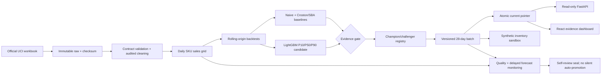
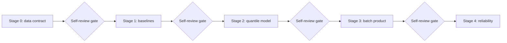

# DemandCast — Cursor + Codex Implementation Blueprint

> Status: architecture approved; active under career-system GOAL_DELIVERY mode
> Audience: Phạm Hoàng Hải (Mighty Raccoon), Cursor, and Codex
> Project type: individual portfolio project
> Language: English for code, documentation, commits, APIs, and public artifacts
> Default operating mode: local-first, free-first, batch forecasting, **GOAL_DELIVERY**
> Scope: Stage 0 through Stage 4, with measurable stop gates between stages
> Delivery contract: career-system `shared/SELF_REVIEW_PROTOCOL.md`

---

## 0. How to use this document

This file is the source of truth for DemandCast. Implement stages in order. A coding agent must read this entire file before modifying the DemandCast repository.

### Operating mode override (normative)

The career system default is **GOAL_DELIVERY**. The human states a goal and checks the final result. Wherever this blueprint says “STOP awaiting human approval,” “wait for human approval,” “ask before push,” or shows a human/self-review gate between stages, the agent MUST run the delivery loop in `shared/SELF_REVIEW_PROTOCOL.md` (vendored after bootstrap): execute → verify → audit → evidence → self-review → seal → ship. Continue across stages when the goal is end-to-end. Commit, push, and deploy as needed. Only catastrophic hard stops require a goal that names them.

The project deliberately separates:

1. a reproducible forecasting benchmark;
2. a batch forecast product;
3. an explicitly synthetic inventory decision sandbox; and
4. optional senior-level reliability upgrades that are justified by measured triggers.

The word **demand** in the product name is shorthand. The dataset records invoice transactions, not payment status, inventory availability, or lost sales. Therefore, the modeled target is **observed non-cancelled, positive-quantity invoiced units**, used as a proxy for demand. Public claims, UI copy, charts, and documentation must preserve that distinction.

### Non-negotiable agent rules

- Do not change the dataset, target grain, forecast horizon, or primary metrics unless the goal explicitly renames those locked fields.
- Seal each stage before entering the next; continue automatically when the goal is multi-stage delivery.
- Do not add cloud services, paid APIs, distributed infrastructure, a feature store, Kubernetes, or a deep model unless the relevant evidence gate in this document is met and sealed (and paid spend stays within program rules).
- Do not expose customer-level or invoice-level data in the API, dashboard, screenshots, logs, or portfolio.
- Do not call inventory outputs “production recommendations.” They are synthetic scenario outputs.
- Do not fabricate experiment results, latency numbers, uptime, model wins, costs, screenshots, or business impact.
- Do not optimize on the final lockbox folds.
- Commit, push, deploy, and publish when required to finish the stated goal; do not ask for separate push permission. Catastrophic hard stops in `SELF_REVIEW_PROTOCOL.md` still apply.
- Keep raw data immutable. A cleaning bug is fixed by creating a new processed dataset version, never by editing raw files.
- If the current repository conflicts with this blueprint, resolve within blueprint constraints when possible; otherwise stop with an exact conflict report in the final handoff.

---

## 1. Product thesis

DemandCast demonstrates that an AI/ML engineer can turn a messy transactional dataset into a trustworthy, reproducible, probabilistic forecast system without pretending that a portfolio demo has production scale.

### Core user story

> As a retail planning analyst, I want a reproducible 28-day SKU-level sales forecast with uncertainty intervals, so I can inspect likely demand, compare forecast versions, and explore clearly labeled hypothetical inventory policies.

### Hiring signals

DemandCast should provide evidence of:

- precise problem framing and honest limitations;
- deterministic data engineering and data contracts;
- leakage-safe time-series evaluation;
- strong classical and intermittent-demand baselines;
- global gradient-boosted quantile forecasting;
- model lineage and champion/challenger governance;
- batch inference, versioned publication, and rollback;
- API and dashboard productization;
- monitoring, SLO design, failure drills, and runbooks;
- security, privacy, licensing, and reproducibility discipline.

### Deliberate non-goals

- Real-time per-request model inference.
- A claim to forecast latent demand under stockouts.
- Real inventory optimization using the UCI dataset.
- Customer prediction, customer segmentation, or personalized pricing.
- Price elasticity, promotion uplift, causal inference, or supply-chain lead-time prediction.
- A generic “AutoML” platform.
- A microservice fleet.
- A deep neural network included only for visual appeal.
- A production availability claim based on a local demo.

### System flow





---

## 2. Locked dataset and license

### Required source

Use only the official **UCI Online Retail II** dataset:

- UCI record: https://archive.ics.uci.edu/dataset/502/online+retail+ii
- DOI: https://doi.org/10.24432/C5CG6D
- Dataset citation: Chen, D. (2012). *Online Retail II* [Dataset]. UCI Machine Learning Repository.
- License: Creative Commons Attribution 4.0 International
- License text: https://creativecommons.org/licenses/by/4.0/

The UCI record describes 1,067,371 transactions for a UK-based non-store retailer from 2009-12-01 through 2011-12-09. The source workbook is `online_retail_II.xlsx`.

### Dataset policy

- The repository must not contain the 43+ MB source workbook.
- `scripts/download_data.py` or an equivalent documented command must fetch from the official UCI source.
- If automated downloading is not stable, the script may instruct the user to place the official workbook at `data/raw/online_retail_II.xlsx`; it must not silently use a mirror.
- Store the source URL, retrieval timestamp, byte size, SHA-256 checksum,
  source-terminal date, `data_complete_through`, `last_complete_date`, the
  conservative-boundary reason, reviewer/status, and manifest schema version
  in `data/manifests/raw_dataset.json`. A dataset snapshot is invalid when its
  completeness watermark is absent or later than its reviewed source boundary.
- Preserve the workbook unchanged under `data/raw/`, which is ignored by Git.
- Include attribution in `README.md`, `DATA_CARD.md`, and `NOTICE`.
- Any tiny test fixture derived from the source must be transformed or synthetic and contain no `CustomerID`. Document its origin.
- Do not silently replace Online Retail II with the similarly named one-year Online Retail dataset.

### Expected source fields

Normalize sheet-specific aliases into this canonical raw contract:

| Canonical field | Accepted source aliases | Type after parsing | Required for modeling |
|---|---|---:|---:|
| `invoice_no` | `Invoice`, `InvoiceNo` | string | yes |
| `stock_code` | `StockCode` | string | yes |
| `description` | `Description` | nullable string | no |
| `quantity` | `Quantity` | signed integer | yes |
| `invoice_ts` | `InvoiceDate` | timestamp | yes |
| `unit_price_gbp` | `Price`, `UnitPrice` | non-negative numeric where valid | yes |
| `customer_id` | `Customer ID`, `CustomerID` | nullable string | no; drop before aggregate publication |
| `country` | `Country` | nullable string | no |
| `source_sheet` | generated | string | lineage only |
| `source_row_number` | generated | integer | lineage only |

Treat `invoice_no`, `stock_code`, and `customer_id` as identifiers, never numbers. Preserve leading zeros and mixed alphanumeric values.

---

## 3. Locked forecasting problem

### Unit of observation

The modeling table has exactly one row per:

```text
(calendar_date, stock_code)
```

The target is:

```text
observed_units = sum(quantity)
```

over valid, non-cancelled, positive-quantity invoice lines for that SKU and calendar day.

### Time semantics

- Treat source timestamps as retailer-local naive timestamps because the source provides no authoritative timezone.
- Derive `calendar_date` from the parsed source timestamp without converting timezone.
- Record this assumption in the data card.
- Define `data_complete_through` in every dataset snapshot. An origin `t` means
  the batch starts only after retailer-local day `t` has closed and the input
  watermark proves all accepted files/partitions through `t` were ingested and
  validated. Features may use `calendar_date <= t` only when
  `t <= data_complete_through`; otherwise move the origin back to the watermark.
- The static UCI source does not prove that its terminal calendar day is
  complete. V1 therefore sets `last_complete_date = max(clean_date) - 1 day`
  unless primary-source evidence and a human-reviewed manifest prove a
  different boundary. Replay claims mean “available after the recorded day
  close,” not that a live retailer would have received every row at that time.
- Build a complete daily grid for every eligible SKU within each fold. Missing SKU-days become `observed_units = 0`.
- Do not fill days before a SKU’s first observed valid sale.

### Forecast contract

At an origin date `t`, generate forecasts for each eligible SKU for:

```text
t + 1 through t + 28 calendar days
```

Required quantiles:

```text
P10, P50, P90
```

The P50 point forecast is the primary point prediction. Output units are non-negative item units per SKU-day.

### Eligible SKU universe

Eligibility is recalculated independently at every forecast origin using only data available on or before that origin.

A SKU is eligible when:

- it passes the merchandise eligibility rules in Section 4;
- its first valid sale date is at least 56 calendar days before the origin; and
- it has at least one positive sale in the trailing 90 calendar days ending at the origin.

Do not use future sales to decide whether a SKU is active. Publish counts and excluded-reason counts for every origin. Cold-start SKUs outside this contract are a documented limitation, not silently backfilled.

### Why batch, not online inference

The use case produces a complete daily forecast set on a schedule. The API reads immutable, precomputed forecast artifacts. Training or model prediction must not run in a request handler.

---

## 4. Cleaning, cancellations, and returns

Cleaning must be deterministic, configured, tested, and summarized in a machine-readable quality report.

### 4.1 Line classification

Normalize strings with Unicode-safe trimming. Invoice cancellation detection is case-insensitive.

Classify every source line into exactly one of these categories:

1. `valid_sale`
   - `invoice_no` is present and does not begin with `C`;
   - `stock_code` is present;
   - `invoice_ts` parses;
   - `quantity > 0`;
   - `unit_price_gbp > 0`; and
   - the SKU is not in the versioned non-merchandise exclusion list.

2. `return_or_cancellation`
   - `invoice_no` begins with `C`, or `quantity < 0`.
   - Preserve it in a separate aggregate quality ledger.
   - Never subtract it from the forecasting target.

3. `invalid_or_adjustment`
   - zero quantity;
   - missing key fields;
   - non-positive price on a non-return line;
   - unparseable timestamp;
   - known non-merchandise/admin code; or
   - contradictory signals that cannot be resolved safely.

The precedence is `return_or_cancellation` before `valid_sale`. A positive quantity on a cancellation invoice and a negative quantity on a normal invoice are both flagged as contradictory and retained only in the return/quality ledger.

### 4.2 Returns policy

Returns and cancellations are not negative future demand. They are:

- excluded from `observed_units`;
- aggregated separately by date and SKU as `returned_units_abs`;
- reported as a return/cancellation rate;
- available only in internal aggregate analysis; and
- never joined as a feature if the timestamp would not have been known at the forecast origin.

A later project version may model returns separately, but that is outside this blueprint.

### 4.3 Non-merchandise items

Create `config/non_merchandise_stock_codes.yml`. Its initial content must be derived through a documented audit and reviewed by a human. Typical source codes may represent postage, manual adjustments, discounts, bank charges, platform fees, or charity rather than merchandise.

Rules:

- Exclusions must be explicit stock codes or exact normalized descriptions, never a broad undocumented regex.
- Each exclusion needs `reason`, `evidence`, and `added_at`.
- The data-quality report must show excluded rows and units per rule.
- Changing this file creates a new processed dataset version and invalidates downstream features.

### 4.4 Duplicates

- Preserve every raw row with a stable `raw_row_id`.
- Compute an exact-duplicate fingerprint over only these normalized business fields: `invoice_no`, `stock_code`, `description`, `quantity`, `invoice_ts`, `unit_price_gbp`, `customer_id`, and `country`.
- Exclude `source_sheet`, `source_row_number`, `raw_row_id`, `ingested_at`, source hashes, and every other lineage/generated field from that fingerprint.
- Flag rows with the same business-field fingerprint as exact duplicates while preserving every raw row and its lineage.
- Exclude exact duplicates from the default modeling table, but retain them in an audit artifact.
- Run and record a sensitivity comparison with duplicates retained at Stage 1.
- Do not deduplicate merely on invoice number, SKU, quantity, and timestamp; separate legitimate invoice lines can share those values.

### 4.5 Outliers

- Do not cap or remove target quantities by default.
- Report extreme quantities by robust percentile and top-N tables.
- If an outlier rule is later proposed, preregister it, compare results with and without it, and obtain human approval.
- Never winsorize evaluation targets.

### 4.6 Customer and geography

- `customer_id` may be missing and is not needed for SKU-day demand.
- Drop `customer_id` before producing the daily modeling table.
- Do not expose invoice numbers.
- The default target aggregates valid sales across all countries because the project forecasts retailer-wide SKU sales.
- Country-specific models are out of scope.

### 4.7 Data-quality invariants

The pipeline must fail closed when:

- a required canonical column is absent;
- timestamp parse failures exceed 0.1%;
- a supposedly valid sale has `quantity <= 0` or `unit_price_gbp <= 0`;
- duplicate `calendar_date, stock_code` rows remain after daily aggregation;
- any published `observed_units` is negative;
- the dataset date range unexpectedly changes without a new manifest approval; or
- the processed schema version does not match the feature builder.

Warnings, not immediate failures, include material row-count changes, a new country, a new exclusion candidate, or a return-rate shift. Thresholds belong in version-controlled configuration.

---

## 5. Leakage-safe backtesting

### 5.1 Fold design

Use expanding-window rolling-origin evaluation:

- minimum training history: 365 calendar days;
- forecast horizon: 28 calendar days;
- step between origins: 28 calendar days;
- total evaluation origins: the latest 8 valid origins supported by the dataset;
- development origins: first 6 of those 8;
- final lockbox origins: last 2 of those 8.

Generate exact dates from the cleaned dataset and persist them in:

```text
data/manifests/backtest_v1.json
```

The last valid origin is `last_complete_date - 28 days`, where
`last_complete_date` comes from the approved completeness watermark. Never
hand-adjust the watermark or origins after viewing outcomes.

### 5.2 Lockbox policy

- Use only the six development folds for feature selection, baseline selection, hyperparameter tuning, and promotion-threshold design.
- Freeze model code, feature schema, hyperparameters, seeds, post-processing, and promotion rules before running the two lockbox folds.
- This is a **procedural evaluation lockbox**, not a cryptographically blind external test: the official workbook contains the dates. Agents and reports must not claim that the underlying rows were secret. The protection is the split-aware runner, clean frozen source, approval receipt, and consumption ledger.
- Human-authored exclusions and every target-affecting cleaning decision must be frozen without inspecting lockbox forecast errors or row-level target outcomes. Schema/checksum validation may scan the complete workbook, but lockbox-period target exploration is prohibited.
- The Stage 2A lockbox-authorizing manifest resolves to a clean source commit
  and records the source-tree hash, dependency-lock hash,
  environment/container hash, blueprint hash, dataset version,
  `backtest_v1` protocol hash and exact two origin dates, data/config hashes,
  both baseline-role/publisher-spec hashes, served post-processing, numeric
  rules, exact command hash, authoritative-evaluation-clone ID, and canonical
  future ledger path
  `evidence/demandcast-stage-2b/lockbox-consumption.yaml`. Its immutable
  authorization record has state `UNUSED`.
- Immediately before any lockbox outcome is read, take an exclusive OS ledger
  lock in the recorded authoritative clone, verify the immutable `UNUSED`
  authorization and absence of the future ledger, then create the canonical
  ledger with `O_CREAT|O_EXCL` directly in state `STARTED`. Fsync the file and
  parent directory and reread/hash it before opening actuals. Subsequent state
  writes use a sibling temporary file, fsync, atomic rename, and parent fsync.
  `STARTED`, `SUCCEEDED`, and `FAILED` all mean consumed.
- The ledger schema records `schema_version`, ledger/consumption IDs, state,
  purpose, dataset version, protocol ID/hash, exact origins, approved-manifest
  path/hash, Stage 2A receipt path/hash, clean source/tree/dependency/environment
  hashes, frozen publisher/baseline/config hashes, clone/host identity,
  transition timestamps, result-manifest path/hash when terminal, and sanitized
  error/partial-artifact hashes on failure. Any mismatch fails before actuals.
- On success, transition `STARTED` to `SUCCEEDED`. On any exception, signal, timeout, or partial result, preserve all partial artifacts and transition to `FAILED` where possible. Never automatically retry a consumed protocol.
- A new protocol name or version never makes opened dates fresh. Once an origin is `STARTED`, it can only be development evidence for later work. A new lockbox requires genuinely unseen dates; if none exist, the changed candidate is development-only.
- Stage 2B creates a separate result manifest that hashes the final ledger and
  every result. `packet.yaml` includes both as hashed artifacts, and the Stage
  2B receipt accepts that result manifest—not the Stage 2A packet—as its
  subject. V1 is a single-authoritative-clone procedural control; the final
  committed ledger informs future clones, but no distributed-lock claim is made.

### 5.3 Feature cutoff

For a forecast origin `t`, every target-derived feature must be computed from rows with:

```text
calendar_date <= t
```

Known future calendar fields for target dates are allowed. Future sales, returns, prices, aggregate statistics, and SKU activity are not.

For each outer evaluation or publication origin `t`, construct a separate direct multi-horizon training table. Historical origins are weekly and anchored to `t`:

```text
latest_historical_origin = t - 28 calendar days
historical_origins = latest_historical_origin - 7*k
where k = 0, 1, 2, ... and historical_origin >= latest_historical_origin - 364 days
```

For every such historical origin, recalculate SKU eligibility using only data available then and create one row per:

```text
(historical_origin, stock_code, horizon_day)
```

where `horizon_day` is 1 through 28, features are anchored to the historical origin, and the target date is `historical_origin + horizon_day`. Every training target must satisfy `target_date <= t`; the `t - 28` latest-origin rule enforces this. The trailing training-origin window is at most 365 calendar days.

Fit a fresh model from this table for every outer fold/origin. The second lockbox origin may use observations that were historically available by that origin, including the first lockbox horizon, but it uses the same frozen model specification and no decision is changed between origins. Do not recursively insert actual values from inside an origin’s own evaluation horizon.

### 5.4 Required leakage tests

- Perturb all observations after an origin and assert that features at that origin are byte-identical.
- On a synthetic fixture, perturb would-be lockbox outcomes and assert that the eligible SKU set and predictions created at each origin do not change. Pre-lockbox tests must not read official lockbox target rows.
- Assert rolling windows are shifted before aggregation.
- Assert SKU activity and target encodings are origin-bounded.
- Assert scalers or encoders, if any, fit only on the relevant training partition.
- Assert no evaluation date appears in the training target rows for that fold.
- Assert the historical-origin calendar is weekly, spans no more than 365 days, ends at `outer_origin - 28`, and produces only targets on or before the outer origin.
- Assert every fitted artifact records `training_cutoff == outer_origin` and cannot be reused for an earlier origin.

---

## 6. Baseline ladder

Implement and evaluate every baseline before LightGBM.

### Required baselines

1. **Zero forecast**
   - Predict 0 for every SKU-day.
   - Important for a zero-heavy intermittent task.

2. **Last observed day**
   - Repeat the most recently observed daily units as of the origin.

3. **Seasonal naive, period 7**
   - For each target weekday, use the most recent observation of the same weekday that is on or before the origin.
   - Never use an actual observation from inside the forecast horizon.

4. **Trailing 28-day mean**
   - Constant forecast equal to mean daily units over the last 28 days ending at the origin.

5. **Recent weekday mean**
   - For each forecast weekday, average the last eight available observations of that weekday at or before the origin.

6. **Croston**
   - Use smoothing parameter `alpha = 0.10`; do not tune it.
   - Let daily history be indexed from 1. Initialize demand size `z` to the first non-zero size and interval `p` to the 1-based index of that first non-zero observation. This makes leading zero days part of the first inter-demand interval.
   - At each later non-zero demand, update `z = alpha*x + (1-alpha)*z` and `p = alpha*q + (1-alpha)*p`, where `q` is the interval since the prior non-zero demand.
   - Forecast the constant daily rate `z / p`.
   - An all-zero history forecasts zero.
   - A history with exactly one non-zero event uses the initialized `z / p` without a later update.

7. **Syntetos–Boylan Approximation (SBA)**
   - Use the same Croston state and fixed `alpha = 0.10`.
   - Forecast the constant daily rate `(1 - alpha/2) * z / p`.
   - An all-zero history forecasts zero.

8. **Recent-weekday empirical quantiles**
   - For each target weekday, take the last eight observations of that weekday available on or before the origin.
   - Compute raw P10, P50, and P90 with the pinned NumPy `linear` quantile method.
   - If fewer than four same-weekday observations exist, use the last 28 daily observations; if no eligible history exists, return zero for all three quantiles.
   - Clip to non-negative values and assert raw P10 <= P50 <= raw P90.
   - Preregister exactly four development-only interval-scale candidates: `0.75`, `1.00`, `1.25`, and `1.50`.
   - For scale `s`, preserve P50 and calculate served bounds:

     ```text
     served_p10 = max(0, p50 - s * (p50 - raw_p10))
     served_p90 = p50 + s * (raw_p90 - p50)
     ```

   - Evaluate all four scales on the same six development folds. A scale is eligible only when the pooled P10–P90 coverage defined in Section 8.5 is between 72% and 88% inclusive.
   - Among eligible scales, select the one with coverage closest to 80%; break ties by lower mean P10/P50/P90 pinball loss, then narrower mean interval width, then smaller scale. Freeze the result before Stage 2B.
   - If no scale is eligible, freeze the empirical P50 as point-capable evidence with `interval_status=unavailable_development_coverage`; served P10/P90 are null and must not be described as uncertainty bounds.
   - This is a transparent empirical fallback, not a calibrated guarantee. The selected scale is a bounded development-only adjustment and its lockbox coverage remains final evidence.

Croston and SBA may be implemented locally with hand-verified tests or through a pinned open-source library whose behavior matches the initialization above. A library choice must be documented and version locked. They produce point forecasts; they are not allowed to invent uncertainty intervals.

Required hand-calculated fixture:

```text
history = [0, 2, 0, 0, 4], alpha = 0.10
initial z = 2
initial p = 2
second non-zero interval q = 3
updated z = 0.10*4 + 0.90*2 = 2.2
updated p = 0.10*3 + 0.90*2 = 2.1
Croston = 2.2 / 2.1 = 1.047619...
SBA = (1 - 0.10/2) * 2.2 / 2.1 = 0.995238...
```

### Baseline champions

Choose and freeze two roles before candidate comparison:

- **point baseline champion:** lowest pooled development P50 WAPE across every
  point-capable baseline. Values within `1e-12` are ties; break them by lower
  worst-fold WAPE, then lower population standard deviation of the six fold
  WAPEs, then lower absolute pooled bias, then the fixed baseline order in
  Section 6.
- **interval fallback candidate:** the recent-weekday empirical P50 plus its
  preregistered selected interval scale when one passes the development
  coverage gate. It remains eligible only when its pooled P50 WAPE is no more
  than 2% worse than the point baseline champion and no individual fold is more
  than 5% worse. Record the point guardrail, `interval_status`, pinball loss,
  coverage, and width.

The two roles may differ. Stage 2B always final-evaluates the point champion and
the frozen interval candidate, whether or not LightGBM passed development. If
LightGBM is rejected, Stage 3 uses the interval candidate only when it passed
the development point guardrail and its final lockbox interval gate. If either
condition fails, Stage 3 publishes the frozen point baseline champion with null
P10/P90 and `interval_status=unavailable_publisher_point_only`. Croston and SBA
point outputs are never relabeled as uncertainty intervals.

For like-for-like model selection, retain the interval candidate's internal
empirical quantile rows even when its public interval status is unavailable.
Use the development-selected scale when one exists; otherwise use the
preregistered raw `s=1.00` rows strictly as an internal empirical-quantile
benchmark. This does not make unavailable bounds publishable: public P10/P90
remain null unless the interval gates pass.

`interval_status` is one of:

```text
available_dev_selected
unavailable_development_coverage
unavailable_lockbox_coverage
unavailable_publisher_point_only
```

Any `p90` inventory scenario requires `interval_status=available_dev_selected` and non-null P90. Otherwise it is rejected; P50 scenarios remain allowed and retain the synthetic warning.

Regardless of publisher family, the finally approved publisher exposes P10/P90
only when its interval method was frozen from development and pooled final
lockbox coverage is between 65% and 95% inclusive. If no development interval
candidate qualifies or final lockbox coverage falls outside that range, the
served publisher becomes the frozen point champion, with null P10/P90 and the
matching unavailable status. The stricter LightGBM promotion coverage gate in
Section 7 still applies.

---

## 7. LightGBM quantile candidate

### Model form

The default learned candidate is a global, direct, multi-horizon LightGBM model:

- one model for each quantile: alpha 0.10, 0.50, and 0.90;
- `objective=quantile`;
- one shared training table across eligible SKUs;
- `horizon_day` is an explicit feature;
- deterministic seeds and pinned package versions;
- CPU-first training.

Official LightGBM documentation:

- https://lightgbm.readthedocs.io/en/stable/Parameters.html
- https://lightgbm.readthedocs.io/en/stable/Parameters-Tuning.html

### Allowed v1 features

All target-derived features are as of the origin:

- lags: 1, 7, 14, 28, and 56 days;
- rolling mean and standard deviation: 7, 14, 28, and 56 days;
- rolling non-zero day count: 28, 56, and 90 days;
- rolling sum: 7, 28, and 56 days;
- days since last non-zero sale;
- age in days since first valid sale;
- average inter-demand interval using history only;
- trailing zero proportion;
- stock code as a categorical feature;
- horizon day;
- target-date day of week, day of month, ISO week, month, and weekend flag;
- origin month and origin day of week.

Do not include:

- future price or promotion fields;
- customer information;
- full free-text descriptions;
- target encodings computed outside a fold;
- return information that occurs after the origin;
- features selected after inspecting lockbox outcomes.

### Training and tuning budget

- Start with documented conservative defaults.
- Limit tuning to a small, reproducible search on development folds.
- Evaluate exactly 3 preregistered shared hyperparameter configurations.
- Each configuration is freshly fit for P10, P50, and P90 on each of the 6 development folds: `3 configurations × 6 folds × 3 quantiles = 54 fitted development models`.
- Count every fitted model in the run ledger, including failed fits. Reusing one later-trained model across earlier folds is forbidden.
- Stage 2B may fit at most 6 fresh LightGBM models: `2 lockbox origins × 3 quantiles`. It fits each lockbox origin from the frozen model specification and that origin’s cutoff-safe training table. Count attempted and failed fits in this cap and in the run ledger; baselines do not count as fitted LightGBM models.
- Any later Stage 3 forward forecast refit is a separately identified production-like batch fit and is not retroactively added to the Stage 2 evaluation budget.
- Select one shared configuration by the mean of P10, P50, and P90 pinball losses aggregated across all development folds. Use raw unit loss because all candidates share identical observations.
- Use WAPE and bias as safety diagnostics during selection, never as a post-hoc reason to inspect more configurations.
- Log search space, seeds, run duration, and hardware.
- A larger search requires human approval and evidence that variance, not data quality, is the bottleneck.

### Quantile post-processing

LightGBM quantile models can cross.

- Record the raw quantile crossing rate.
- Serve non-crossing quantiles by sorting each triplet into P10 <= P50 <= P90.
- Record the correction rate and evaluate all promotion metrics on the served, sorted-and-clipped outputs.
- Clip negative outputs to zero and record the clipping rate.
- A high correction or clipping rate is a model-quality warning, not something to hide.
- Report raw-model diagnostics separately, but never substitute raw metrics for served-output gates.
- No post-hoc LightGBM interval calibration is allowed in v1. A future calibration method requires a new preregistered development protocol and cannot reuse an opened lockbox as fresh evidence.

### Candidate promotion gate

The LightGBM candidate may replace both frozen baseline roles as the publishing champion only when all are true on development folds:

- aggregate P50 WAPE, computed once over the concatenated SKU-day observations from all six development folds, improves by at least 5% relative to the frozen point baseline champion;
- mean P10/P50/P90 pinball loss improves by at least 3% relative to the frozen empirical-quantile benchmark on identical development observations;
- no more than one development fold is worse than the baseline by over 2% relative WAPE;
- absolute aggregate bias is no greater than 10%, and its absolute value is no more than 2 percentage points worse than the baseline’s absolute aggregate bias;
- served P10/P90 empirical coverage is between 72% and 88% inclusive, with no post-hoc calibration;
- quantiles are finite, non-negative after documented post-processing, and ordered;
- all leakage and reproducibility tests pass;
- the complete six-fold candidate evaluation finishes within 120 minutes and peak resident memory stays within 12 GiB on the recorded reference machine; and
- lockbox protocol, code, configuration, and model are frozen.

After development selection, stop for human review and the Section 11.1 checkpoint/finalization protocol. The lockbox-authorizing frozen manifest must contain a clean source commit, exact source-tree hash, dependency-lock hash, environment/container hash, blueprint hash, data/protocol/config hashes, weekly training-origin contract, feature schema, frozen model specification, both baseline-role hashes, fallback interval-scale decision, development decision, served post-processing, promotion rules, and exact command hash. A dirty-tree candidate manifest is not lockbox-authorizing. A separate Stage 2B action may run the lockbox only when the user explicitly approves the exact clean manifest hash. Stage 2B always evaluates the frozen publisher and both baselines. When LightGBM failed development, it is excluded from lockbox promotion and cannot be revived by the result.

The candidate is publishable as champion only if, over the concatenated observations from both lockbox folds:

- P50 WAPE is strictly lower than the frozen point baseline champion;
- mean P10/P50/P90 pinball loss is strictly lower than the frozen empirical-quantile benchmark;
- in each lockbox fold separately, relative P50 WAPE is no more than 2% worse than the frozen point baseline;
- in each lockbox fold separately, mean quantile pinball loss is no more than 2% worse than the frozen empirical-quantile benchmark;
- absolute aggregate bias is no greater than 10%;
- P10/P90 empirical coverage is between 70% and 90%;
- no prediction is missing or non-finite;
- post-processed quantiles are non-negative and ordered;
- every lockbox fold contains the expected eligible-SKU count and row count; and
- no leakage, contract, reproducibility, or artifact-integrity test fails.

Relative improvement is `(baseline_metric - candidate_metric) /
baseline_metric`. For a positive-required improvement gate, `baseline_metric=0`
means the gate cannot be passed; a perfect baseline cannot be improved by the
required positive percentage. For a non-inferiority/worse-by-at-most gate,
`baseline_metric=0` requires `candidate_metric=0`. Never divide by zero or reuse
one rule for both gate types. Candidate and baseline comparisons use identical
observations and served outputs.

Any candidate failure keeps the point baseline as the point benchmark and
evaluates the frozen interval candidate without reviving LightGBM. Do not alter
a candidate and rerun against the same lockbox under another protocol name.

For the frozen interval fallback candidate, Stage 2B reports lockbox WAPE, bias,
pinball, coverage, width, and contract integrity. It is interval-capable only
when it already passed the development point guardrail, rows are complete,
finite, non-negative, ordered and lineage-resolvable, leakage tests remain
green, and pooled lockbox coverage is between 65% and 95% inclusive. Otherwise
Stage 3 switches to the frozen point baseline champion, sets P10/P90 null with
the applicable unavailable status, rejects P90 inventory scenarios, and reports
the limitation. No lockbox result triggers post-lockbox tuning.

---

## 8. Metrics and reporting

No single metric is sufficient for intermittent SKU demand.

### 8.1 WAPE — primary point metric

For a set of observations:

```text
WAPE = sum(abs(y - y_hat)) / sum(abs(y))
```

- Use P50 as `y_hat`.
- Compute only where the aggregate denominator is non-zero.
- Report overall, by fold, by horizon bucket (1–7, 8–14, 15–28), and by demand-volume segment.
- Never average per-row percentage errors.

### 8.2 MASE

Use a weekly seasonal scaling term calculated from the training history:

```text
scale = mean(abs(y_t - y_(t-7)))
MASE = mean(abs(y - y_hat)) / scale
```

- Calculate per SKU-fold.
- Exclude undefined zero-scale series from the aggregate MASE.
- Report the percentage of eligible SKU-folds with a defined scale.
- Report macro mean and median, not only a volume-weighted number.

The metric was proposed in Hyndman and Koehler, “Another look at measures of forecast accuracy”:
https://doi.org/10.1016/j.ijforecast.2006.03.001

### 8.3 Bias

```text
bias = sum(y_hat - y) / sum(abs(y))
```

Positive values mean overforecasting. Report the same slices as WAPE.

### 8.4 Pinball loss

For quantile `q` and residual `e = y - y_hat_q`:

```text
pinball_q = mean(max(q * e, (q - 1) * e))
```

Report raw unit loss at P10, P50, and P90 and their mean. If a normalized version is shown, label its denominator explicitly.

For promotion, `pinball_q` is the arithmetic mean across all concatenated
eligible SKU-day rows in the named fold set. “Mean P10/P50/P90 pinball” is the
unweighted arithmetic mean of those three pooled quantile losses. Fold means
are diagnostics only unless a gate explicitly says “in each fold.”

### 8.5 Interval diagnostics

- P10–P90 empirical coverage; nominal target is 80%.
- Mean and median interval width.
- Coverage by horizon bucket and volume segment.
- Raw quantile crossing rate.
- Quantile correction rate.
- Negative prediction clipping rate.

For any named fold set, pooled coverage is exactly:

```text
coverage = sum(1[p10_units <= observed_units <= p90_units]) / N
```

Bounds are inclusive, including `p10_units = observed_units = 0`. `N` is every
expected eligible SKU-day row concatenated across the named folds after served
post-processing. Missing/null/non-finite bounds make an interval-capable gate
fail rather than reducing `N`. Coverage is also reported per fold and slice,
but those values are not averaged to form the pooled gate.

### 8.6 Required report slices

- overall;
- each origin;
- horizons 1–7, 8–14, and 15–28;
- intermittency segment computed independently for each SKU-fold from its origin-bounded training history: `dense` for zero proportion `< 0.50`, `intermittent` for `0.50 <= zero proportion < 0.80`, `highly_intermittent` for `0.80 <= zero proportion < 0.95`, and `extreme` for `zero proportion >= 0.95`;
- volume quartile determined from training history only;
- top 20 SKUs by training volume, clearly labeled as a diagnostic rather than the aggregate result.

Every report includes sample counts and denominators.

---

## 9. Optional deep-model evidence gate

A deep forecasting model is not part of the default implementation.

It may be proposed only after Stages 0–3 are complete and all of the following are true:

- the baseline and LightGBM pipelines are reproducible and fully evaluated;
- error analysis identifies a concrete pattern that a sequence model could plausibly address;
- there are at least 500 eligible series across most development folds and at least one year of usable history;
- the experiment hypothesis, architecture, compute budget, and success criterion are preregistered;
- expected local or free-tier compute is no more than two GPU-hours or an explicitly approved alternative;
- the deep model reuses the exact same folds, eligible universe, metrics, and lockbox rules; and
- the human approves the experiment before code is added.

Once the original two lockbox folds have been opened for LightGBM, they are no longer untouched evidence for a later deep-model choice. A deep-model proposal must define a new, honest evaluation protocol with genuinely unseen later data, or be labeled development-only. It must not reuse opened outcomes while calling them a lockbox.

Suggested preregistered success criterion:

- at least 3% relative improvement over LightGBM in mean quantile loss on development folds;
- no material regression in WAPE or bias;
- inference and artifact cost no more than 2x LightGBM unless a measured gain justifies it.

If the gate fails, document the result and stop. Do not add a Transformer, TFT, N-BEATS, N-HiTS, or another deep model for résumé keywords.

---

## 10. Synthetic inventory decision sandbox

The source dataset contains no authoritative:

- on-hand inventory;
- stockout flags;
- lost sales;
- supplier lead times;
- purchase orders;
- service-level targets;
- holding costs; or
- stockout costs.

Therefore, inventory logic is a required Stage 3 simulation layer, but it is never presented as a real retailer decision system. Its purpose is to demonstrate a bounded, auditable human-in-the-loop workflow using synthetic assumptions.

### Required labeling

Every related API response, dashboard page, export, screenshot, and case-study section must display:

```text
SYNTHETIC SCENARIO — NOT AN OPERATIONAL RECOMMENDATION
```

### Versioned scenario inputs

Store assumptions in `config/inventory_scenarios.synthetic.yml`, including:

- scenario ID and version;
- deterministic random seed;
- non-negative integer initial on-hand units;
- dated scheduled receipts as `{receipt_id, arrival_day, units}` records, where `receipt_id` is unique within a SKU scenario, `arrival_day` is an integer from 1 through 28, and `units` is a non-negative integer;
- positive integer review period in days;
- non-negative fixed integer synthetic lead time in days;
- planning quantile, restricted to `p50` or `p90`;
- non-negative holding cost per unit-day;
- non-negative shortage penalty per unit; and
- integer order-pack size, minimum order, and maximum order constraints.

Scenario defaults must be visibly arbitrary examples, not implied retailer facts.

`review_period_days >= 1`, `lead_time_days >= 0`, and their sum must be at most
28 so the proposed order arrival at `lead_time_days + 1` and the complete
protection window remain inside the forecast contract. `order_pack_size >= 1`;
`minimum_order_units >= 0`; `maximum_order_units >= order_pack_size`;
`minimum_order_units <= maximum_order_units`; and both minimum and maximum must
be exact multiples of the pack size. Stage 3 rejects rather than silently
rounds invalid assumptions. A `p90` scenario is valid only when every selected
forecast row has a non-null P90 and
`interval_status=available_dev_selected`.

Stage 3 uses a fixed lead time and lost-sales replay only. It has no backorder input or backorder mode. A lead-time distribution or backorder policy is a Stage 4-or-later extension that requires a separately approved, versioned formula and tests; it may not silently change this contract.

### Deterministic policy contract

For each SKU and scenario:

```text
protection_days = review_period_days + lead_time_days
forecast_protection_units =
    sum(selected daily p50 or p90 for horizon days 1..protection_days)
receipts_in_protection =
    sum(receipt.units where 1 <= receipt.arrival_day <= protection_days)
inventory_position =
    initial_on_hand + receipts_in_protection
raw_order_units =
    max(0, ceil(forecast_protection_units - inventory_position))
if raw_order_units == 0:
    order_units = 0
else:
    packed_order_units =
        ceil(raw_order_units / order_pack_size) * order_pack_size
    order_units =
        min(
            max(packed_order_units, minimum_order_units),
            maximum_order_units
        )
```

This sum of marginal daily quantiles is a transparent planning heuristic, not a statistically exact quantile of cumulative demand. The UI and case study must state that limitation.

Scenario mode is derived from the forecast batch:

- `historical_replay` runs the full daily replay and produces observed replay
  metrics/costs after the applicable evidence boundary is consumed;
- `planning_only` is required for `forward_unknown`. It computes protection
  demand and proposed units only; fulfilled/shortage/on-hand replay fields,
  fill/stockout metrics, and synthetic realized costs are null with
  `replay_status=pending_actuals`. When complete actuals later exist, create a
  new immutable historical-replay result instead of mutating the planning row.

For historical replay, simulate one day at a time. Each dated scheduled receipt arrives at the start of its declared `arrival_day`; the proposed synthetic order arrives at the start of day `lead_time_days + 1`. Use held-out `observed_units` only as the replay's observed sales proxy, never as proof of unconstrained latent demand. Stage 3 uses exactly this lost-sales recurrence:

```text
available_units = opening_on_hand + arrivals
fulfilled_units = min(available_units, observed_units)
shortage_units = max(observed_units - available_units, 0)
closing_on_hand = max(available_units - observed_units, 0)
daily_holding_cost = closing_on_hand * holding_cost_per_unit_day
daily_shortage_cost = shortage_units * shortage_penalty_per_unit
```

Required replay metrics:

- unit fill rate: `1 - sum(shortage_units) / sum(observed_units)`; when observed units sum to zero, report `1.0` with `zero_demand_denominator=true`;
- stockout-day rate: days with positive shortage divided by simulated days;
- mean closing on-hand units;
- total ordered units;
- total synthetic holding cost;
- total synthetic shortage cost;
- total synthetic cost; and
- decision status: pending, accepted, adjusted, or rejected.

Report the same scenario under both exact reference policies:

- `no_order`: force `order_units=0` while retaining the same initial on-hand, dated receipts, observed replay path, cost assumptions, and lost-sales recurrence.
- `seasonal_naive_order_up_to`: for horizon day `h`, use the most recent observation of that target weekday available at the origin, equivalently `observed_units[origin_date - 6 days + ((h - 1) mod 7)]`; sum those 28 direct point forecasts over the same protection days and apply the identical receipt, pack, minimum, maximum, arrival, cost, and lost-sales formulas above.

The seasonal-naive reference is point-only and never supplies P90. These are scenario comparisons, not a model-promotion objective or evidence of real savings.

### Allowed outputs

- forecast demand over lead time;
- order-up-to level derived from a selected forecast quantile;
- simulated replenishment quantity;
- simulated inventory trajectory;
- simulated holding and shortage costs;
- human approval status.

The project may demonstrate a simple quantile-based order-up-to policy. It must not claim optimized real-world inventory or realized cost savings.

### Human control

- No scenario automatically sends an order.
- Scenario runs are immutable and auditable.
- Every action appends a new `inventory_decision_events.v1` record; no prior result or event is updated or deleted.
- Every event records `decision_event_id`, `scenario_result_id`,
  `event_version`, `prior_event_id` (nullable only for version 1), status, actor
  label, reason, and UTC timestamp.
- Every decision request supplies the exact `scenario_result_id`,
  `expected_prior_event_id`, and `expected_event_version`. In one transaction,
  compare-and-swap against the current head and insert the next event.
  `UNIQUE(scenario_result_id, event_version)` plus an equivalent current-head
  constraint prevents forks; a stale or concurrent request returns `409`.
- An `accepted` or `rejected` event has `adjusted_order_units=null`. An
  `adjusted` event provides non-negative integer `adjusted_order_units` that is
  either zero or satisfies the same pack, minimum, and maximum constraints. All
  statuses obey the same current-head CAS rule and retain the originally
  proposed units.
- An “approve” action records only a local demonstration decision.
- The dashboard must support rejecting a recommendation and adding a reason.

### Sandbox acceptance gate

The Stage 3 sandbox passes only when:

- hand-calculated unit tests reproduce every formula above;
- the same inputs and seed produce byte-equivalent result rows and the same assumptions hash;
- invalid receipt dates/IDs/units, horizons, costs, quantile availability, packs, minimum/maximum constraints, order units, event references, and states fail validation;
- forward/planning-only results keep all replay outcome and cost fields null,
  while historical results require them;
- tests prove the exact order of operations: subtract dated in-window receipts, ceil raw need, round up to a pack, apply the minimum, then cap at the maximum;
- every API, React, export, screenshot, and evidence-packet surface carries the mandatory warning;
- replay metrics include their denominators and scenario version;
- concurrent/stale accept/adjust/reject actions cannot fork the event chain;
  accepted/adjusted/rejected events retain the prior head and applicable units,
  and no event triggers an external order; and
- no public copy calls a synthetic difference a realized business impact.

There is deliberately no “best cost” acceptance threshold because every cost and inventory input is synthetic.

---

## 11. Data contracts and versioning

Use Pydantic for API/config contracts and Pandera or equivalent explicit validation for tabular contracts. Contract versions are strings such as `raw_transactions.v1`.

### Required tables

#### `raw_transactions.v1`

Canonical source fields from Section 2 plus `raw_row_id`, `ingested_at`, `source_sha256`, and classification audit fields. Immutable.

#### `clean_sales_lines.v1`

| Field | Type | Constraint |
|---|---|---|
| `raw_row_id` | string | unique |
| `invoice_no_internal` | string | internal only; never published |
| `stock_code` | string | non-empty |
| `invoice_ts` | timestamp | parsed |
| `calendar_date` | date | derived |
| `quantity` | integer | > 0 |
| `unit_price_gbp` | float | > 0 |
| `source_sha256` | string | non-empty |

#### `daily_sku_sales.v1`

| Field | Type | Constraint |
|---|---|---|
| `calendar_date` | date | unique with `stock_code` |
| `stock_code` | string | non-empty |
| `observed_units` | integer | >= 0 |
| `is_observed_sale_day` | boolean | deterministic |
| `dataset_version` | string | non-empty |

No customer or invoice identifier is allowed.

#### `feature_rows.v1`

Primary key:

```text
(origin_date, stock_code, horizon_day)
```

Include `feature_schema_version`, `dataset_version`, and an `as_of_date` equal to `origin_date`.

#### `forecast_rows.v1`

| Field | Type | Constraint |
|---|---|---|
| `forecast_id` | string | immutable batch ID |
| `generated_at` | UTC timestamp | required |
| `origin_date` | date | required |
| `target_date` | date | origin + 1..28 |
| `horizon_day` | integer | 1..28 |
| `stock_code` | string | non-empty |
| `p10_units` | nullable float | >= 0 when present |
| `p50_units` | float | >= 0 |
| `p90_units` | nullable float | >= 0 when present |
| `interval_status` | enum string | one of the Section 6 statuses |
| `batch_mode` | enum string | `historical_replay` or `forward_unknown` |
| `publisher_kind` | enum string | `learned_model` or `deterministic_rule` |
| `publisher_name` | string | approved LightGBM or baseline rule name |
| `publisher_spec_version` | string | frozen model/rule and post-processing specification |
| `publisher_artifact_version` | string | immutable publisher-manifest version |
| `model_name` | nullable string | required only for `learned_model` |
| `model_version` | nullable string | required only for `learned_model` |
| `model_spec_version` | nullable string | frozen learned-model feature/hyperparameter specification |
| `model_artifact_version` | nullable string | fitted binary version for `learned_model`; null for deterministic rules |
| `trained_through` | date | maximum observed target used for fit/rule history; <= origin |
| `training_cutoff` | date | declared outer-origin training boundary; <= origin |
| `dataset_version` | string | required |
| `feature_schema_version` | string | required |
| `run_id` | string | required |
| `is_synthetic_inventory_input` | boolean | false for forecast itself |

When `interval_status=available_dev_selected`, both bounds are non-null and satisfy `p10_units <= p50_units <= p90_units`. For every unavailable status, both bounds must be null. Mixed nullability is invalid.

`historical_replay` means the 28 target dates already exist in the immutable dataset and may be used for clearly labeled replay/evaluation after the applicable evidence boundary is consumed. `forward_unknown` means target outcomes were unknown at generation time; accuracy and realized-cost fields must be absent or pending. The two modes must never be combined in one forecast batch.

#### `publisher_manifest.v1`, learned-model manifests, and forecast manifests

Every approved publisher has an immutable `publisher_manifest.v1` containing:

- `publisher_kind`, name, `publisher_spec_version`, and
  `publisher_artifact_version`;
- rule/model configuration, served interval decision and post-processing hashes;
- source commit/tree, dependency lock, environment, dataset, feature, and
  training-origin manifest hashes;
- `training_cutoff`, `trained_through`, exact materialization command hash,
  output hashes, and creation time; and
- for `deterministic_rule`, the exact baseline ID/parameters and
  `model_artifact_version=null`.

Materializing a deterministic point champion or empirical interval candidate at
an origin creates and hashes this manifest; it is not called model fitting.
Every fitted learned-model artifact additionally has `model_manifest.v1`
containing:

- model family/name, `model_spec_version`, `model_artifact_version`, and artifact checksum;
- frozen feature schema and hyperparameter/config hashes;
- `training_cutoff` and `trained_through`, with `trained_through <= training_cutoff`;
- dataset version and exact training-origin manifest hash;
- clean source commit, source-tree hash, dependency-lock hash, environment hash, and exact normalized training-command hash; and
- creation timestamp, run ID, numerical-tolerance policy, and fitted-model count.

Every forecast manifest repeats the resolved publisher fields and manifest
checksum. Learned publishers also repeat model spec/artifact/checksum fields;
deterministic publishers require those model fields to be null. All manifests
include `training_cutoff`, `trained_through`, batch mode, origin, horizon,
dataset/feature/config/code identities, interval status, row/checksum inventory,
and generation command hash. A forecast may resolve only a publisher artifact
with `trained_through <= training_cutoff <= origin_date`.

Historical replay/backfill must refit the frozen model specification independently at each origin. It must reject a model artifact trained through any later date, even when model family and hyperparameters match. Tests must attempt a future-trained artifact, a mismatched spec/artifact version, and a tampered cutoff and prove that all fail closed.

#### `evaluation_rows.v1`

Store fold, origin, horizon, actual, served predictions, interval status, model spec/artifact versions, trained-through/cutoff dates, dataset version, split protocol, and batch mode. This table is internal; the public dashboard may display only aggregates.

#### `inventory_scenario_results.v1`

Must contain:

- `synthetic=true` and the mandatory warning string;
- scenario ID/version, forecast ID, stock code, and assumptions hash;
- `scenario_mode` as `historical_replay` or `planning_only`, plus
  `replay_status` as `complete` or `pending_actuals`;
- planning quantile, interval status, protection days, forecast protection units, dated-receipts hash, inventory position, raw, packed, and constrained order units;
- `lost_sales` replay mode and denominator flags;
- nullable fill rate, stockout-day rate, mean closing on-hand, total ordered
  units, holding cost, shortage cost, and total synthetic cost. They are required
  only for `historical_replay`/`complete` and must all be null for
  `planning_only`/`pending_actuals`;
- reference-policy identifier;
- immutable scenario-result ID and initial `decision_status=pending`; and
- result schema version and code Git SHA.

#### `inventory_decision_events.v1`

Append-only primary key `decision_event_id`. Each event contains scenario-result
ID, positive monotonic `event_version`, nullable `prior_event_id`, status,
originally proposed units, nullable adjusted units, actor label, reason, UTC
timestamp, event schema version, and code Git SHA. The CAS and unique-chain
constraints in Section 10 are normative; the current decision state is derived
by traversing one unique event chain and never written back into a scenario
result.

### Version identity

A processed dataset version is a content hash over:

- raw source checksum;
- cleaning code Git SHA;
- contract version;
- non-merchandise exclusion config hash; and
- relevant parsing configuration.

A forecast batch identity includes:

- origin date;
- batch mode;
- dataset version;
- feature schema version;
- publisher kind/name, `publisher_spec_version`, and
  `publisher_artifact_version`;
- nullable learned-model name/version/artifact fields, `training_cutoff`, and
  `trained_through`;
- publisher manifest checksum and learned-model checksum when applicable;
- forecast configuration hash; and
- code Git SHA.

### 11.1 Career-system evidence handoff

DemandCast must use the shared contracts from the Mighty Raccoon career-system repository:

- `shared/PROJECT_STATE_TEMPLATE.md`;
- `shared/EVIDENCE_PACKET_SPEC.md`;
- `shared/DECISION_LOG_TEMPLATE.md`;
- `shared/GATE_RECEIPT_TEMPLATE.yaml`; and
- `shared/GATE_RECEIPT_SCHEMA.json`.

These source paths are bootstrap inputs, not permanent runtime dependencies.
Vendor byte-identical approved copies under
`docs/contracts/career-system/` with a manifest of source path, SHA-256, and
copy date. Gate verification uses those repository-relative copies and fails if
their hashes differ from the approved career-system versions.

At repository bootstrap:

- copy the project-state template to `PROJECT_STATE.md`;
- copy this approved blueprint into
  `docs/blueprints/demandcast-blueprint.md` and verify its SHA-256 so receipts
  use a repository-relative, immutable blueprint snapshot;
- copy `EVIDENCE_PACKET_SPEC.md`, `DECISION_LOG_TEMPLATE.md`,
  `GATE_RECEIPT_TEMPLATE.yaml`, and `GATE_RECEIPT_SCHEMA.json` byte-for-byte to
  `docs/contracts/career-system/` and write the checked contract manifest;
- create a Git-ignored `artifacts/candidate/` area for dirty-tree runs;
- create `evidence/demandcast-stage-N` only during a clean-commit verification/finalization rerun; and
- store accepted architectural decisions under `docs/adr/` using the decision-log fields.

Every finalized stage report must update the project state and create:

```text
evidence/demandcast-stage-N/packet.yaml
evidence/demandcast-stage-N/claims.yaml
evidence/demandcast-stage-N/metrics/
evidence/demandcast-stage-N/diagrams/
evidence/demandcast-stage-N/screenshots/
evidence/demandcast-stage-N/notes/
```

Before the user authorizes a commit or release, write only a candidate run and packet draft below `artifacts/candidate/stage-N/`; do not create a shared-spec packet with a non-immutable ref. After an exact commit or release exists, a separate clean evidence-finalization rerun creates the public packet and may set a claim to `verified` with that full immutable ref, reproduction command, artifact path, checksum, and verification date. A local dirty-tree run alone never justifies a public `verified` status.

The portfolio may consume only evidence packets that pass the vendored
`docs/contracts/career-system/EVIDENCE_PACKET_SPEC.md`. Do not strengthen
wording while translating a stage result into a case study or LinkedIn draft.

Stage handoff uses two tiers:

1. The implementation agent produces an ignored local candidate run and packet draft under `artifacts/candidate/stage-N/`, recording `HEAD`, `git diff --binary` SHA-256, dependency-lock hash, blueprint SHA-256, commands, and raw-artifact hashes. It is not a public Evidence Packet.
2. The user reviews the diff and candidate evidence, then separately authorizes a checkpoint commit.
3. Verification reruns from that clean immutable commit. Only this rerun may finalize public `verified` claims.
4. A subsequent evidence/gate commit adds `docs/gates/stage-N.yaml`, the
   finalized packet, and the approved project-state update. Start from the shared
   template with `status: pending`, populate the exact nested fields required by
   `GATE_RECEIPT_SCHEMA.json`, and validate it. Do not invent a project-specific
   flat receipt. The receipt records the clean source commit, blueprint and
   project-state hashes, packet and reviewed run-manifest hashes, accepted
   configuration and artifact/publisher manifest hashes, previous-receipt chain,
   approval actor/date/phrase, and next allowed stage. The human alone changes
   the receipt to `approved`.
5. The next stage verifies the shared receipt schema and transitive hashes,
   including receipt → packet → `claims.yaml`. It verifies that the recorded
   source commit is an ancestor, that the diff from that source commit to the
   gate commit is restricted by the exact shared-contract interpretations of
   `evidence/**`, `docs/gates/**`, and `PROJECT_STATE.md`, and that the current
   worktree is clean with no untracked files. It rejects absolute/traversing or
   escaping-symlink paths, a missing receipt, unexpected intervening code change,
   or any hash mismatch.

Stage 2B is stricter: its frozen manifest and approval hash must resolve to a
clean immutable source commit. A dirty-tree candidate manifest can be reviewed
during Stage 2A but can never authorize the one-time lockbox. Because the
lockbox cannot be rerun for evidence finalization, the authorized clean-source
run writes raw outputs to `artifacts/candidate/stage-2b/<run-id>/` and sanitized
pending evidence to `evidence/demandcast-stage-2b/` in the same execution. The
human reviews those outputs, then commits a new Stage 2B packet and receipt
chained to Stage 2A; `packet.yaml.ref` remains the clean pre-run source commit.
The Stage 2A packet is immutable and is never updated with lockbox outcomes.

---

## 12. Repository structure

Use this structure unless a small, documented adjustment is approved:

```text
demandcast/
├── .github/
│   └── workflows/
│       ├── ci.yml
│       └── security.yml
├── apps/
│   └── web/
│       ├── src/
│       │   ├── api/
│       │   ├── components/
│       │   ├── pages/
│       │   ├── test/
│       │   ├── App.tsx
│       │   └── main.tsx
│       ├── e2e/
│       ├── index.html
│       ├── package.json
│       ├── package-lock.json
│       ├── tsconfig.json
│       └── vite.config.ts
├── artifacts/
│   └── candidate/             # gitignored dirty-tree runs and packet drafts
├── config/
│   ├── base.yml
│   ├── backtest_v1.yml
│   ├── data_quality.yml
│   ├── inventory_scenarios.synthetic.yml
│   ├── lightgbm_quantile.yml
│   ├── non_merchandise_stock_codes.yml
│   └── replay_calendar_v1.yml
├── data/
│   ├── raw/                  # gitignored
│   ├── interim/              # gitignored
│   ├── processed/            # gitignored
│   ├── forecasts/            # gitignored, immutable version dirs
│   ├── manifests/            # safe manifests may be committed
│   └── samples/              # tiny synthetic fixtures only
├── evidence/
│   └── demandcast-stage-N/   # only clean-commit finalized public packets
├── docs/
│   ├── blueprints/
│   │   └── demandcast-blueprint.md
│   ├── contracts/
│   │   └── career-system/
│   │       ├── EVIDENCE_PACKET_SPEC.md
│   │       ├── DECISION_LOG_TEMPLATE.md
│   │       ├── GATE_RECEIPT_TEMPLATE.yaml
│   │       ├── GATE_RECEIPT_SCHEMA.json
│   │       └── manifest.json
│   ├── adr/
│   │   ├── 0001-batch-first.md
│   │   ├── 0002-sales-proxy-target.md
│   │   ├── 0003-rolling-origin-evaluation.md
│   │   └── 0004-local-first-storage.md
│   ├── diagrams/
│   ├── gates/
│   ├── runbooks/
│   │   ├── batch-failure.md
│   │   ├── data-contract-failure.md
│   │   └── rollback.md
│   ├── threat-model.md
│   ├── capacity-cost-model.md
│   ├── evaluation-protocol.md
│   └── postmortems/
├── notebooks/
│   └── 01_data_audit.ipynb   # optional; cleared outputs
├── reports/
│   ├── data_quality/
│   ├── evaluation/
│   ├── monitoring/
│   └── model_cards/
├── scripts/
│   ├── download_data.py
│   ├── run_local_pipeline.sh
│   └── verify_reproducibility.sh
├── src/
│   └── demandcast/
│       ├── api/
│       │   ├── app.py
│       │   ├── dependencies.py
│       │   ├── routes_forecasts.py
│       │   ├── routes_health.py
│       │   ├── routes_runs.py
│       │   └── schemas.py
│       ├── data/
│       │   ├── contracts.py
│       │   ├── ingest.py
│       │   ├── clean.py
│       │   ├── aggregate.py
│       │   └── quality.py
│       ├── evaluation/
│       │   ├── backtest.py
│       │   ├── metrics.py
│       │   ├── protocol.py
│       │   └── reports.py
│       ├── features/
│       │   ├── builder.py
│       │   ├── calendar.py
│       │   └── intermittent.py
│       ├── inventory/
│       │   ├── contracts.py
│       │   └── simulator.py
│       ├── models/
│       │   ├── base.py
│       │   ├── baselines.py
│       │   ├── croston.py
│       │   ├── lightgbm_quantile.py
│       │   └── registry.py
│       ├── monitoring/
│       │   ├── data_monitor.py
│       │   ├── forecast_monitor.py
│       │   └── service_monitor.py
│       ├── orchestration/
│       │   ├── jobs.py
│       │   ├── ledger.py
│       │   ├── locks.py
│       │   └── publish.py
│       ├── storage/
│       │   ├── artifacts.py
│       │   └── forecast_repository.py
│       ├── cli.py
│       ├── config.py
│       └── logging.py
├── tests/
│   ├── contract/
│   ├── failure_injection/
│   ├── integration/
│   ├── property/
│   └── unit/
├── .env.example
├── .gitignore
├── .pre-commit-config.yaml
├── CITATION.cff
├── DATA_CARD.md
├── Dockerfile
├── LICENSE
├── Makefile
├── MODEL_CARD.md
├── NOTICE
├── PROJECT_STATE.md
├── README.md
├── docker-compose.yml
├── mkdocs.yml
├── pyproject.toml
└── uv.lock
```

### Default stack

- Python 3.11.
- `uv` for dependency locking.
- pandas as the primary dataframe API, with openpyxl for the official workbook.
- Parquet for immutable tabular artifacts.
- DuckDB for local analytical reads.
- scikit-learn-compatible utilities.
- LightGBM for quantile models.
- MLflow with a local SQLite backend and local artifact directory.
- FastAPI + Pydantic for read APIs.
- React + TypeScript + Vite for the evidence dashboard.
- Vitest, Testing Library, and Playwright for dashboard tests.
- pytest, Hypothesis, Ruff, and mypy.
- Docker Compose only for reproducible local services; the data pipeline must also run without Docker.

Do not add Redis, Kafka, Airflow, Kubernetes, a cloud warehouse, or a vector database.

---

## 13. CLI, API, and dashboard

### 13.1 CLI contract

Expose composable commands:

```text
demandcast data download
demandcast data ingest
demandcast data validate
demandcast data build-daily
demandcast features build --as-of YYYY-MM-DD
demandcast backtest run --protocol backtest_v1 --split development --model-spec-version SPEC
demandcast lockbox run --approved-manifest-sha256 SHA256
demandcast train --as-of YYYY-MM-DD --model-spec-version SPEC
demandcast publisher materialize --origin YYYY-MM-DD --publisher-spec-version SPEC
demandcast forecast --origin YYYY-MM-DD --publisher-artifact-version ARTIFACT --batch-mode historical_replay|forward_unknown
demandcast backfill --calendar replay_calendar_v1 --origin-start YYYY-MM-DD --origin-end YYYY-MM-DD --publisher-spec-version SPEC --publish none
demandcast publish --forecast-id ID
demandcast monitor data
demandcast monitor forecast
demandcast rollback --to-forecast-id ID
demandcast serve-api
```

Commands must:

- accept config paths;
- emit structured logs;
- return non-zero on failed contracts;
- write an immutable manifest;
- be idempotent for the same identity inputs; and
- support `--dry-run` for publish and rollback.

Backfill rules:

- `backtest_v1` is the immutable eight-origin development/lockbox evaluation protocol; it is never reused as the general replay schedule;
- `replay_calendar_v1` is a separately versioned manifest of eligible historical replay origins, generated at `data/manifests/replay_calendar_v1.json` from its checked-in config: anchor at `last_complete_date - 28 days`, step backward by 28 days, and retain every origin with at least 365 prior calendar days and a complete 28-day replay horizon; its completeness-watermark hash is part of every backfill parent and child identity;
- the replay manifest carries any overlap with `backtest_v1` and the lockbox consumption state. An overlapping lockbox origin cannot be replayed or used for inventory until the ledger is consumed and the publisher decision is human-reviewed;
- requested origins must lie on `replay_calendar_v1`, and each uses only its own as-of snapshot;
- each origin refits a learned publisher or materializes a deterministic rule
  from the frozen `publisher_spec_version`; a supplied/reused publisher artifact
  with `trained_through` or `training_cutoff` after that origin fails closed;
- one invocation is limited to 13 origins or 365 calendar days, whichever is smaller;
- `--publish` defaults to `none`; backfill never changes `current.json`;
- an identical existing forecast identity is a no-op, while an identity collision with different checksums fails closed;
- late source corrections create a new dataset version and new forecast IDs; old batches remain immutable; and
- publication of one reviewed backfill result is a separate explicit `demandcast publish` action.

Run the React dashboard separately:

```text
npm --prefix apps/web ci
npm --prefix apps/web run dev
```

### 13.2 API contract

Required endpoints:

```text
GET /health/live
GET /health/ready
GET /v1/catalog
GET /v1/history/{stock_code}
GET /v1/forecasts
GET /v1/forecasts/{stock_code}
GET /v1/evaluations/current
GET /v1/data-quality/current
GET /v1/runs
GET /v1/runs/{run_id}
GET /v1/operations/status
GET /v1/operations/alerts
GET /v1/inventory-scenarios
POST /v1/inventory-scenarios
GET /v1/inventory-scenarios/{scenario_id}
POST /v1/inventory-results/{scenario_result_id}/decisions
```

Rules:

- `/health/live` checks process liveness only.
- `/health/ready` validates that the current published manifest and forecast files are readable and checksummed.
- Forecast endpoints read only the current immutable published batch unless a version is explicitly requested.
- Public data endpoints return bounded SKU-day history or bounded aggregate summaries only: no raw transaction, customer, invoice, row-level lockbox-evaluation, local-path, or unrestricted artifact response is permitted.
- `/v1/catalog` returns bounded selectable SKU metadata and version availability; `/v1/history/{stock_code}` returns at most 365 daily aggregate rows per request; `/v1/evaluations/current` and `/v1/data-quality/current` return only precomputed aggregate reports and their denominators/versions.
- `/v1/runs` is a paginated sanitized summary; `/v1/runs/{run_id}` is a sanitized manifest/metric detail; operations status and alerts expose bounded precomputed summaries without stack traces, commands containing secrets, or filesystem paths.
- Pagination, deterministic sort order, allowlisted filters, maximum 100 items per page, maximum 365 history days, maximum 100 SKU codes per forecast request, and maximum 28 forecast days are mandatory. Oversized requests fail with a structured 422 response rather than truncating silently.
- Training, data download, and champion promotion are never API endpoints.
- Inventory endpoints always return `synthetic: true` and the warning.
- Inventory POST/decision routes are disabled by default and may be registered only when `DEMANDCAST_LOCAL_MUTATIONS_ENABLED=true` and the service is bound to a loopback address. They reject non-loopback clients; a public deployment is read-only and exposes only curated immutable GET results.
- Decision requests carry `expected_prior_event_id` and
  `expected_event_version`; the API performs the Section 10 transactional CAS
  and returns `409` for a stale head. Loopback is determined from the actual
  socket peer; forwarded headers are ignored unless a separately configured
  trusted-proxy policy exists.
- API errors use a versioned structured schema and never leak local paths or stack traces.
- Browser CORS origins are an explicit environment/config allowlist; wildcard CORS is forbidden for a public deployment.

Required public response schemas are versioned and bounded:

- `CatalogResponse.v1`: `api_version`, dataset/forecast IDs, generated timestamp, page/cursor metadata, and at most 100 `{stock_code, safe_description, history_start, history_end, forecast_available}` items.
- `HistoryResponse.v1`: `api_version`, `stock_code`, dataset version, requested/returned date bounds, `row_count`, and at most 365 `{calendar_date, observed_units}` daily aggregate rows.
- `CurrentEvaluationResponse.v1`: protocol/model/dataset identities, batch mode, interval status, consumption state, aggregate metrics with numerators/denominators, and at most 100 predeclared fold/horizon/volume/intermittency slice rows. Lockbox aggregates are absent until the ledger is `SUCCEEDED`; row-level actuals are never returned.
- `CurrentDataQualityResponse.v1`: dataset/contract IDs, check timestamp/status, cleaning-funnel aggregate counts, parse/return/duplicate/exclusion rates with denominators, eligible-SKU count, and bounded alert summaries.
- `RunListResponse.v1` and `RunDetailResponse.v1`: page/cursor metadata and sanitized run ID, job type/state, batch mode, origin, immutable input/output version IDs, attempt count, start/end timestamps, aggregate metrics, and sanitized error code. Detail adds checksums and state-transition timestamps but no raw command, local path, or stack trace.
- `OperationsStatusResponse.v1`: readiness, current/previous forecast IDs, last batch status/time, forecast age, ledger counts by state, disk-utilization band, and monitor timestamps.
- `OperationsAlertsResponse.v1`: page/cursor metadata and at most 100 `{alert_id, category, severity, status, detected_at, aggregate_evidence, review_event_id}` records.
- `InventoryScenarioResponse.v1`: synthetic flag/warning, scenario/replay mode,
  nullable pending replay fields, and the versioned fields in
  `inventory_scenario_results.v1`; list responses use at most 100 curated
  immutable scenarios.

Example forecast response:

```json
{
  "api_version": "v1",
  "forecast_id": "fc_...",
  "origin_date": "2011-11-11",
  "batch_mode": "historical_replay",
  "publisher_kind": "learned_model",
  "publisher_name": "demandcast-lgbm",
  "publisher_spec_version": "lgbm-quantile-spec-v1",
  "publisher_artifact_version": "publisher_...",
  "model_version": "demandcast-lgbm-7",
  "model_spec_version": "lgbm-quantile-spec-v1",
  "model_artifact_version": "model_...",
  "trained_through": "2011-11-11",
  "training_cutoff": "2011-11-11",
  "dataset_version": "sha256:...",
  "interval_status": "available_dev_selected",
  "items": [
    {
      "stock_code": "85123A",
      "target_date": "2011-11-12",
      "horizon_day": 1,
      "p10_units": 0.0,
      "p50_units": 2.4,
      "p90_units": 8.7,
      "interval_status": "available_dev_selected"
    }
  ]
}
```

When intervals are unavailable, the response preserves P50 and returns `"p10_units": null`, `"p90_units": null`, and the exact unavailable `interval_status`; it never substitutes zero or P50 for a missing bound.

### 13.3 React dashboard

The dashboard is a React/TypeScript client over the versioned FastAPI contract. Generate or validate its TypeScript client/types from a checked-in OpenAPI snapshot, and fail CI when the snapshot drifts from the API. It must not read Parquet, DuckDB, MLflow, or local filesystem paths directly.

Required routes:

```text
/
/forecasts
/evaluation
/data-quality
/inventory-sandbox
/operations
```

Required pages:

1. **System overview**
   - current forecast/model/data versions;
   - last successful batch;
   - data-quality status;
   - prominent limitations.

2. **SKU forecast explorer**
   - actual history;
   - P50 with P10–P90 interval only when available; otherwise an explicit point-only/unavailable state with no interval band;
   - origin and horizon;
   - publisher kind/spec/artifact version, nullable learned-model lineage, and
     trained-through/cutoff provenance;
   - an unmistakable `historical_replay` or `forward_unknown` badge.

3. **Backtest evidence**
   - baseline comparison;
   - WAPE, MASE, bias, pinball, coverage;
   - fold/horizon/volume slices;
   - no invented business KPI.

4. **Data quality**
   - cleaning funnel;
   - returns/cancellations;
   - duplicate and exclusion audits;
   - dataset manifest.

5. **Synthetic inventory sandbox**
   - mandatory warning above the fold;
   - editable synthetic assumptions;
   - deterministic policy and replay metrics from Section 10;
   - accept/adjust/reject demo decision and audit record.
   - P90 controls disabled with the interval-status reason whenever bounds are unavailable;
   - `planning_only` forward scenarios show replay metrics/costs as pending,
     never as zero or realized;
   - lockbox-origin scenarios unavailable until the lockbox ledger is `SUCCEEDED` and the human-reviewed champion receipt exists.

6. **Operations**
   - run history;
   - current pointer;
   - monitoring alerts;
   - rollback drill evidence.

Dashboard rules:

- Use semantic HTML, keyboard-operable controls, visible focus, and text alternatives for charts.
- Show loading, empty, stale, partial, and error states explicitly.
- Preserve the source forecast/model/data/scenario version beside every chart or decision.
- Never display historical replay outcomes as forward performance. `historical_replay` may show observed evaluation values; `forward_unknown` shows outcomes and accuracy as pending.
- Do not generate or expose inventory replay for a lockbox origin while its ledger is `UNUSED` or `STARTED`; inventory simulation is downstream of consumed evidence and a human-reviewed publisher decision.
- Never crop or collapse the synthetic warning.
- Do not calculate a second, browser-only version of policy metrics; render API results.
- Use responsive layouts without requiring a desktop viewport.
- The production build must contain no API secret or private dataset.

---

## 14. MLflow and lineage

Use MLflow locally only after the deterministic baseline pipeline works.

Official references:

- Tracking: https://mlflow.org/docs/latest/ml/tracking/
- Dataset tracking: https://mlflow.org/docs/latest/ml/tracking/tracking-api/
- Model Registry workflow and aliases: https://mlflow.org/docs/latest/ml/model-registry/workflow/

### Required run metadata

Log:

- Git SHA and dirty-worktree flag;
- raw and processed dataset versions;
- split protocol and fold IDs;
- feature schema version;
- config hash;
- model family and hyperparameters;
- random seeds;
- dependency lock hash;
- training hardware summary;
- wall-clock runtime;
- all required metrics and slices;
- model artifact checksum;
- evaluation report and plots; and
- promotion decision with reason.

Use `champion` and `challenger` aliases. Alias changes require:

- passed automated gates;
- a human approval record;
- a published evaluation report; and
- a rollback target.

The MLflow store is not the only lineage source. Every published forecast includes a standalone JSON manifest so it can be audited if MLflow is unavailable.

Do not commit `mlruns/`, the SQLite tracking database, raw artifacts, or model binaries to Git.

---

## 15. Scheduling, publication, and monitoring

### 15.1 Local schedule

The default scheduler is a documented OS cron/launchd entry invoking one CLI pipeline. The static historical dataset means scheduled runs are demonstrations; label them as replay/simulation. Stage 4 must check in a disabled example schedule and execute the equivalent command in one recorded replay drill. Do not install a persistent OS schedule without a separate user instruction.

Every scheduled or manual forecast declares exactly one batch mode. Historical dates use `historical_replay`; a batch whose target dates were unknown at generation uses `forward_unknown`. Schedules, manifests, UI copy, and monitoring must preserve that label.

Pipeline order:

```text
ingest → validate → build daily table → build features
→ load approved champion → forecast → validate forecast
→ write versioned batch → atomically publish pointer → monitor
```

Training is separate from daily forecasting. A monitoring event may create a retraining recommendation but must not automatically promote a model.

### 15.2 Backfill and late-data behavior

Backfill uses the bounded CLI contract in Section 13.1 and the same artifact, contract, and lineage path as a normal forecast. It is not an alternate notebook workflow.

- Each origin gets a separate job identity and immutable forecast directory.
- A multi-origin parent manifest records requested range, generated/no-op/failed child jobs, and checksums.
- Every child refits the frozen model specification at its own origin and rejects any future-trained artifact.
- A failed SKU aborts its entire origin batch. A failed origin makes the parent `FAILED`; no newly generated sibling is moved from staging into the final forecast namespace and no pointer changes. Preserve staged successes and partial failed output under quarantine for diagnosis rather than mixing old and new SKU rows.
- Late or corrected data creates a new raw/processed dataset version. Rebuilt forecasts reference that new version and do not overwrite prior artifacts.
- The API exposes a backfilled artifact only by explicit version until a human separately publishes it.
- Tests must cover a partial child failure, duplicate rerun, identity collision, late-data version change, and prohibition on implicit pointer updates.

### 15.3 Idempotency and job ledger

Use a local SQLite job ledger at Stage 4. Each job identity is a SHA-256 over canonical JSON containing:

- job type, normalized command/arguments, and batch mode;
- clean source commit and source-tree hash;
- dependency-lock and environment hashes;
- dataset version and protocol or `replay_calendar_v1` hash;
- origin and horizon;
- feature-schema and every relevant contract/config hash;
- publisher kind/name, `publisher_spec_version`,
  `publisher_artifact_version`, publisher-manifest checksum, nullable learned
  model fields/checksum, `training_cutoff`, and `trained_through`; and
- parent job identity when applicable.

States:

```text
PENDING → RUNNING → SUCCEEDED
             ↘ RETRY_WAIT → RUNNING
             ↘ FAILED
             ↘ QUARANTINED
```

Rules:

- repeated successful identities return the prior result;
- a worker writes a heartbeat at least every 30 seconds; `RUNNING` is stale only after 30 minutes without a heartbeat;
- a stale job never resumes automatically. `demandcast jobs recover --job-id ID --reason TEXT` must acquire the writer lock, record actor/time/reason, mark the abandoned attempt `FAILED_STALE`, and either create the next attempt under the same identity or quarantine it;
- one writer lock protects publication;
- there are at most 3 total attempts per identity. Only explicitly classified transient I/O errors enter `RETRY_WAIT`, with deterministic delays of 1 second before attempt 2 and 4 seconds before attempt 3; no jitter and no fourth attempt;
- contract, data-quality, model-quality, integrity, identity-collision, permission, configuration, and lockbox failures are not retried automatically;
- Stage 2B lockbox evaluation is never handled by this retry loop: `STARTED`, `SUCCEEDED`, or `FAILED` remains consumed;
- errors record sanitized cause, attempt count, and artifact pointers.

### 15.4 Atomic publication

Build each complete forecast in a sibling temporary directory on the same filesystem:

```text
data/forecasts/.tmp-<forecast_id>-<uuid>/
```

Then:

1. write every expected SKU partition and `manifest.json`;
2. validate schemas, exact eligible-SKU × 28 row completeness, batch mode, interval nullability/order, lineage, and checksums;
3. close and fsync every file, then fsync the temporary directory;
4. atomically rename the whole directory to `data/forecasts/<forecast_id>/` and fsync `data/forecasts/`;
5. write and fsync `current.json.tmp-<uuid>` containing the final manifest checksum;
6. atomically replace `current.json` with that temporary pointer and fsync its parent directory.

If any SKU, checksum, fsync, or validation fails, abort the whole batch, leave the prior pointer unchanged, and move the temporary directory plus a failed-series manifest to quarantine. Never fill failed SKU rows from the prior batch. If the final identity already exists with identical checksums, return a no-op; if it differs, fail closed as an identity collision.

The API opens the version referenced by `current.json`. It never reads a partially written directory.

### 15.5 Monitoring

#### Data monitoring

- source checksum and schema;
- date freshness in replay context;
- row counts and valid-line rate;
- parse failures and missing keys;
- return/cancellation rate;
- duplicate rate;
- eligible SKU count;
- target distribution and zero proportion.

#### Forecast monitoring

When actuals become available in historical replay:

- WAPE, MASE coverage, bias, pinball, interval coverage;
- missing forecast rate;
- horizon and volume slices;
- quantile crossing/correction and clipping;
- model/data version mismatch;
- challenger shadow results.

#### Service monitoring

- readiness;
- request count, error rate, and latency;
- current forecast age;
- manifest/checksum failures;
- disk utilization;
- last batch status.

Drift or metric alerts do not automatically retrain, promote, or roll back. They create a review event with evidence.

---

## 16. SLOs and capacity/cost model

These are engineering targets to test, not claims of historical production availability.

### Reference environment

Before publishing any benchmark, record:

- CPU model and core count;
- RAM;
- operating system;
- Python and dependency versions;
- dataset version;
- eligible SKU count;
- forecast row count.

### Local acceptance SLOs

| Concern | Target | Measurement |
|---|---:|---|
| Batch completeness | 100% of eligible SKU × 28 rows | manifest validation |
| Batch publication | no partial batch visible | failure-injection test |
| Batch runtime | <= 10 minutes after features exist | 5 local replay runs |
| Forecast API latency | p95 <= 200 ms at 10 RPS | 10-minute local load test |
| Forecast API errors | < 1% at 10 RPS | same load test |
| Readiness correctness | 100% rejection of corrupt current artifact | failure-injection suite |
| Rollback RTO | <= 15 minutes | timed recovery drill |
| Rollback RPO | last successfully published batch | manifest verification |
| Reproducibility | same inputs create same manifest and predictions within documented float tolerance | clean-environment rerun |

Do not claim “99.9% uptime.” A portfolio replay does not provide enough observation time.

### Cost model

Default expected external spend is zero:

- local CPU training;
- local DuckDB/Parquet;
- local MLflow;
- no paid API;
- no always-on cloud service.

`docs/capacity-cost-model.md` must estimate storage, memory, runtime, and optional hosting costs using measured artifact sizes and runtime. Any monthly cloud spend above zero requires an explicit user decision. The hard program cap is approximately **300,000 VND per month**, inclusive of hosting, APIs, storage, and monitoring. The cost model must state the pricing date, exchange-rate assumption when needed, forecast usage, upper-bound monthly cost, and shutdown path. Exceeding the cap requires a new user decision; an agent may not silently substitute a paid service.

---

## 17. Failure modes and rollback

| Failure | Detection | Safe behavior | Recovery |
|---|---|---|---|
| Official workbook missing/unavailable | checksum/download error | retain prior data; no publish | retry download or manual official placement |
| Workbook schema changes | contract failure | stop ingest | inspect aliases, version contract |
| Corrupt or partial XLSX | parser/checksum failure | quarantine input | reacquire official file |
| Duplicate pipeline invocation | idempotency collision | return existing run or reject writer | inspect ledger |
| Partial processed write | missing manifest/checksum | never mark dataset current | delete quarantined temp artifact |
| Feature leakage regression | property test failure | block training/promotion | fix builder; invalidate affected runs |
| Training crash | failed MLflow/job run | champion unchanged; partials quarantined | retry only when the Stage 4 transient-I/O classifier and 3-attempt budget permit; lockbox never retries |
| Candidate misses gate | evaluation gate | baseline/champion remains | publish negative result |
| Quantile corruption | forecast contract failure | do not publish | regenerate from approved model |
| One SKU or partial forecast write fails | whole batch quarantined; pointer unchanged | API serves prior complete batch; never mix SKU rows | inspect failed-series manifest, then create an allowed new attempt |
| Corrupt current batch | readiness/checksum error | become unready; no silent fallback | execute reviewed rollback |
| MLflow unavailable | health check | forecast can use standalone approved manifest | restore tracking later |
| SQLite lock/disk full | write failure/monitor | no pointer update | free reviewed space; recover stale job |
| Monitoring actuals delayed | missing actuals | mark metrics pending | recompute when available |
| Bad champion promotion | post-publish regression | require human rollback decision | repoint alias and forecast pointer |

### Rollback design

`demandcast rollback --to-forecast-id ID` must:

1. validate that the target batch exists;
2. verify checksum, schema, data version, and model manifest;
3. show the current and target versions;
4. require confirmation unless `--dry-run`;
5. atomically replace the current pointer;
6. record actor, reason, timestamp, and prior pointer; and
7. run readiness and a smoke query.

Rollback never deletes the failed artifact. Preserve it for diagnosis.

At Stage 4, run at least these recovery drills:

- kill the job between artifact write and pointer swap;
- corrupt a copy of the current manifest;
- simulate a failed candidate promotion;
- simulate MLflow being unavailable during API startup;
- restore the previous known-good forecast.

Write one blameless example postmortem based on a real injected failure, not a fictional outage.

---

## 18. Testing strategy

### Unit tests

- source alias normalization;
- identifier string preservation;
- cancellation and negative-quantity precedence;
- invalid price and zero-quantity handling;
- explicit non-merchandise exclusions;
- duplicate fingerprint behavior;
- daily zero-grid construction;
- eligible SKU calculation at an origin;
- every lag and rolling statistic;
- Croston and SBA against hand-calculated sequences;
- seasonal-naive lookup without horizon peeking;
- WAPE, MASE, bias, pinball, coverage, and edge denominators;
- quantile sorting and clipping accounting;
- weekly historical-origin and target-boundary generation;
- model/forecast identity hashes and future-trained-artifact rejection;
- interval-status/nullability rules;
- every dated-receipt, pack/min/max, order-of-operations, seasonal-naive reference, lost-sales, warning, and append-only decision-event rule;
- React data-state and warning components; and
- generated OpenAPI client schema compatibility.

### Property tests

- future perturbations cannot affect origin-bounded features;
- synthetic would-be lockbox perturbations cannot affect the origin calendar, training rows, eligible set, or predictions;
- daily aggregates are non-negative and unique;
- published available intervals satisfy P10 <= P50 <= P90, while unavailable intervals have null P10/P90;
- forecast row count equals eligible SKUs × 28;
- idempotent inputs produce the same identity;
- a current pointer references one complete immutable artifact;
- one failed SKU makes the entire batch unavailable and leaves the pointer unchanged;
- customer and invoice identifiers never enter public schemas; and
- a backfill cannot update the current pointer implicitly or use an artifact trained after its origin.

### Contract tests

- raw, clean, daily, feature, forecast, evaluation, and scenario schemas;
- configuration schema;
- API OpenAPI examples;
- bounded catalog/history/evaluation/data-quality/runs/operations responses and loopback-only mutation denial;
- checked-in OpenAPI snapshot versus React client types;
- backwards compatibility for public v1 responses.

### Integration tests

Use a tiny deterministic synthetic workbook fixture that contains:

- both source sheet alias styles;
- a valid sale;
- a cancellation;
- a negative return;
- a contradictory line;
- a duplicate;
- an invalid timestamp;
- an administrative stock code;
- a missing customer;
- multiple days and SKUs.

Run:

```text
fixture ingest → validation → clean → aggregate → features
→ baseline backtest → forecast → publish → API query
→ React route render
```

### Failure-injection tests

- terminate before and after pointer swap;
- corrupted manifest;
- missing forecast partition;
- stale job lock;
- disk-write exception;
- unavailable MLflow;
- invalid scenario assumptions;
- rollback target mismatch;
- one failed SKU and one failed child in a bounded backfill, proving whole-batch abort and unchanged pointer;
- transient-I/O retry exhaustion and a non-retryable contract failure;
- stale heartbeat followed by explicit audited recovery; and
- late-data dataset-version change.

### Reproducibility and performance tests

- clean-environment pipeline using the lockfile;
- deterministic model seeds;
- prediction comparison within a declared numerical tolerance;
- API load test;
- React production build and Playwright smoke/accessibility checks;
- dashboard bundle-size report; and
- batch runtime and peak-memory measurement.

### CI gates

Pull requests must run:

- Ruff format/lint;
- mypy on production modules;
- unit, property, contract, and small integration tests;
- React TypeScript check, lint, Vitest, production build, and bounded Playwright smoke tests;
- OpenAPI/client drift check;
- dependency vulnerability scan;
- secret scan;
- test coverage report, with high coverage required for cleaning, leakage boundaries, metrics, publication, and rollback.

Full UCI backtests are scheduled/manual because of runtime and data download. CI must never download from an unofficial mirror.

---

## 19. Security, privacy, and licensing

Although the source is public, minimize row-level exposure.

### Data handling

- Raw data stays local and Git-ignored.
- Remove `customer_id`, invoice number, and descriptions from published aggregate artifacts unless a reviewed use requires descriptions.
- API and dashboard expose SKU-day aggregates only.
- Logs contain identifiers for runs/models/datasets, not customers or invoices.
- Test fixtures contain no real customer identifiers.
- Published screenshots must be inspected for raw rows, file paths, usernames, tokens, and customer IDs.

### Application security

- Validate every query/body with Pydantic.
- Bound pagination, date ranges, SKU-list length, and scenario numeric ranges.
- Use parameterized DuckDB/SQLite queries.
- Do not deserialize untrusted pickle/model files.
- Verify model and forecast artifact checksums before load.
- Use an explicit CORS allowlist for any public deployment.
- Do not enable debug mode publicly.
- Run the container as a non-root user with a read-only application filesystem where practical.
- Keep secrets in environment variables; provide `.env.example` without values.
- Pin dependencies and produce an SBOM at Stage 4.
- Run secret and dependency scans in CI.
- Document abuse cases and trust boundaries in `docs/threat-model.md`.

### Threat-model minimum

Cover:

- poisoned or replaced source workbook;
- path traversal through artifact IDs;
- query amplification and oversized exports;
- malicious scenario input;
- unsafe model artifact loading;
- leaked local/customer data;
- unauthorized champion or pointer change;
- corrupted lineage metadata;
- denial of service through expensive queries.

### Attribution

Public docs must cite UCI and Daqing Chen, link the DOI, and state CC BY 4.0. The project’s own code license does not replace the dataset license.

---

## 20. Milestones, deliverables, and stop gates

Every stage updates `PROJECT_STATE.md` and its stage evidence packet under the rules in Section 11.1. Stage promotion is based on the stored evidence, not an agent’s prose summary.

### Stage 0 — Contract and deterministic data foundation

#### Build

- repository scaffold and pinned local environment;
- README problem statement with limitations and architecture diagram;
- official download/manual-placement workflow and raw manifest;
- canonical ingestion for both workbook sheets;
- cleaning/classification pipeline;
- daily SKU sales table;
- data contracts and quality report;
- dataset citation, data card, and initial ADRs;
- synthetic test fixture and tests.

#### Evidence

- raw checksum and retrieval manifest;
- cleaning funnel with counts for every classification;
- date range, SKU count, zero-day handling, return rate, duplicate audit;
- contract-test output;
- no customer data in processed daily table.

#### Stop gate

Do not start modeling until:

- a clean-environment run reproduces the same processed manifest;
- all invariants and leakage-independent data tests pass;
- exclusions are human-reviewed;
- data limitations are explicit; and
- the human approves Stage 0 evidence.

### Stage 1 — Leakage-safe baseline benchmark

#### Build

- frozen `backtest_v1` origin manifest;
- eligibility logic per origin;
- cutoff-safe features required by baselines;
- all eight required baselines;
- four preregistered empirical interval scales and exact development-only selection gate;
- required metric implementations and slices;
- development/lockbox enforcement;
- evaluation report generator;
- leakage property tests.

#### Evidence

- baseline leaderboard on six development folds;
- fold and horizon stability;
- duplicate-retention sensitivity analysis;
- frozen point baseline champion and guarded interval candidate, including its preregistered interval-scale decision and internal empirical-quantile benchmark;
- runtime and memory on reference hardware.

#### Stop gate

Do not train LightGBM until:

- every baseline uses the same eligible universe and folds;
- metric unit tests and leakage tests pass;
- both baseline roles are frozen from development folds only;
- lockbox results have not been opened; and
- the human approves Stage 1 evidence.

### Stage 2 — Quantile LightGBM and governed model selection

#### Build

- direct multi-horizon feature table;
- P10/P50/P90 LightGBM models;
- exactly 54 development fits (`3 configs × 6 folds × 3 quantiles`) using the weekly, trailing-365-day, cutoff-safe training contract;
- quantile post-processing and diagnostics;
- local MLflow tracking and registry;
- model card and promotion gate;
- frozen Stage 2A candidate manifest;
- separate, explicitly approved Stage 2B single lockbox run.

#### Evidence

- candidate vs every baseline;
- all metrics and slices;
- feature importance with caution against causal interpretation;
- raw/corrected quantile diagnostics;
- lineage manifest and reproducibility rerun;
- Stage 2A development promote/reject recommendation;
- Stage 2B lockbox result only when the exact frozen manifest was approved;
- Stage 2B publisher/baseline final evaluation, atomic consumption-ledger transitions, and no-retry evidence;
- clear final champion decision.

#### Stop gate

- Stage 2A always stops after development evaluation and manifest freeze. It never opens the lockbox.
- If the candidate misses the development gate, keep both frozen baseline
  roles, exclude LightGBM from promotion, and freeze the point-champion plus
  interval-candidate publisher manifests.
- Whether the candidate passes or fails, require explicit human approval of the exact frozen manifest before Stage 2B.
- Stage 2B runs the two lockbox folds once, always evaluates the frozen publisher/baselines, fits no more than 6 fresh candidate models when eligible, and makes no implementation edit.
- If any exact lockbox criterion in Section 7 fails, keep both frozen baseline roles and document the negative result.
- Do not manipulate fold definitions, eligible SKUs, or metrics to force a win.
- Do not start a deep model.
- Productization may continue only with the human-approved publisher:
  LightGBM when all applicable gates pass, the guarded interval candidate when
  both its point/interval gates pass, or otherwise the frozen point champion.

### Stage 3 — Batch forecast product

#### Build

- versioned full 28-day batch forecasting;
- immutable artifacts and standalone model/forecast lineage manifests with spec/artifact/cutoff identities, interval status, and batch mode;
- bounded aggregate FastAPI catalog/history/forecast/evaluation/data-quality/runs/operations read service;
- React/TypeScript evidence dashboard;
- required lost-sales-only synthetic inventory scenario with dated receipts, exact references, replay metrics, and append-only decision audit;
- Docker/local launch path;
- API, React, integration, accessibility, and basic load tests.

#### Evidence

- one reproducible forecast batch;
- API OpenAPI contract and example queries;
- checked-in OpenAPI/client compatibility evidence;
- dashboard screenshots with real measured outputs;
- prominent sales-proxy and synthetic-inventory labels;
- deterministic inventory formula/replay test report;
- latency/load report on reference hardware.

#### Stop gate

Do not call the system production-ready until:

- API never invokes training or live model prediction;
- all public outputs trace to an immutable forecast manifest;
- no customer/invoice data is exposed;
- synthetic inventory formulas, audit behavior, and labeling pass the Section 10 gate;
- the React client exposes no direct data/artifact access and passes its production build;
- acceptance SLOs pass or misses are reported; and
- the human approves Stage 3.

### Stage 4 — Senior reliability and operations

#### Build

- idempotent job ledger and single-writer lock;
- separate replay calendar, bounded origin-refit backfill, future-trained rejection, and late-data version handling;
- exact job identity, heartbeat/stale recovery, 3-attempt transient-I/O retry, and quarantine behavior;
- whole-batch temporary-directory, fsync, atomic rename, and pointer publication;
- champion/challenger governance;
- monitoring reports and review events;
- rollback command and drills;
- security threat model, SBOM, and hardened container;
- runbooks, capacity/cost model, ADRs;
- one failure-injection postmortem;
- disabled local replay schedule example and one recorded equivalent-command drill.

#### Evidence

- failure-injection test results;
- timed rollback drill;
- current/previous pointer audit;
- partial/duplicate/late-data backfill evidence;
- monitoring snapshots;
- SLO and resource report;
- threat-model mitigations and unresolved risks.

#### Final gate

DemandCast is portfolio-ready when:

- a new developer can reproduce the data and benchmark from the official source;
- the champion decision is evidence-backed;
- API/dashboard outputs match their lineage manifests;
- rollback is demonstrated;
- limitations are as visible as model performance;
- no metric or impact is fabricated; and
- public docs distinguish implemented capabilities from future design; and
- the portfolio handoff uses only finalized evidence packets with immutable refs.

---

## 21. Senior upgrade triggers

Stage 4 means senior engineering discipline, not automatic infrastructure complexity.

| Upgrade | Add only when this measured trigger exists |
|---|---|
| Prefect/Dagster-style orchestrator | More than 3 independently scheduled workflows, cross-job dependencies, or manual recovery exceeds 30 minutes/month in repeated operation |
| PostgreSQL job/metadata store | More than one concurrent writer or at least 3 observed SQLite lock/contention incidents |
| Object storage | Artifacts exceed 5 GB, a second machine must consume them, or remote durability is explicitly required |
| Distributed workers | Measured batch runtime misses the 10-minute SLO after profiling and local algorithmic optimization |
| Feature store | At least 2 models reuse the same features across batch and online paths and measured training-serving skew exists |
| Authentication/accounts | A public deployment stores user scenarios or exposes non-public data |
| Multi-tenancy | Two real tenants require isolation; do not simulate tenancy for résumé value |
| Kubernetes | Never for the portfolio default; reconsider only for a real multi-service deployment with measured autoscaling/availability needs |
| Deep forecasting model | All requirements in Section 9 are approved |
| Real inventory optimization | Real on-hand, stockout, lead-time, cost, and order-outcome data become available under an approved contract |
| Automatic retraining | At least 3 reviewed retraining cycles show stable gates; promotion remains human-approved |
| Cloud deployment | Local acceptance is complete, a public demo is necessary, cost is approved, and privacy controls are reviewed |

An unmet trigger is a decision to remain simple, not unfinished work.

---

## 22. Public case-study requirements

The eventual portfolio case study should follow:

```text
Problem → Constraints → Decisions → Evaluation → Product → Operations → Limitations
```

Include:

- why observed sales are only a demand proxy;
- why batch forecasting fits the use case;
- why rolling-origin evaluation is required;
- why seasonal naive and Croston/SBA matter;
- why uncertainty intervals matter;
- exactly how the champion was selected;
- one failure and the resulting engineering change;
- cost/runtime on named hardware;
- what was deliberately not built.

Do not include:

- “AI-powered” without a specific mechanism;
- fake revenue, stockout reduction, or cost-saving claims;
- production uptime language;
- a benchmark without denominators and folds;
- screenshots with synthetic inventory warnings cropped out;
- claims that LightGBM feature importance explains causality.

---

## 23. Copy-paste prompts for Cursor

Use a fresh Cursor Agent conversation for each stage. Attach this blueprint and the repository root. Do not paste the next prompt until the prior stop gate is reviewed.

### Cursor prompt — Stage 0

```text
You are implementing ONLY Stage 0 of DemandCast in the current repository.

First read 03_DEMANDCAST_CURSOR_CODEX_BLUEPRINT.md in full, plus any existing AGENTS.md, README, pyproject.toml, and git status. Treat the blueprint as the source of truth. Before editing, summarize the observed repository state, list the files you intend to create or modify, and state any conflict. If a conflict changes the approved dataset, target, privacy boundary, or architecture, STOP and ask me.

Implement the Stage 0 “Contract and deterministic data foundation” deliverables only. Lock the data source to official UCI Online Retail II, DOI 10.24432/C5CG6D, CC BY 4.0. Create a local-first Python 3.11 project with uv, canonical two-sheet ingestion, immutable raw manifest/checksum, deterministic line classification, versioned non-merchandise exclusions, daily SKU sales aggregation, explicit tabular contracts, a machine-readable quality report, citation/data-card/NOTICE documentation, ADRs, and a tiny synthetic workbook fixture. The exact-duplicate fingerprint must use only invoice number, stock code, description, quantity, invoice timestamp, unit price, customer ID, and country; it must exclude sheet/row IDs, hashes, timestamps, and all lineage/generated fields. Label the target as observed non-cancelled positive-quantity invoiced units, never as payment confirmation or latent demand. Record the conservative completeness watermark and `last_complete_date`. Bootstrap PROJECT_STATE.md; copy and hash the approved blueprint under docs/blueprints and the shared contract/schema/template set under docs/contracts/career-system; write the dirty-tree candidate run/packet draft under artifacts/candidate/stage-0. Do not create a public Evidence Packet without a clean immutable commit.

Use test-driven changes. Include unit, contract, and integration tests for aliases, identifiers, cancellations, returns, contradictions, invalid rows, duplicates, exclusions, zero-day grids, and absence of customer/invoice fields from daily output. Do not put the UCI workbook, customer IDs, invoice IDs, generated reports with private paths, or large artifacts in Git.

Anti-drift rules:
- Do not implement baselines, LightGBM, MLflow, API, dashboard, inventory simulation, scheduling, or cloud deployment.
- Do not use a mirror dataset.
- Do not silently choose exclusions; make them explicit and reviewable.
- Do not fabricate data-quality counts. If the workbook is unavailable, complete the code/tests/docs and report the exact manual download step.
- Do not commit, push, or deploy.
- Do not edit files outside this repository.

Run the relevant formatter, linter, type checks, tests, and a clean fixture pipeline. Update the Stage 0 candidate evidence draft and project state. End with: changed files, commands run with results, unverified items, candidate evidence produced, finalization still required, and a clear STOP awaiting human approval. Do not begin Stage 1.
```

### Cursor prompt — Stage 1

```text
You are implementing ONLY Stage 1 of DemandCast in the current repository.

Read 03_DEMANDCAST_CURSOR_CODEX_BLUEPRINT.md in full and inspect the completed Stage 0 artifacts, tests, manifests, configs, git status, and `docs/gates/stage-0.yaml`. Verify its source commit, blueprint hash, evidence-packet hash, approval receipt, and clean worktree; do not assume the gate passed. Before editing, report the current state, planned files, and any contract mismatch. STOP if Stage 0 is incomplete, the receipt mismatches, or lockbox outcomes have already been used for design.

Implement the Stage 1 “Leakage-safe baseline benchmark” exactly as specified: generate and persist the latest eight valid expanding-window 28-day origins from the approved `last_complete_date`, with the first six marked development and last two marked lockbox; calculate origin-bounded SKU eligibility; implement zero, last-day, weekly seasonal naive, trailing-28-day mean, recent-weekday mean, Croston, SBA, and the locked recent-weekday empirical P10/P50/P90 baseline; evaluate only interval scales `[0.75, 1.00, 1.25, 1.50]` on development with the exact inclusive pooled coverage formula, 72%–88% gate, and deterministic tie-breaks; implement WAPE, seasonal MASE with defined-series coverage, bias, pooled pinball, interval diagnostics, and the exact four intermittency bins; generate all required report slices; freeze the point baseline champion and the guarded interval fallback candidate with its internal empirical-quantile benchmark. Add the duplicate-retention sensitivity analysis and update artifacts/candidate/stage-1 plus PROJECT_STATE.md; shared Evidence Packet finalization occurs only from a clean commit.

Use tests first. Add hand-calculated Croston/SBA and metric tests plus a synthetic would-be-lockbox perturbation test proving that future target changes cannot alter the origin calendar, training rows, features, eligibility, or predictions; this test must not read official lockbox target rows. Ensure no baseline reads observations inside its 28-day horizon. Describe the lockbox as procedural protection, not secret/blind data.

Anti-drift rules:
- Do not run, reveal, or inspect the two lockbox outcomes.
- Do not treat a renamed protocol/model as a fresh lockbox after an origin is opened.
- Do not implement LightGBM, deep models, MLflow, API, dashboard, inventory simulation, or scheduling.
- Do not alter the approved dataset, cleaning policy, 28-day horizon, fold count, eligible-universe rule, or metric definitions to improve results.
- Do not fabricate leaderboard values; if full data is unavailable, produce fixture evidence and list the blocked full-data command.
- Do not commit, push, or deploy.

Run formatter, lint, type checks, unit/property/contract/integration tests, then the full development benchmark if official local data exists. End with changed files, exact commands/results, baseline evidence and resource measurements, leakage evidence, unresolved risks, and a clear STOP awaiting human approval. Do not begin Stage 2.
```

### Cursor prompt — Stage 2A

```text
You are implementing ONLY Stage 2A of DemandCast in the current repository.

Read 03_DEMANDCAST_CURSOR_CODEX_BLUEPRINT.md in full. Inspect Stage 0/1 evidence, `docs/gates/stage-1.yaml`, the frozen backtest_v1 manifest, both frozen baseline roles, tests, and git status. Verify the receipt hashes and clean source commit. Confirm that the first six folds alone were used and the two lockbox folds remain unopened. Before editing, state the frozen contracts, proposed files, and any conflict. STOP if the receipt mismatches or either baseline role/split protocol is not frozen.

Implement ONLY Stage 2A: the direct global multi-horizon LightGBM quantile candidate for P10/P50/P90. Build only the approved origin-bounded features, include horizon_day, pin deterministic dependencies/seeds, and evaluate exactly 3 preregistered configurations across 6 development folds and 3 quantiles, for exactly 54 counted fits including failures. For each outer origin, build weekly historical training origins through `outer_origin - 28`, bounded to the trailing 365 days, retain only labels with `target_date <= outer_origin`, and fit fresh per fold. Record raw quantile crossing and negative rates, apply documented triplet sorting and zero clipping, prohibit post-hoc LightGBM calibration, and implement the exact served-output development gate. Add local MLflow tracking with dataset/config/code/model lineage and champion/challenger records. Produce a model card, reproducibility artifacts, a candidate packet draft under artifacts/candidate/stage-2a, and—only in a no-edit clean-commit finalization rerun—the Stage 2A evidence packet, immutable `UNUSED` lockbox authorization, canonical future-ledger key/path, and lockbox-authorizing manifest required by Sections 5.2 and 7.

Use tests first for feature cutoffs, weekly training-origin/label boundaries, future-target perturbations, feature schema, quantile post-processing, fitted-model counts, deterministic identities, and promotion rules. Run all development comparisons against the point baseline and frozen empirical-quantile benchmark on identical rows. Freeze code, features, configs, hyperparameters, seeds, the decision rule, and the selected publisher. Do not execute or inspect either lockbox fold in this task. If LightGBM fails, keep both baseline roles and mark it ineligible for lockbox promotion. If this task changed the worktree, output a candidate manifest only and state that it cannot authorize Stage 2B; after a separate user-approved checkpoint commit, this same Stage 2A prompt may be rerun in no-edit finalization mode to reproduce development results and emit the clean lockbox-authorizing manifest hash and proposed Stage 2B command.

Anti-drift rules:
- Do not add any deep model.
- Do not change folds, eligibility, cleaning, metrics, thresholds, or features after viewing results.
- Do not productize with FastAPI/React yet.
- Do not add cloud tracking or paid tuning.
- Do not claim a win unless the persisted reports prove every gate.
- Do not commit, push, deploy, or promote an alias without my explicit approval.

Run formatter, lint, type checks, all tests, and development evaluation only.
Update PROJECT_STATE.md and the candidate draft under
`artifacts/candidate/stage-2a/`; never mutate a finalized packet and never
write `evidence/demandcast-stage-2a/` from a dirty tree. End with changed files,
commands/results, MLflow and standalone lineage locations,
candidate-versus-baseline evidence, development promote/reject recommendation,
candidate-manifest hash, confirmation that lockbox remains unopened, resource
use, and “STOP — Stage 2A awaiting checkpoint review and clean finalization.”
Do not begin Stage 2B or Stage 3.
```

### Cursor prompt — Stage 2B lockbox

```text
Execute ONLY the one-time DemandCast Stage 2B lockbox evaluation. This instruction is valid only when I supply LOCKBOX_APPROVED_MANIFEST_SHA256=<exact hash> in the same message.

Read 03_DEMANDCAST_CURSOR_CODEX_BLUEPRINT.md completely. Inspect the Stage 2A report, clean frozen manifest, `docs/gates/stage-2a.yaml`, project state, immutable `UNUSED` authorization, canonical future-ledger path, git status, and artifact hashes. Recompute the manifest SHA-256 and compare it with my supplied value. Verify the clean source commit and source-tree hash, dependency-lock/environment hashes, blueprint/evidence/receipt hashes, dataset version, protocol hash and exact two origins, weekly training contract, publisher/model specifications, features, seeds, served post-processing, interval-scale decision, both baseline roles, thresholds, authoritative-clone ID, and exact command hash. Require the canonical Stage 2B consumption ledger to be absent and no lockbox output. If any value differs, if the hash/receipt is absent, if the worktree is dirty, or if any `STARTED`, `SUCCEEDED`, or `FAILED` ledger exists, STOP without running it.

Do not make implementation, configuration, test, documentation, or tuning changes. Immediately before reading any outcome, acquire the exclusive lock and create/fsync `evidence/demandcast-stage-2b/lockbox-consumption.yaml` with `O_CREAT|O_EXCL` in `STARTED`, bound to every approved key; any `STARTED`, `SUCCEEDED`, or `FAILED` state is consumed. Run the predeclared two-fold command once, fitting at most 6 fresh candidate models from the frozen specification (`2 origins × 3 quantiles`) and counting every fit. Always final-evaluate the guarded interval candidate and point champion; apply LightGBM criteria only when it was development-eligible. If interval publication fails, recommend the frozen point champion with null P10/P90 and reject P90 inventory. On success transition to `SUCCEEDED`; on any failure preserve partial artifacts, transition to `FAILED` where possible, and never auto-retry. Write raw outputs under `artifacts/candidate/stage-2b/<run-id>/` and sanitized pending output under `evidence/demandcast-stage-2b/`; create a result manifest that hashes the final ledger and every result. Never modify Stage 2A evidence, change an alias, or publish a forecast.

Anti-drift:
- do not rerun a failed or surprising lockbox;
- do not inspect row-level outcomes before the aggregate command completes;
- do not change folds, universe, metrics, thresholds, model, or baseline;
- do not claim an opened date became fresh because a protocol, manifest, or model was renamed;
- do not commit, push, deploy, or start Stage 3;
- do not call the candidate champion until a human reviews this result.

End with manifest/hash verification, the exact command and exit result, combined and per-fold lockbox metrics, every gate result, candidate/pending-public artifact paths and checksums, consumed-ledger/result-manifest hashes, publisher recommendation, and “STOP — lockbox consumed; awaiting human review and a separate chained Stage 2B receipt.”
```

### Cursor prompt — Stage 3

```text
You are implementing ONLY Stage 3 of DemandCast in the current repository.

Read 03_DEMANDCAST_CURSOR_CODEX_BLUEPRINT.md in full. Inspect the approved Stage 0-2 evidence, `docs/gates/stage-2b.yaml`, current publisher manifest, data/publisher/model contracts, tests, and git status. Verify the clean source/blueprint/evidence/approval hashes. State which publisher is approved: LightGBM only if all gates pass; the guarded empirical interval candidate only if its development and lockbox gates pass; otherwise the frozen point baseline champion. State the exact immutable versions and files you plan to change. STOP if the receipt mismatches or there is no human-reviewed publisher decision.

Implement the Stage 3 batch product: complete immutable 28-day forecast artifacts and standalone manifests carrying publisher kind/spec/artifact versions, nullable learned-model lineage, batch mode, training cutoff/trained-through, interval status, and checksums; all bounded aggregate FastAPI health, catalog, history, forecast, current evaluation/data-quality, runs list/detail, operations status/alerts, and scenario endpoints from Section 13.2; and the six-route React/TypeScript/Vite dashboard using an OpenAPI-validated client. Requests read precomputed artifacts only. Render `historical_replay` versus `forward_unknown` honestly and serve null P10/P90 with an unavailable status when interval gates fail. Implement historical replay versus forward `planning_only` scenario contracts, exact dated-receipt/pack/min/max/lost-sales/reference formulas, mandatory warnings, and the transactional non-forking decision-event CAS. Inventory mutations are loopback-only behind the disabled-by-default flag; public mode is read-only. Do not expose lockbox inventory replay before consumption and human publisher approval. Provide local launch commands and Docker support.

Use tests first. Add model/forecast manifest and future-trained-artifact rejection tests; nullable-interval and batch-mode contracts; completeness; every API response/bound/privacy rule; loopback mutation denial; React state/route/OpenAPI/accessibility checks; exact inventory receipt, pack/min/max, seasonal-naive, lost-sales, replay-metric, append-only event, and warning tests; and full integration tests. Measure latency, throughput, and frontend build size on named local hardware; report measured results even if an SLO is missed.

Anti-drift rules:
- Do not add scheduling, job queues, distributed systems, cloud deployment, authentication, or a deep model.
- Do not expose CustomerID, invoice numbers, raw transactions, local filesystem paths, or stack traces.
- Do not call synthetic outputs operational recommendations or claim business savings.
- Do not fabricate screenshots, performance, availability, or model metrics.
- Do not commit, push, publish, or deploy.

Run Python and React formatter/lint/type checks, tests, one real reproducible batch when local official data exists, API/React/Playwright smoke tests, production web build, accessibility checks, and the bounded load test. Update PROJECT_STATE.md and artifacts/candidate/stage-3; finalize evidence/demandcast-stage-3 only in a clean-commit rerun. End with changed files, commands/results, artifact IDs and lineage, privacy checks, measured SLO results, screenshots that remain to be captured manually, risks, and a clear STOP awaiting human approval. Do not begin Stage 4.
```

### Cursor prompt — Stage 4

```text
You are implementing ONLY Stage 4 of DemandCast in the current repository.

Read 03_DEMANDCAST_CURSOR_CODEX_BLUEPRINT.md in full. Inspect the approved Stage 0-3 evidence, `docs/gates/stage-3.yaml`, current immutable forecast publication flow, tests, runbooks, and git status. Verify the clean source/blueprint/evidence/approval hashes. Before editing, map every proposed component to a Stage 4 requirement or a measured senior-upgrade trigger. STOP on a receipt mismatch or before adding any component whose trigger is not met.

Implement senior reliability without unnecessary infrastructure: separate versioned `replay_calendar_v1`; origin-specific spec refits that reject future-trained artifacts; the exact canonical Stage 4 job identity; local SQLite ledger with 30-second heartbeats, 30-minute stale threshold, explicit recovery, and at most 3 transient-I/O attempts with 1-second/4-second delays; single-writer lock; bounded backfill/late-data versioning; quarantine; same-filesystem temporary batch directories, whole-batch validation/abort, fsync + atomic directory rename, then fsync + atomic pointer replacement; champion/challenger approval records; monitoring/review events; safe dry-run rollback; failure-injection drills; hardened container, SBOM/security checks, threat model, ADRs, runbooks, capacity/cost model with the 300,000 VND/month cap, a disabled replay schedule example plus recorded equivalent-command drill, and one postmortem based on an actually injected failure.

Use tests first for exact identity fields, state transitions, heartbeat/stale/recovery rules, retry counts/delays/classification, concurrent publication, replay-calendar bounds, future-trained backfill rejection, child/SKU whole-batch failures, no-ops/late versions, temp-directory and partial writes, corrupt manifests, missing MLflow, rollback audit, pointer atomicity, readiness, and recovery. Execute the defined recovery drills in a disposable local copy. Record actual times and outcomes.

Anti-drift rules:
- Do not add Redis, Kafka, Airflow, Prefect, Dagster, PostgreSQL, object storage, feature stores, Kubernetes, cloud services, authentication, multi-tenancy, or deep models unless the exact measured trigger is shown and I explicitly approve it.
- Monitoring must not auto-retrain, auto-promote, or auto-rollback.
- Preserve failed artifacts for diagnosis.
- Do not invent uptime history, incidents, RTO, costs, or SLO success.
- Do not commit, push, publish, deploy, or alter external services.

Run Python and React formatter/lint/type checks, the complete test suite, security/secret/dependency checks, load tests, reproducibility verification, backfill tests, and recovery drills. Update PROJECT_STATE.md and artifacts/candidate/stage-4; finalize evidence/demandcast-stage-4 only in a clean-commit rerun. End with changed files, exact commands/results, measured SLO table, drill evidence, unresolved threat-model risks, cost/capacity evidence, trigger decisions, and a final implementation-status report. Do not expand scope.
```

---

## 24. Copy-paste prompts for Codex

Use a fresh Codex task context for each stage. Give Codex the DemandCast repository as its working directory and make this blueprint available in the repository.

### Codex prompt — Stage 0

```text
Work only in the current DemandCast repository and implement ONLY Stage 0.

Read 03_DEMANDCAST_CURSOR_CODEX_BLUEPRINT.md completely before taking implementation actions. Also inspect AGENTS.md if present, README.md, pyproject.toml, the repository tree, and git status. Preserve unrelated/user changes. Begin with a concise commentary update stating the Stage 0 boundary. Then report the observed state and planned files. If the repository conflicts with the blueprint’s locked UCI Online Retail II source, target definition, privacy boundary, or local-first architecture, stop and ask me.

Implement the Stage 0 contract/data foundation with tests first: Python 3.11 +
uv scaffold, official UCI download or documented official manual placement,
immutable source checksum/completeness-watermark manifest, canonical ingestion
across both workbook sheet schemas, deterministic classification of
sales/returns/invalid lines, explicit audited non-merchandise config, daily SKU
sales grid, tabular contracts, machine-readable quality report,
DATA_CARD/NOTICE/CITATION/README attribution, initial ADRs, and a tiny synthetic
workbook fixture. The exact-duplicate fingerprint uses only invoice number,
stock code, description, quantity, invoice timestamp, unit price, customer ID,
and country; exclude sheet/row IDs, hashes, ingestion timestamps, and every
lineage/generated field. Label the target observed non-cancelled
positive-quantity invoiced units, never as payment confirmation or latent
demand. Bootstrap PROJECT_STATE.md; copy/hash the approved blueprint to
`docs/blueprints/demandcast-blueprint.md`; vendor and verify the complete
career-system contract/schema/template set under
`docs/contracts/career-system/`; and write the dirty-tree candidate run/packet
draft under `artifacts/candidate/stage-0/`. Do not create a public Evidence
Packet without a clean immutable commit.

Anti-drift:
- no forecasting models, backtests, MLflow, API, dashboard, inventory simulation, scheduler, cloud, or paid service;
- no unofficial mirror, real raw data, CustomerID, InvoiceNo, or large artifact in Git;
- no guessed/fabricated quality counts;
- no edits outside this repository;
- no commit, push, deployment, or GitHub mutation.

Use apply_patch for manual file edits. Run formatter, lint, mypy, unit/contract/integration tests, and the fixture pipeline. If official local data is present, also run the real data pipeline without printing raw rows. Update PROJECT_STATE.md and the Stage 0 candidate packet draft. Finish with changed files, exact verification commands and outcomes, candidate evidence, finalization still required, limitations, and “STOP — Stage 0 awaiting human approval.” Do not implement Stage 1.
```

### Codex prompt — Stage 1

```text
Work only in the current DemandCast repository and implement ONLY Stage 1.

Read 03_DEMANDCAST_CURSOR_CODEX_BLUEPRINT.md completely. Inspect AGENTS.md if present, git status, Stage 0 manifests/reports/tests, current configs, and `docs/gates/stage-0.yaml`. Preserve user changes. Verify the clean source commit, blueprint hash, evidence-packet hash, and approval receipt before editing. Start with a concise commentary update and a file-level plan. If the receipt mismatches, Stage 0 is incomplete, source contracts differ, or lockbox outcomes were exposed during design, stop and explain.

Implement the exact leakage-safe baseline benchmark: persisted
latest-eight-origin `backtest_v1` manifest derived from the approved
completeness watermark, first six development and final two locked;
origin-only eligibility; zero, last-day, weekly seasonal naive,
trailing-28-day mean, recent-weekday mean, Croston, SBA, and the locked
recent-weekday empirical P10/P50/P90 baseline; exactly the development-only
interval scales `[0.75, 1.00, 1.25, 1.50]`, the exact inclusive pooled
coverage formula and 72%–88% eligibility gate, and specified tie-breaks;
exact WAPE/MASE/bias/pooled-pinball/coverage utilities and four intermittency
bins; development leaderboard; frozen point baseline champion and guarded
interval candidate with its point-performance guardrail and internal
empirical-quantile benchmark; duplicate-retention sensitivity report. Build
cutoff-safe code, not notebook-only logic. Update PROJECT_STATE.md and
`artifacts/candidate/stage-1/`; finalization against the vendored Evidence
Packet contract occurs only from a clean commit.

Test first. Include hand-calculated baseline/metric tests and a synthetic would-be-lockbox perturbation test proving future target changes cannot alter the origin calendar, training rows, features, eligibility, or forecasts; never read official lockbox target rows in that test. Ensure seasonal naive never reads inside the horizon. Describe the lockbox as procedural protection, not secret/blind data.

Anti-drift:
- do not inspect or run lockbox outcomes;
- do not treat a renamed protocol/model as a fresh lockbox after an origin is opened;
- no LightGBM, deep model, MLflow, API, dashboard, inventory, scheduler, or cloud;
- do not change dataset, cleaning, 28-day horizon, folds, eligibility, or metrics to improve a score;
- no fabricated leaderboard or performance values;
- no commit, push, deployment, or external mutation.

Use apply_patch for edits. Run formatting, lint, mypy, tests, and the full six-fold development benchmark only if official local data is available. Finish with changed files, commands/results, leakage proof, leaderboard/resource evidence, unresolved issues, and “STOP — Stage 1 awaiting human approval.” Do not implement Stage 2.
```

### Codex prompt — Stage 2A

```text
Work only in the current DemandCast repository and implement ONLY Stage 2A.

Read 03_DEMANDCAST_CURSOR_CODEX_BLUEPRINT.md completely. Inspect AGENTS.md if present, git status, Stage 0/1 evidence, `docs/gates/stage-1.yaml`, frozen backtest_v1, both frozen baseline roles, and tests. Preserve user changes. Verify the clean source/blueprint/evidence/approval hashes. Start with a concise commentary update. Confirm from artifacts that only six development folds were used and two lockbox folds remain unopened. Stop if the receipt mismatches or this cannot be proven.

Implement the global direct multi-horizon LightGBM quantile candidate for alpha
0.10/0.50/0.90 using only approved origin-bounded features. Pin deterministic
dependencies/seeds. Evaluate exactly 3 preregistered configurations across 6
development folds and 3 quantiles: exactly 54 counted fits including failures.
For every outer origin, build weekly historical origins through
`outer_origin - 28`, use only the trailing 365 days, require
`target_date <= outer_origin`, and fit a fresh model per fold. Log raw
crossing/negative rates and documented sorting/clipping, prohibit post-hoc
calibration, and apply every exact pooled/per-fold numeric gate to served
outputs; add local SQLite-backed MLflow tracking/registry, standalone
publisher/model lineage, champion/challenger records, model card,
reproducibility checks, and a packet draft under
`artifacts/candidate/stage-2a/`. Only a later no-edit clean-commit finalization
rerun may create `evidence/demandcast-stage-2a/`, an immutable `UNUSED`
authorization bound to the canonical future ledger path/key, and the
lockbox-authorizing manifest.

Test first: cutoff and future-target perturbation tests, weekly training-origin/label boundary tests, schema tests, fitted-model-count tests, deterministic identity tests, quantile post-processing tests, and promotion-gate tests. Run development comparison against the point baseline and frozen empirical-quantile benchmark on identical rows. Freeze code/config/features/hyperparameters/seeds/rules and the selected publisher. Do not run or inspect either lockbox fold in this task. If LightGBM fails, keep both baseline roles and mark it ineligible for lockbox promotion. If this task changed the worktree, output only a candidate manifest and state that it cannot authorize Stage 2B. After a separate user-approved checkpoint commit, this same Stage 2A prompt may be rerun in no-edit finalization mode to reproduce development results and emit the clean lockbox-authorizing manifest hash plus proposed Stage 2B command.

Anti-drift:
- no deep model, API, dashboard, cloud MLflow, or paid tuning;
- do not alter data, folds, eligibility, features, thresholds, or metrics after results;
- never claim promotion without persisted evidence;
- do not change an alias without explicit human approval;
- no commit, push, deployment, or external mutation.

Use apply_patch for edits. Run formatter, lint, mypy, all tests, development
evaluation only, and reproducibility verification. Update PROJECT_STATE.md and
keep claims planned where an immutable ref is unavailable. Finish with changed
files, exact commands/results, lineage locations, candidate evidence,
development promote/reject recommendation, candidate-manifest hash,
confirmation that lockbox remains unopened, resource measurements, and “STOP
— Stage 2A awaiting checkpoint review and clean finalization.” Do not
implement Stage 2B or Stage 3.
```

### Codex prompt — Stage 2B lockbox

```text
Work only in the current DemandCast repository and execute ONLY the one-time Stage 2B lockbox evaluation. This instruction is valid only when my same message supplies LOCKBOX_APPROVED_MANIFEST_SHA256=<exact hash>.

Read 03_DEMANDCAST_CURSOR_CODEX_BLUEPRINT.md completely. Inspect AGENTS.md if
present, git status, the Stage 2A report and clean frozen manifest,
`docs/gates/stage-2a.yaml`, PROJECT_STATE.md,
`evidence/demandcast-stage-2a/`, the immutable `UNUSED` authorization, and the
canonical future-ledger declaration. Preserve user changes. Start with a
concise commentary update that no implementation edit is allowed. Recompute
the manifest SHA-256 and compare it with my supplied value. Verify the clean
source commit/tree, dependency-lock/environment, vendored
blueprint/contracts/evidence/receipt hashes, dataset version, exact protocol
hash and two origins, weekly training contract, publisher/model
specifications, features, seeds, served post-processing, interval decision,
both baseline roles, numeric thresholds, authoritative-clone ID, canonical
ledger key/path, and normalized command hash. Require the canonical
`evidence/demandcast-stage-2b/lockbox-consumption.yaml` to be absent and no
lockbox output. Stop on any mismatch, dirty worktree, missing approval, an
existing ledger in any state, or a different clone/host identity.

Immediately before reading any outcome, acquire the exclusive lock and
atomically create/fsync
`evidence/demandcast-stage-2b/lockbox-consumption.yaml` with
`O_CREAT|O_EXCL` in `STARTED`, bound to the complete canonical ledger schema;
`STARTED`, `SUCCEEDED`, and `FAILED` are all consumed. Run the predeclared
two-fold command once, fitting no more than 6 fresh candidate models from the
frozen specification (`2 origins × 3 quantiles`) and counting every fit.
Always final-evaluate the guarded interval candidate and point champion; apply
LightGBM criteria only when it was development-eligible. Record a point-only
recommendation with null P10/P90 and P90-inventory rejection when the interval
candidate fails. Do not change code, config, tests, documentation, aliases, or
thresholds. On success atomically transition to `SUCCEEDED`; on any error
preserve partial artifacts, transition to `FAILED` where possible, and never
auto-retry. Write raw output under
`artifacts/candidate/stage-2b/<run-id>/`, sanitized pending output under
`evidence/demandcast-stage-2b/`, and a result manifest hashing the final ledger
and every output. Never mutate Stage 2A evidence. A human later reviews and
commits a separate Stage 2B packet/receipt chained to Stage 2A.

Anti-drift:
- no rerun after an error, failed gate, or surprising result;
- no row-level outcome exploration before the aggregate command completes;
- no tuning, alternate slice, fold, universe, metric, model, or baseline change;
- no claim that a renamed protocol, manifest, or model makes an opened date fresh;
- no commit, push, publish, deployment, alias mutation, or Stage 3 work;
- do not call the candidate champion before human review.

Finish with manifest/hash verification, exact command and exit result, combined
and per-fold metrics, every numeric gate result, candidate/pending-public
artifact paths and checksums, final consumed-ledger and result-manifest hashes,
publisher recommendation, and “STOP — lockbox consumed; awaiting human review
and a separate chained Stage 2B receipt.”
```

### Codex prompt — Stage 3

```text
Work only in the current DemandCast repository and implement ONLY Stage 3.

Read 03_DEMANDCAST_CURSOR_CODEX_BLUEPRINT.md completely. Inspect AGENTS.md if
present, git status, approved Stage 0-2 evidence,
`docs/gates/stage-2b.yaml`, publisher decision, data/publisher/model contracts,
and existing tests. Preserve user changes. Verify the clean
source/blueprint/evidence/approval hashes. Start with a concise commentary
update. Identify the exact approved publisher: LightGBM only when all gates
pass; the guarded interval candidate only when its development point guardrail
and final interval gate pass; otherwise the frozen point baseline champion.
Stop if the receipt mismatches or there is no human-reviewed decision.

Implement the batch product only: complete immutable 28-day batches and
standalone manifests carrying publisher kind/name/spec/artifact versions,
nullable learned-model lineage, batch mode, training
cutoff/`trained_through`, interval status, and checksums; all bounded aggregate
FastAPI health, catalog, history, forecast, current
evaluation/data-quality, runs list/detail, operations status/alerts, and
scenario endpoints from Section 13.2; the six-route React/TypeScript/Vite
dashboard with an OpenAPI-validated client; and local/Docker launch paths.
Requests query precomputed artifacts only. Render `historical_replay` versus
`forward_unknown` honestly and use null P10/P90 with explicit unavailable
status when required. Implement `historical_replay` versus
`planning_only` scenario contracts, exact dated-receipt/pack/min/max/lost-sales
and reference formulas, mandatory warning, and the append-only, transactional
non-forking decision-event CAS using expected prior ID/version; stale writes
return 409. Scenario mutations are loopback-only behind the
disabled-by-default flag; public mode is read-only. Do not expose lockbox
inventory replay until its ledger is consumed and a human-approved publisher
receipt exists.

Test first: deterministic and learned publisher manifests, nullable learned
lineage, and future-trained-artifact rejection; nullable intervals and batch
modes; forecast completeness; every API response/bound/privacy rule; loopback
mutation denial; readiness; React routes/OpenAPI/accessibility; exact
receipt/pack/min/max/seasonal-naive/lost-sales formulas; historical replay
metrics versus null/pending `planning_only` fields; stale decision CAS returning
409 and non-forking event chains; warning propagation; and full fixture
integration. Run one real batch if official local data is available. Measure
bounded local API load performance and frontend build size; report the
reference hardware.

Anti-drift:
- no scheduler, job queue, distributed infrastructure, cloud deployment, auth, or deep model;
- never expose CustomerID, InvoiceNo, raw rows, paths, or stack traces;
- never describe synthetic inventory as operational or claim savings;
- do not fabricate metrics, screenshots, availability, or latency;
- no commit, push, publish, deployment, or external mutation.

Use apply_patch for edits. Run Python and React formatter/lint/type checks, tests, API/React/Playwright smoke checks, production web build, accessibility checks, and load test. Update PROJECT_STATE.md and artifacts/candidate/stage-3; finalize evidence/demandcast-stage-3 only in a clean-commit rerun. Finish with changed files, exact commands/results, forecast and lineage IDs, privacy evidence, measured SLO table, risks, and “STOP — Stage 3 awaiting human approval.” Do not implement Stage 4.
```

### Codex prompt — Stage 4

```text
Work only in the current DemandCast repository and implement ONLY Stage 4.

Read 03_DEMANDCAST_CURSOR_CODEX_BLUEPRINT.md completely. Inspect AGENTS.md if present, git status, approved Stage 0-3 evidence, `docs/gates/stage-3.yaml`, publication path, tests, and operations docs. Preserve user changes. Verify the clean source/blueprint/evidence/approval hashes. Start with a concise commentary update and map each proposed change to a Stage 4 requirement or a measured senior-upgrade trigger. Stop on a receipt mismatch or before adding anything whose trigger is unmet.

Implement senior reliability with local, proportionate components: separate versioned `replay_calendar_v1`; origin-specific frozen-spec refits and future-trained rejection; the exact canonical job identity; SQLite ledger with 30-second heartbeats, 30-minute stale threshold, explicit recovery, and at most 3 transient-I/O attempts delayed 1 second then 4 seconds; single-writer lock; bounded backfill/late-data versioning; quarantine; same-filesystem temp directories, whole-batch validation/abort, fsync + atomic directory rename, then fsync + atomic pointer replacement; champion/challenger approval audit; monitoring/review events; safe rollback with dry-run; failure-injection drills; hardened non-root container, SBOM/scans, threat model, ADRs, runbooks, measured capacity/cost model with the 300,000 VND/month cap, a disabled replay schedule example plus recorded equivalent-command drill, and one postmortem from an actual injected failure.

Test first for exact identity fields, state/idempotency, heartbeat/stale/explicit recovery, retry counts/delays/classification, concurrency, replay-calendar bounds, future-trained backfill rejection, child/SKU whole-batch failures, no-ops/late versions, temp/partial writes, corrupt manifests, unavailable MLflow, readiness, rollback audit, and pointer atomicity. Run every defined drill in a disposable copy and measure actual recovery time.

Anti-drift:
- no Redis, Kafka, Airflow, Prefect, Dagster, PostgreSQL, object storage, feature store, Kubernetes, cloud, auth, multi-tenancy, auto-promotion, auto-rollback, or deep model without its measured trigger and explicit approval;
- preserve failed artifacts;
- no invented uptime, incident, RTO, cost, or SLO result;
- no commit, push, publish, deployment, or external mutation.

Use apply_patch for edits. Run Python and React formatter/lint/type checks, complete tests, security/secret/dependency scans, reproducibility check, bounded load test, backfill tests, and recovery drills. Update PROJECT_STATE.md and artifacts/candidate/stage-4; finalize evidence/demandcast-stage-4 only in a clean-commit rerun. Finish with changed files, exact commands/results, SLO/drill evidence, remaining risks, capacity/cost results, all trigger decisions, and a truthful final implementation status. Do not expand scope.
```

---

## 25. Definition of done checklist

### Scientific validity

- [ ] Target is labeled observed non-cancelled, positive-quantity invoiced units, not payment-confirmed sales or latent demand.
- [ ] Official Online Retail II source, DOI, checksum, and license are recorded.
- [ ] Cleaning and return rules are deterministic and audited.
- [ ] Eligible SKU universe is origin-bounded.
- [ ] Backtests use six development plus two procedurally protected lockbox origins with an atomic consumption ledger; opened dates are never called fresh under another name.
- [ ] Seasonal naive and Croston/SBA are included.
- [ ] WAPE, MASE coverage, bias, pinball, and interval coverage are reported.
- [ ] Candidate promotion follows the preregistered gate.
- [ ] Development tuning counts exactly 54 fits and Stage 2B at most 6 fresh candidate fits.
- [ ] Unavailable intervals publish null P10/P90 and reject P90 inventory scenarios.
- [ ] Negative results remain visible.

### Engineering validity

- [ ] Clean environment reproduces processed and forecast manifests.
- [ ] Feature leakage property tests pass.
- [ ] API reads only immutable precomputed forecasts.
- [ ] React client types match the versioned OpenAPI contract.
- [ ] Model/data/config/code lineage is resolvable.
- [ ] Publisher/forecast manifests expose publisher spec/artifact versions,
      nullable learned-model lineage, and safe training
      cutoff/`trained_through` dates.
- [ ] Publication is atomic and idempotent.
- [ ] Backfill uses its separate replay calendar, refits per origin, rejects future-trained artifacts, is bounded/versioned, and cannot publish implicitly.
- [ ] Rollback is tested and timed.
- [ ] Monitoring creates review events without automatic promotion.
- [ ] SLO claims use measured reference hardware.

### Safety and honesty

- [ ] No customer or invoice identifiers are publicly exposed.
- [ ] Every inventory surface says synthetic and non-operational.
- [ ] Dated-receipt, pack/min/max, lost-sales, exact reference-policy, and append-only adjusted-decision contracts pass deterministic tests.
- [ ] Public APIs are bounded aggregate reads; mutation routes are loopback-only and disabled by default.
- [ ] No fabricated business value, production scale, uptime, or model metrics.
- [ ] Raw data and MLflow artifacts are not committed.
- [ ] Threat model, license attribution, and unresolved risks are public.
- [ ] Implemented and designed-but-not-implemented capabilities are visually distinct.
- [ ] Portfolio-ready claims use finalized career-system evidence packets with immutable refs.

---

## 26. Primary references

- UCI Online Retail II dataset: https://archive.ics.uci.edu/dataset/502/online+retail+ii
- Dataset DOI: https://doi.org/10.24432/C5CG6D
- Creative Commons Attribution 4.0: https://creativecommons.org/licenses/by/4.0/
- LightGBM parameters: https://lightgbm.readthedocs.io/en/stable/Parameters.html
- LightGBM parameter tuning: https://lightgbm.readthedocs.io/en/stable/Parameters-Tuning.html
- MLflow Tracking: https://mlflow.org/docs/latest/ml/tracking/
- MLflow Model Registry workflows: https://mlflow.org/docs/latest/ml/model-registry/workflow/
- FastAPI documentation: https://fastapi.tiangolo.com/
- React TypeScript guide: https://react.dev/learn/typescript
- Vite guide: https://vite.dev/guide/
- Playwright documentation: https://playwright.dev/docs/intro
- DuckDB documentation: https://duckdb.org/docs/stable/
- Pydantic documentation: https://docs.pydantic.dev/latest/
- Pandera documentation: https://pandera.readthedocs.io/
- Hyndman & Koehler on forecast accuracy and MASE: https://doi.org/10.1016/j.ijforecast.2006.03.001

This blueprint intentionally favors a correct, explainable, reproducible system over a larger technology list.
