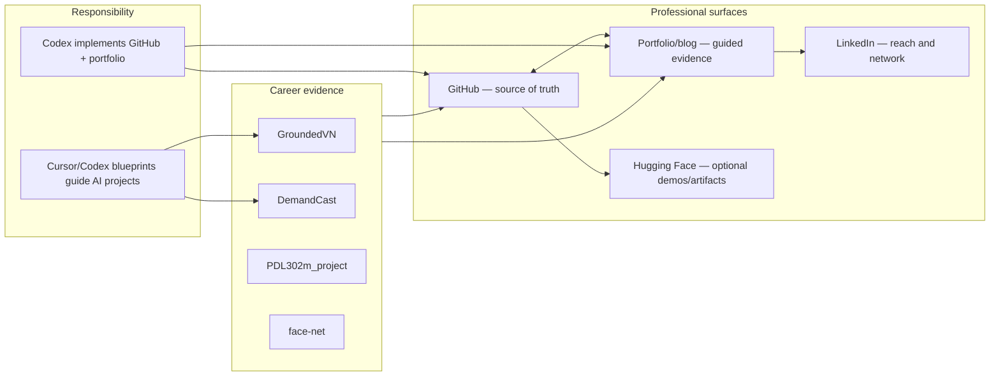
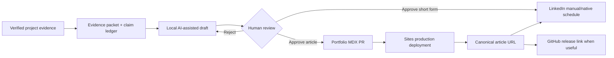
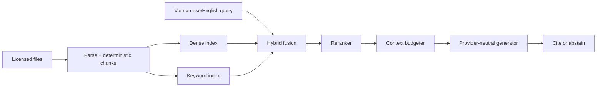

# Mighty Raccoon AI Career System — Validated Design

Date: 2026-07-28
Owner: Phạm Hoàng Hải
Secondary brand: Mighty Raccoon
GitHub account: `Therockycloud`
Status: approved design, awaiting written-spec review

## 1. Decision summary

The program will:

1. Clean the current GitHub profile through reversible changes.
2. Build and deploy an English-first React portfolio.
3. Provide a senior-level Cursor/Codex blueprint for GroundedVN.
4. Provide a senior-level Cursor/Codex blueprint for DemandCast.
5. Operate professional content across GitHub, LinkedIn, and the portfolio only.

Codex directly implements GitHub cleanup and the portfolio after this written specification and the implementation plan are approved.

GroundedVN and DemandCast are executed separately through milestone blueprints. They are not built simultaneously.

## 2. Context

The current public profile has:

- no public real-name display in the connected profile result;
- no profile README;
- no intentional pinned-project story;
- 12 public repositories with course copies, duplicates, broken labs, and several stronger AI projects mixed together;
- a popular-repository section that currently exposes low-signal course and backup repositories.

The profile needs to support AI Engineer, Applied AI, ML Engineer, and adjacent AI Product internship applications in Vietnam and internationally.

Current job descriptions emphasize Python, data/SQL, ML frameworks, API integration, Git, evaluation, deployment, Docker, CI/CD, MLOps, and monitoring. React is useful as a demonstration layer but is not the main AI-engineering signal.

Sources:

- [VNG AI Engineer Intern](https://career.vng.com.vn/tim-kiem-viec-lam/chi-tiet/6783-ai-engineer-intern-vnggames-vi)
- [FPT Telecom student opportunities](https://fptjobs.com/SVCNTS2026)
- [ITL AI Engineering Intern](https://itlvn.com/career/vela-ai-engineering-intern/)
- [VietinBank AI engineering role](https://tuyendung.vietinbank.vn/tuyendung/en/thong-tin-tuyen-dung/TSC202606531T00597/)
- [GitHub profile documentation](https://docs.github.com/en/account-and-profile/concepts/personal-profile)
- [GitHub résumé/profile tutorial](https://docs.github.com/en/account-and-profile/tutorials/using-your-github-profile-to-enhance-your-resume)

## 3. Constraints

- Time: 10–15 hours per week.
- Horizon: more than three months; roadmap targets approximately 20 weeks.
- Infrastructure: local/free first.
- Paid API/cloud: only when justified, capped near 300,000 VND per month.
- Audience: Vietnamese and international.
- Public content language: English first; Vietnamese summaries where useful.
- Personal social media is not part of the professional system.
- No repository deletion.
- No public-history rewrite.
- No biometric images on public GitHub.
- No unverified metric or inflated contribution claim.

## 4. Identity

Use:

- Primary: `Phạm Hoàng Hải`.
- Secondary: `Mighty Raccoon`.
- GitHub username: keep `Therockycloud`.

The real name remains the résumé/profile matching key. Mighty Raccoon is a restrained technical brand, not a separate professional identity.

## 5. System boundary

Out of scope:

- Facebook.
- Instagram.
- X/Threads.
- TikTok/YouTube.
- Personal photos, lifestyle, language-learning, or non-IT content.
- Automatic cross-posting between professional and personal identities.

## 6. Professional content flow

No content generator can publish. Missing evidence becomes a question, not an invented claim.

## 7. Responsibility and deliverables

### Codex-delivered

- `01_GITHUB_CLEANUP_IMPLEMENTATION_SPEC.md`
- `04_PORTFOLIO_IMPLEMENTATION_SPEC.md`
- Implementation plans created only after spec review.
- GitHub mutations and site deployment only after implementation-plan approval.

### Cursor/Codex-guided

- `02_GROUNDEDVN_CURSOR_CODEX_BLUEPRINT.md`
- `03_DEMANDCAST_CURSOR_CODEX_BLUEPRINT.md`

### Shared

- `05_CAREER_ROADMAP.md`
- evidence packet;
- project state;
- decision log.

## 8. GitHub cleanup design

### Keep active

1. `PDL302m_project`
2. `face-net`
3. `SVD-ail303m-g5project`
4. `fpt-hub`

### Repair, then pin

1. `PDL302m_project`
2. `face-net`

The `PDL302m_project` repository name remains unchanged. Its README will explain:

- DPL302m course context;
- team-project status;
- the final deployed pipeline;
- Hải’s documented integration, security, evaluation, and UI responsibilities;
- the contribution-table link.

### Archive

1. `ADY201m`
2. `online-course-assignment`
3. `emotion-detector`
4. `expressBookReviews`
5. `xrwvm-fullstack_developer_capstone`
6. `cars-dealership-capstone`
7. `github-final-project`
8. `github-final-project-backup-20260602-0903`

### Untouched

- All private repositories.

### Final target pins

1. GroundedVN.
2. DemandCast.
3. `PDL302m_project`.
4. `face-net`, only after its public-data evaluation, privacy, ownership, and
   presentation gates pass.

Three verified pins are an acceptable final state while `face-net` remains
blocked; the profile does not fill a slot for appearance alone.

## 9. Safe local checkpoint design

Local repositories:

- `/Users/konalyn/Documents/FPT Materials/DPL302m/PDL302m_project`
- `/Users/konalyn/Documents/FPT Materials/DPL302m/FaceRecognition`

Observed before implementation:

- PDL: `main` equals `origin/main`; ten documentation files are modified.
- FaceRecognition: `main` equals `origin/main`; a 5.6 MB notebook with saved outputs and 20 real registered-face images are untracked.

Rules:

- Never use `git add .`.
- PDL checkpoint stages only the reviewed documentation files.
- Follow the exact checkpoint procedure in `01_GITHUB_CLEANUP_IMPLEMENTATION_SPEC.md`: PDL receives an honest documentation checkpoint only after privacy and rendered-document review; FaceRecognition tags its already-pushed tracked HEAD and creates no fake commit.
- Create and push an annotated pre-cleanup tag.
- Perform cleanup on `chore/portfolio-cleanup`.
- Face images remain local and untracked.
- Review and clear notebook outputs before any future public notebook commit.

## 10. GroundedVN design

Purpose:

- Bilingual evidence assistant.
- Hybrid retrieval, reranking, citations, abstention, adversarial evaluation.
- Local-first provider abstraction.

Stages:

1. Contract and reproducible baseline.
2. Local MVP.
3. Portfolio-quality measured RAG.
4. Operable demo.
5. Senior stretch when triggered.

Core flow:

Evaluation:

- Official MIRACL English retrieval benchmark.
- A project-authored Vietnamese/English evaluation pack for Vietnamese retrieval, answer support, citation, abstention, and prompt-injection cases.
- MIRACL does not provide an official Vietnamese configuration; the blueprint must never invent `MIRACL-vi`.

Senior complexity:

- durable/idempotent ingestion;
- atomic index activation;
- versioned evaluation plane;
- OpenTelemetry;
- SLO and error budget;
- canary configuration;
- backup/restore;
- threat model, audit, deletion, and tenant isolation only after a measured need.

No Kubernetes or microservices are required by default.

Primary source:

- [MIRACL repository and Apache-2.0 license](https://github.com/project-miracl/miracl)

## 11. DemandCast design

Purpose:

- Forecast retail SKU demand.
- Produce probabilistic forecasts.
- Translate forecasts into clearly simulated, human-reviewed inventory proposals.

Data:

- UCI Online Retail II.
- CC BY 4.0.
- 1,067,371 transaction records covering December 2009 through December 2011.
- DOI `10.24432/C5CG6D`.

Primary source:

- [UCI Online Retail II](https://archive.ics.uci.edu/dataset/502/online+retail+ii)

Core flow:

```mermaid
flowchart LR
    RAW["Versioned transactions"] --> CLEAN["Returns/cancellations + quality rules"]
    CLEAN --> FEAT["Leakage-safe lag/rolling features"]
    FEAT --> BACK["Rolling-origin backtests"]
    BACK --> REG["Model + forecast registry"]
    REG --> Q["P10/P50/P90 forecasts"]
    Q --> POLICY["Synthetic inventory policy"]
    POLICY --> UI["FastAPI + React dashboard"]
    UI --> HUMAN["Human accept/adjust/reject"]
```

Mandatory baselines:

- seasonal naive;
- moving/rolling baseline;
- Croston or SBA for intermittent demand.

Candidate:

- LightGBM quantile model.

A deep model is allowed only if it beats the locked baselines under the same folds, data, and compute budget.

Metrics:

- MASE;
- WAPE;
- bias;
- pinball loss;
- interval coverage and width;
- simulated stockout, holding-cost, and service-level proxies.

Inventory lead time and costs are explicitly synthetic; they are not real commercial results.

## 12. Portfolio design

Visual direction: Editorial Systems.

- Warm paper background.
- Graphite text.
- Cobalt primary accent.
- Restrained rust secondary accent.
- Serif display, neutral sans body, mono evidence labels.
- Strong grids and visible rules.
- No heavy animation, 3D, particle background, badge wall, or skill bars.

Architecture:

- React via Next.js App Router.
- TypeScript.
- static export;
- local MDX;
- build-time schema/evidence validation;
- no runtime CMS/database;
- Sites production deployment.

Routes:

- home;
- work index and case studies;
- writing index and articles;
- about;
- optional verified résumé;
- RSS, sitemap, and 404.

Initial case studies:

- Smart Parking after its evidence/ownership/privacy/presentation gate.
- FaceNet only after its public-data evaluation and
  evidence/ownership/privacy/presentation gate; otherwise it remains a
  production-excluded draft.
- Honest “currently building” content for GroundedVN/DemandCast.

Sources:

- [React with TypeScript](https://react.dev/learn/typescript)
- [Next.js static exports](https://nextjs.org/docs/app/guides/static-exports)
- [Next.js MDX](https://nextjs.org/docs/app/guides/mdx)
- [Hugging Face Spaces](https://huggingface.co/docs/hub/main/spaces-overview)

## 13. Error handling and failure boundaries

Global:

- Missing evidence stops publication.
- A failed test stops stage promotion.
- A failed GitHub write is verified before retry.
- Repository archive targets are resolved by exact owner/name.
- No bulk destructive operation uses a glob.

GroundedVN:

- unsupported answer → abstain;
- parse failure → failed ingestion record, no partial index activation;
- index migration failure → previous active index remains;
- provider failure → explicit error/fallback, never fake an answer;
- prompt-injection case → constrained evidence response or refusal.

DemandCast:

- late/missing data → quarantine or stale-data status;
- duplicate batch/backfill → idempotent no-op;
- partial series failure → failed-series manifest;
- model loses to baseline → baseline remains champion;
- interval undercoverage → block promotion;
- stale forecast → API/dashboard marks it stale.

Portfolio:

- missing résumé/contact → hide the control;
- broken external URL → fail release validation;
- draft content → excluded from production;
- missing claim source → build failure;
- failed deployment verification → restore last verified Sites version.

## 14. Testing design

GitHub:

- pre/post inventory;
- exact status and ref verification;
- public logged-out profile review;
- archive-state verification;
- repository-specific tests before repair push.

GroundedVN:

- parser/chunker determinism;
- retrieval metrics;
- citation mapping;
- abstention and adversarial cases;
- idempotent ingestion;
- load/soak and recovery at senior stage.

DemandCast:

- schema and cleaning;
- time-leakage sentinels;
- fold reproducibility;
- baseline/model parity;
- interval calibration;
- batch idempotency and late-data recovery.

Portfolio:

- typecheck/unit tests;
- content/evidence validation;
- static export;
- link check;
- Playwright smoke;
- accessibility scan and manual keyboard review;
- performance budget;
- responsive/browser QA.

## 15. Implementation order

1. User reviews this written specification.
2. Create an implementation plan.
3. Execute safe GitHub checkpoints.
4. Execute GitHub cleanup.
5. Build and deploy the initial portfolio.
6. Execute GroundedVN milestones.
7. Update the portfolio from verified GroundedVN evidence.
8. Execute DemandCast milestones.
9. Update the portfolio from verified DemandCast evidence.

## 16. Acceptance criteria

The design is implemented successfully when:

- the public GitHub profile has an honest identity and intentional repository story;
- exactly the approved eight repositories are archived and none are deleted;
- biometric files remain private/local;
- the portfolio is deployed, accessible, performant, and evidence-validated;
- GroundedVN and DemandCast blueprints can be followed one milestone at a time in Cursor or Codex;
- every public metric has an inspectable source;
- no personal-social automation is introduced;
- the user can restore pre-cleanup Git state and the previous site version.

## 17. Review gate

No implementation begins until the user reviews this design and the linked specifications and approves them. Requested revisions are applied to the documents first.
